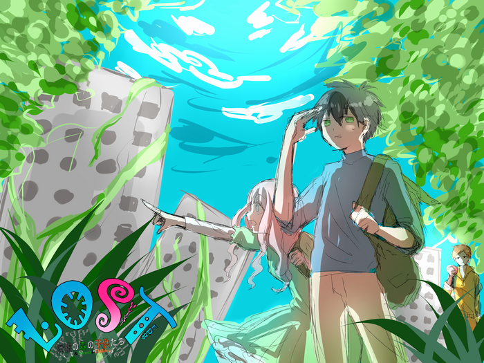

---
link:
  - rel: "stylesheet"
    href: "./css/style.css"
---

## はじめに

大人たちは死に絶え、子どもたちは残された。  
日本中を森が覆い、異形の獣たちが我が物顔で闊歩する。  
変わり果てた世界。その中で、彼らは生きることを選択した。  
自分たちだけのサバイバル。これは、文明崩壊から５年後の物語。

本ゲームは、文明崩壊後の日本を生き延びる人々を演じるゲームです。

プレイヤーの分身であるキャラクター（以下、PC)は、 物資を求めて危険な森を探索する冒険者となります。

### このルールの読み方

### かっこの種類

- 【】：キャラクターの能力値やアビリティを表します。
- 《》：特技を表します。
- ＜＞：このゲームで使われる固有名詞を表します。

### 端数の処理

このゲームでは、割り算を行う場合常に端数は切り上げになります。

### 用語

ゲームマスター(GM)

ゲームを遊ぶ時の進行役です。ゲームを遊ぶときは、本ルールよりも GM の裁定が最優先となります。

プレイヤー(PL)

GM と一緒にゲームを遊ぶ人です。本ゲームの目的は、参加者全員が楽しいときを過ごすことです。
