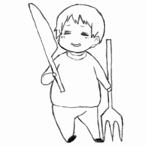
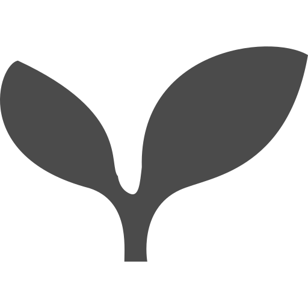
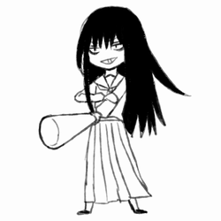
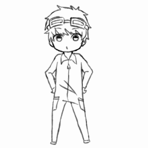

---
link:
  - rel: "stylesheet"
    href: "../css/style.css"
---

<!---->

## アビリティ{#ability .break-verso}

アビリティには、以下の要素があります。

| アビリティの要素 | 概要                                                                          |
| ---------------- | ----------------------------------------------------------------------------- |
| 名前             | 同名アビリティの効果は重複しない。                                            |
| グループ         | 取得したクラスと汎用のグループのアビリティを習得できる。                      |
| タイプ           | タイプによって使用タイミングが決まる。攻撃、支援、補助、割込み、常駐の 5 つ。 |
| 反動             | アビリティを使うために消費する【気力】。                                      |
| 指定特技         | アビリティを使うために必要な判定の《指定特技》。                              |
| 対象             | アビリティの効果の対象。                                                      |
| 効果             | アビリティの効果。                                                            |

<dl class="small-dl">
  <dt>名前</dt>
  <dd>
    アビリティの名前です。同じ名前のアビリティの効果は重複しません。</dd>
  <dt>グループ</dt>
  <dd>汎用、クラスのグループがあります。
    <dl>
      <dt>汎用グループ</dt>
      <dd>冒険者なら誰でも習得できます。</dd>
      <dt>クラスグループ</dt>
      <dd>クラスを選択していれば習得できます。</dd>
    </dl>
  </dd>
  <dt>タイプ</dt>
  <dd>攻撃、支援、補助、割込み、常駐の５つのタイプがあります。
    <dl>
      <dt>攻撃タイプ</dt>
      <dd>自分の手番に使います。相手を攻撃するために使います。</dd>
      <dt>支援タイプ</dt>
      <dd>自分の手番に使います。攻撃以外の行動をするために使います。</dd>
      <dt>補助タイプ</dt>
      <dd>特技の行為判定に組み合わせて使います。１つの行為判定に組み合わせられる補助タイプのアビリティは一つだけです。</dd>
      <dt>割込みタイプ</dt>
      <dd>
        誰かの行動に割りこんで使います。同じ名前の割込みタイプのアビリティは、１サイクル（戦闘中ならば1ラウンド）１回のみ使えます。 </dd>
      <dt>常駐タイプ</dt>
      <dd>習得していれば常に効果を発揮します。</dd>
    </dl>
  </dd>
   
  <dt>反動</dt>
  <dd>
    アビリティを使うことで消費する【気力】の値です。【気力】がマイナスになるようには消費できません。</dd>
  <dt>指定特技</dt>
  <dd>アビリティを使用するために判定が必要な特技です。</dd>
  <dl> 
    <dt>《指定特技》</dt>
    <dd>《指定特技》の判定に成功すると効果を発揮します。</dd>
    <dt>なし</dt>
    <dd>判定をすることなく効果を発揮します。</dd>
    <dt>自由</dt>
    <dd>アビリティを習得したときに自由に特技を１つ選択します。</dd>
    <dt>任意</dt>
    <dd>判定をする時に自由に特技を選ぶことができます。</dd>
    <dt>可変</dt>
    <dd>判定をする時にランダムに特技を決定します。1d6を振って分野を、2d6を振って特技を決定してください。</dd>
    <dt>-</dt>
    <dd>
      常駐・補助アビリティです。 常に効果を発揮、または他の判定に組み合わせることで効果を発揮します。 </dd>
  </dl>
  <dt>対象</dt>
  <dd>アビリティの効果の対象です。</dd>
  <dt>効果</dt>
  <dd>アビリティの効果です。</dd>
</dl>

  

### 汎用{.break-verso}

冒険者なら誰でも取得できるアビリティです。
手に馴染んだ武器による【武器攻撃】で＜ヌシ＞へのとどめを確実に成功させましょう。

 

  

    

    
武器攻撃

  

  

    

      
タイプ

      
攻撃

    

    

      
反動

      
0

    

    

      
対象

      
単体

    

  

  

    
指定特技

    
自由

  

  
指定特技の判定に成功すると、装備中の《指定特技》が一致している武器1つの[攻撃力]点のダメージを与える。この時、命中判定の達成値にプラス2の修正がつく。指定特技ごとに別の【アビリティ】として扱う。

  

    

    
かばう

  

  

    

      
タイプ

      
割込み

    

    

      
反動

      
2

    

    

      
対象

      
単体

    

  

  

    
指定特技

    
《受ける》

  

  
指定特技の判定に成功すると、キャラクター1人のダメージを肩代わりできる。

  

    

    
見切り

  

  

    

      
タイプ

      
補助

    

    

      
反動

      
2

    

    

      
対象

      
-

    

  

  

    
指定特技

    
-

  

  
回避判定に組み合わせて使用する。回避判定の指定特技を《かわす/胴部9》に変更する。

  

    

    
強打

  

  

    

      
タイプ

      
補助

    

    

      
反動

      
2

    

    

      
対象

      
-

    

  

  

    
指定特技

    
-

  

  
命中判定に組み合わせて使用する。命中した攻撃のダメージを1増加させる。

  

    

    
応急手当

  

  

    

      
タイプ

      
支援

    

    

      
反動

      
3

    

    

      
対象

      
単体

    

  

  

    
指定特技

    
《手当》

  

  
指定特技の判定に成功すると、対象の【体力】が1点増加する。

  

    

    
足払い

  

  

    

      
タイプ

      
攻撃

    

    

      
反動

      
3

    

    

      
対象

      
単体

    

  

  

    
指定特技

    
《しゃがむ》

  

  
指定特技の判定に成功すると、対象に『転倒』の変調を与える。

  

    

    
乱舞

  

  

    

      
タイプ

      
補助

    

    

      
反動

      
8

    

    

      
対象

      
-

    

  

  

    
指定特技

    
-

  

  
命中判定に組み合わせて使用する。命中した攻撃のダメージを3増加させる。

  

    

    
集中

  

  

    

      
タイプ

      
補助

    

    

      
反動

      
2

    

    

      
対象

      
-

    

  

  

    
指定特技

    
-

  

  
命中判定に組み合わせて使用する。命中判定の達成値にプラス1の修正がつく。

  

    

    
たからもの

  

  

    

      
タイプ

      
割込み

    

    

      
反動

      
3

    

    

      
対象

      
自身

    

  

  

    
指定特技

    
-

  

  
自身の振ったダイス1つの出目を6にする。シナリオ1回。また、生死判定に失敗したとき、この【アビリティ】を失うことでそれを成功にできる。これには気力を消費しない。

  

    

    
説得

  

  

    

      
タイプ

      
攻撃

    

    

      
反動

      
6

    

    

      
対象

      
単体

    

  

  

    
指定特技

    
自由

  

  
指定特技の判定に成功すると、対象の気力を2点減少させる。

### ビッグ{.break-verso}

 

<!-- 
恵まれた体格を活かしたアビリティを習得できます。
 -->

  

    

    
におうだち

  

  

    

      
タイプ

      
割込み

    

    

      
反動

      
5

    

    

      
対象

      
自身

    

  

  

    
指定特技

    
《塞ぐ》

  

  
指定特技の判定に成功すると、今行われている攻撃の対象を自分1人に変更する。

  

    

    
鉄拳

  

  

    

      
タイプ

      
攻撃

    

    

      
反動

      
0

    

    

      
対象

      
単体

    

  

  

    
指定特技

    
《殴る》

  

  
指定特技の判定に成功すると、1点のダメージを与える。このとき命中判定の達成値にプラス3の修正がつく。

  

    

    
怪力

  

  

    

      
タイプ

      
常駐

    

    

      
反動

      
-

    

    

      
対象

      
自身

    

  

  

    
指定特技

    
-

  

  
白兵攻撃や肉体を使った攻撃により与えるダメージが1点上昇する。

  

    

    
頑強

  

  

    

      
タイプ

      
常駐

    

    

      
反動

      
-

    

    

      
対象

      
自身

    

  

  

    
指定特技

    
-

  

  
あなたの【生命力】をプラス2点する。

  

    

    
馬鹿力

  

  

    

      
タイプ

      
常駐

    

    

      
反動

      
-

    

    

      
対象

      
自身

    

  

  

    
指定特技

    
-

  

  
あなたは「装備部位：両手」のアイテムを「装備部位：片手」として扱うことができる。

  

    

    
押し倒し

  

  

    

      
タイプ

      
補助

    

    

      
反動

      
2

    

    

      
対象

      
-

    

  

  

    
指定特技

    
-

  

  
白兵攻撃や肉体を使った攻撃の命中判定に組み合わせて使用する。対象に『転倒』の変調を与える。

### チビ{.break-verso}

 

<!-- 
小器用な立ち回りを活かしたアビリティを習得できます。
 -->

  

    

    
痩身

  

  

    

      
タイプ

      
常駐

    

    

      
反動

      
-

    

    

      
対象

      
自身

    

  

  

    
指定特技

    
-

  

  
回避判定の達成値にプラス1の修正がつく。

  

    

    
両手利き

  

  

    

      
タイプ

      
常駐

    

    

      
反動

      
-

    

    

      
対象

      
自身

    

  

  

    
指定特技

    
-

  

  
《利き腕》と《逆腕》の特技を追加で習得する。さらに、代用判定の時、腕部分野の上下のリストが繋がっているように扱う。

  

    

    
奇襲

  

  

    

      
タイプ

      
割込み

    

    

      
反動

      
5

    

    

      
対象

      
自身

    

  

  

    
指定特技

    
《隠れる》

  

  
戦闘開始時の先制判定の前に使用する。指定特技の判定に成功すると、追加行動を得る。

  

    

    
アクロバット

  

  

    

      
タイプ

      
補助

    

    

      
反動

      
2

    

    

      
対象

      
-

    

  

  

    
指定特技

    
-

  

  
回避判定に組み合わせて使用する。達成値にプラス2の修正がつく。

  

    

    
うろちょろ

  

  

    

      
タイプ

      
補助

    

    

      
反動

      
2

    

    

      
対象

      
-

    

  

  

    
指定特技

    
-

  

  
命中判定に組み合わせて使用する。対象の気力を1点減少させる。

  

    

    
死角

  

  

    

      
タイプ

      
補助

    

    

      
反動

      
2

    

    

      
対象

      
-

    

  

  

    
指定特技

    
-

  

  
命中判定に組み合わせて使用する。達成値にプラス2の修正がつく。

### オトナ{.break-verso}

 

<!-- 
経験に裏打ちされたアビリティを習得できます。
 -->

  

    

    
手練

  

  

    

      
タイプ

      
常駐

    

    

      
反動

      
-

    

    

      
対象

      
自身

    

  

  

    
指定特技

    
-

  

  
「アクション」の特技から１つ選択する。その特技は隣接する部位にダメージを受けても使用不能とならない。

  

    

    
百戦錬磨

  

  

    

      
タイプ

      
常駐

    

    

      
反動

      
-

    

    

      
対象

      
自身

    

  

  

    
指定特技

    
-

  

  
命中判定の達成値にプラス1の修正がつく。

  

    

    
人生経験

  

  

    

      
タイプ

      
常駐

    

    

      
反動

      
-

    

    

      
対象

      
自身

    

  

  

    
指定特技

    
-

  

  
ギャップを2列塗りつぶすことができる。塗りつぶされたギャップは代用判定の際数えない。

  

    

    
遭遇歴

  

  

    

      
タイプ

      
支援

    

    

      
反動

      
3

    

    

      
対象

      
単体

    

  

  

    
指定特技

    
《雑学》

  

  
指定特技の判定に成功すると、対象に『暴露』の変調を与える。

  

    

    
へそくり

  

  

    

      
タイプ

      
常駐

    

    

      
反動

      
-

    

    

      
対象

      
自身

    

  

  

    
指定特技

    
-

  

  
キャラメイク時の初期Jにプラス3Jする。また、セッション開始時に3J獲得できる。

  

    

    
旧友

  

  

    

      
タイプ

      
常駐

    

    

      
反動

      
-

    

    

      
対象

      
自身

    

  

  

    
指定特技

    
-

  

  
あなたを訪ねて古い友人がやってくる。あなたはキャンプフェイズに任意の[タイミング：支援]のキャンプ人材表1つの効果を使用できる。人材のレベルは1とする。指定特技の判定は行うこと。

### ニューエイジ{.break-verso}

 

<!-- 
経験に裏打ちされたアビリティを習得できます。
 -->

  

    

    
火炎弾

  

  

    

      
タイプ

      
攻撃

    

    

      
反動

      
2

    

    

      
対象

      
単体

    

  

  

    
指定特技

    
《投げる》

  

  
指定特技の判定に成功すると、対象に『炎上』の変調を与える。

  

    

    
発電

  

  

    

      
タイプ

      
割込み

    

    

      
反動

      
2

    

    

      
対象

      
アイテム

    

  

  

    
指定特技

    
《機械》

  

  
指定特技の判定に成功すると、アイテム１つを「充電」できる。

  

    

    
念動力

  

  

    

      
タイプ

      
割込み

    

    

      
反動

      
2

    

    

      
対象

      
単体

    

  

  

    
指定特技

    
《逸らす》

  

  
ダメージ適用の直前に使用する。指定特技の判定に成功するとダメージを1点軽減できる。

  

    

    
治癒

  

  

    

      
タイプ

      
支援

    

    

      
反動

      
6

    

    

      
対象

      
単体

    

  

  

    
指定特技

    
《手当》

  

  
指定特技の判定に成功すると、対象の部位ダメージを1つ回復できる。ただし、この判定の達成値には[対象の部位ダメージ数]だけのマイナス修正がつく。

  

    

    
突然変異

  

  

    

      
タイプ

      
常駐

    

    

      
反動

      
-

    

    

      
対象

      
自身

    

  

  

    
指定特技

    
-

  

  
ムシ、ケモノ、ミュータントのグループアビリティからランダムに１つアビリティを習得できる。ただし、その反動が1増加する。常駐タイプのアビリティを習得した場合、【精神力】が2点減少する。

  

    

    
瞬間移動

  

  

    

      
タイプ

      
補助

    

    

      
反動

      
5

    

    

      
対象

      
-

    

  

  

    
指定特技

    
-

  

  
回避判定に組み合わせて使用する。回避に成功したとき、あなた以外のキャラクター1人も回避できたことになる。このアビリティを使用する場合、あなたが攻撃の対象でない場合にも回避判定を行える。

### キズモノ{.break-verso}

 

<!-- 
経験に裏打ちされたアビリティを習得できます。
 -->

  

    

    
銀の腕

  

  

    

      
タイプ

      
常駐

    

    

      
反動

      
-

    

    

      
対象

      
自身

    

  

  

    
指定特技

    
-

  

  
あなたはダメージを受ける時、先にそのダメージの命中部位を決める。＜キズ＞の部位に攻撃が命中した場合、そのダメージを無効化する。

  

    

    
克服

  

  

    

      
タイプ

      
常駐

    

    

      
反動

      
-

    

    

      
対象

      
自身

    

  

  

    
指定特技

    
-

  

  
ギャップを2列塗りつぶすことができる。塗りつぶされたギャップは代用判定の際数えない。

  

    

    
肉を斬らせて

  

  

    

      
タイプ

      
割込み

    

    

      
反動

      
4

    

    

      
対象

      
自身

    

  

  

    
指定特技

    
《耐える》

  

  
自身が部位ダメージを受けた時に使用できる。指定特技の判定に成功すると自身は追加行動を得る。

  

    

    
悪運

  

  

    

      
タイプ

      
割込み

    

    

      
反動

      
3

    

    

      
対象

      
単体

    

  

  

    
指定特技

    
なし

  

  
対象の判定の直後に使用。サイコロ1つの出目をマイナス1する。シナリオ3回。

  

    

    
リハビリ

  

  

    

      
タイプ

      
常駐

    

    

      
反動

      
-

    

    

      
対象

      
自身

    

  

  

    
指定特技

    
-

  

  
＜キズ＞に隣接する8つのアクションの《特技》から１つ選び追加で習得する。このアクションは使用可能になる。

  

    

    
刺し違え

  

  

    

      
タイプ

      
割込み

    

    

      
反動

      
5

    

    

      
対象

      
単体

    

  

  

    
指定特技

    
《撃つ》

  

  
あなたが部位ダメージを受けた時に割り込んで使用する。指定特技の判定に成功すると、対象に、受けた部位ダメージと同じ部位ダメージを与える。

### センシ{.break-verso}

 

<!-- 
経験に裏打ちされたアビリティを習得できます。
 -->

  

    

    
渾身撃

  

  

    

      
タイプ

      
攻撃

    

    

      
反動

      
3

    

    

      
対象

      
単体

    

  

  

    
指定特技

    
自由

  

  
指定特技の判定に成功すると対象に[装備している武器1つの攻撃力+3]点のダメージを与える。

  

    

    
追撃

  

  

    

      
タイプ

      
補助

    

    

      
反動

      
1

    

    

      
対象

      
-

    

  

  

    
指定特技

    
-

  

  
命中判定に組み合わせて使用する。命中した攻撃のダメージを1増加させる。

  

    

    
切り返し

  

  

    

      
タイプ

      
割込み

    

    

      
反動

      
1

    

    

      
対象

      
自身

    

  

  

    
指定特技

    
なし

  

  
命中判定の直後に使用する。その判定を振り直す。

  

    

    
急所狙い

  

  

    

      
タイプ

      
補助

    

    

      
反動

      
2

    

    

      
対象

      
-

    

  

  

    
指定特技

    
-

  

  
命中判定に組み合わせて使用する。その攻撃によるダメージは軽減されない。

  

    

    
なぎ払い

  

  

    

      
タイプ

      
攻撃

    

    

      
反動

      
3

    

    

      
対象

      
3体

    

  

  

    
指定特技

    
《振る》

  

  
指定特技の判定に成功すると、3体までの対象に装備中の武器1つの[攻撃力]点のダメージを与える。

  

    

    
一刀流

  

  

    

      
タイプ

      
常駐

    

    

      
反動

      
-

    

    

      
対象

      
-

    

  

  

    
指定特技

    
-

  

  
装備している武器が1つだけの場合、武器の攻撃力が1点増加する。

### スカウト{.break-verso}

 

<!-- 
経験に裏打ちされたアビリティを習得できます。
 -->

  

    

    
偵察

  

  

    

      
タイプ

      
割込み

    

    

      
反動

      
5

    

    

      
対象

      
全体

    

  

  

    
指定特技

    
《見つける》

  

  
ランダムエンカウントの表を振る直前に使用する。指定特技の判定に成功すると、表を振った後に、その遭遇を無視できるようになる。

  

    

    
マルチワーク

  

  

    

      
タイプ

      
割込み

    

    

      
反動

      
2

    

    

      
対象

      
自身

    

  

  

    
指定特技

    
《休まない》

  

  
探索フェイズの行動前に使用する。判定に成功すると、行動を2回行うことができる。同じ行動を選んでもよい。

  

    

    
とんずら

  

  

    

      
タイプ

      
支援

    

    

      
反動

      
3

    

    

      
対象

      
全体

    

  

  

    
指定特技

    
《逃げる》

  

  
指定特技の判定に成功すると、味方を好きなだけ選んで（自身含む）戦闘から撤退させることができる。ただし、この判定の達成値にはマイナス[自身以外に撤退させる人数]の修正がつく。

  

    

    
踏破

  

  

    

      
タイプ

      
常駐

    

    

      
反動

      
-

    

    

      
対象

      
自身

    

  

  

    
指定特技

    
-

  

  
突破判定及び探索表による判定の達成値にプラス1の修正がつく。

  

    

    
先手必勝

  

  

    

      
タイプ

      
常駐

    

    

      
反動

      
-

    

    

      
対象

      
-

    

  

  

    
指定特技

    
-

  

  
先制判定の達成値にプラス1の修正がつく。先攻で攻撃した場合のみ、あなたの与えるダメージにプラス1の修正がつく。

  

    

    
小器用

  

  

    

      
タイプ

      
常駐

    

    

      
反動

      
-

    

    

      
対象

      
自身

    

  

  

    
指定特技

    
-

  

  
あなたは補助タイプの特技を2つまで組み合わせられるようになる。

### ハンター{.break-verso}

 

<!-- 
経験に裏打ちされたアビリティを習得できます。
 -->

  

    

    
毒矢

  

  

    

      
タイプ

      
攻撃

    

    

      
反動

      
3

    

    

      
対象

      
単体

    

  

  

    
指定特技

    
《撃つ》

  

  
指定特技の判定に成功すると、1点のダメージを与える。その結果対象の【体力】が減少した場合、対象に『毒』の変調を与える。

  

    

    
狙い撃ち

  

  

    

      
タイプ

      
補助

    

    

      
反動

      
1

    

    

      
対象

      
-

    

  

  

    
指定特技

    
-

  

  
命中判定に組み合わせて使用する。攻撃が命中した時、命中する部位が必ず任意となる。

  

    

    
罠設置

  

  

    

      
タイプ

      
攻撃

    

    

      
反動

      
2

    

    

      
対象

      
単体

    

  

  

    
指定特技

    
《罠》

  

  
指定特技の判定に成功すると、対象に『捕縛』の変調を与える。

  

    

    
打込み

  

  

    

      
タイプ

      
補助

    

    

      
反動

      
2

    

    

      
対象

      
-

    

  

  

    
指定特技

    
-

  

  
命中判定に組み合わせて使用する。攻撃が命中した時、対象に『重傷』の変調を与える。

  

    

    
火炎瓶

  

  

    

      
タイプ

      
攻撃

    

    

      
反動

      
3

    

    

      
対象

      
単体

    

  

  

    
指定特技

    
《投げる》

  

  
指定特技の判定に成功すると、対象に『炎上』の変調と1点のダメージを与える。

  

    

    
影牢

  

  

    

      
タイプ

      
支援

    

    

      
反動

      
3

    

    

      
対象

      
単体

    

  

  

    
指定特技

    
《追い込む》

  

  
指定特技の判定に成功すると、[対象が受けている変調]点のダメージを与える。

### ハカセ{.break-verso}

 

<!-- 
経験に裏打ちされたアビリティを習得できます。
 -->

  

    

    
観察眼

  

  

    

      
タイプ

      
支援

    

    

      
反動

      
3

    

    

      
対象

      
単体

    

  

  

    
指定特技

    
《考える》

  

  
指定特技の判定に成功すると、対象に『暴露』の変調を与える。

  

    

    
弱点看破

  

  

    

      
タイプ

      
支援

    

    

      
反動

      
3

    

    

      
対象

      
単体

    

  

  

    
指定特技

    
《見つける》

  

  
指定特技の判定に成功すると、そのラウンドの間、味方の与えるダメージは軽減されない。

  

    

    
戦術

  

  

    

      
タイプ

      
補助

    

    

      
反動

      
3

    

    

      
対象

      
全体

    

  

  

    
指定特技

    
-

  

  
先制判定に組み合わせて使用する。先制判定の達成値にプラス1の修正がつく。先制判定に成功した場合、味方全員が先攻で行動できる。

  

    

    
爆発物

  

  

    

      
タイプ

      
攻撃

    

    

      
反動

      
4

    

    

      
対象

      
全体

    

  

  

    
指定特技

    
《科学》

  

  
指定特技の判定に成功すると敵全体に2点のダメージを与える。判定に失敗した場合、味方全員に2点のダメージを与える。この攻撃によるダメージは軽減できない。

  

    

    
応用と実践

  

  

    

      
タイプ

      
常駐

    

    

      
反動

      
-

    

    

      
対象

      
自身

    

  

  

    
指定特技

    
-

  

  
あなたの特技リストは技術と環境の分野が繋がっているものとして扱うことができる。

  

    

    
ピタゴラ

  

  

    

      
タイプ

      
支援

    

    

      
反動

      
2

    

    

      
対象

      
単体

    

  

  

    
指定特技

    
《地理》

  

  
指定特技の判定に成功すると、ラウンドの終了時に対象に2点のダメージを与える。この攻撃によるダメージは軽減できない。周囲の環境を利用した攻撃を行う。

### ショクニン{.break-verso}

 

<!-- 
経験に裏打ちされたアビリティを習得できます。
 -->

  

    

    
改造

  

  

    

      
タイプ

      
支援

    

    

      
反動

      
3

    

    

      
対象

      
アイテム

    

  

  

    
指定特技

    
《作る》

  

  
武器1つを対象にする。指定特技の判定に成功すると、セッション中その武器の攻撃力にプラス1の修正を与える。

  

    

    
愛刀

  

  

    

      
タイプ

      
常駐

    

    

      
反動

      
-

    

    

      
対象

      
自身

    

  

  

    
指定特技

    
-

  

  
装備している武器1つを愛刀として指定する。愛刀を使った命中判定の達成値にプラス1の修正がつく。さらに愛刀の[攻撃力]が1点増加する。

  

    

    
限界突破

  

  

    

      
タイプ

      
補助

    

    

      
反動

      
-

    

    

      
対象

      
-

    

  

  

    
指定特技

    
-

  

  
武器を使用した攻撃の命中判定に組み合わせて使用する。攻撃に使用する武器の[攻撃力]を2倍にする。攻撃が終わった後、その武器は破壊される。

  

    

    
目利き

  

  

    

      
タイプ

      
割込み

    

    

      
反動

      
1

    

    

      
対象

      
-

    

  

  

    
指定特技

    
《鑑定》

  

  
指定特技の判定に成功すると、ランダムにアイテムを入手する時の表の出目にプラス1かマイナス1の修正をつけることができる。

  

    

    
修理

  

  

    

      
タイプ

      
割込み

    

    

      
反動

      
2

    

    

      
対象

      
アイテム

    

  

  

    
指定特技

    
《耐える》

  

  
武器が破壊される時に割り込んで使用する。指定特技の判定に成功した場合、1D6を振る。5か6の出目が出た場合、その武器を修理しすぐにもう一度装備する。

  

    

    
試作品

  

  

    

      
タイプ

      
攻撃

    

    

      
反動

      
3

    

    

      
対象

      
単体

    

  

  

    
指定特技

    
《作る》

  

  
食料・消耗品以外のアイテムを1つ消費する。指定特技の判定に成功すると、対象に1D6点のダメージを与える。

### ホープ{.break-verso}

 

<!-- 
経験に裏打ちされたアビリティを習得できます。
 -->

  

    

    
みなぎる力

  

  

    

      
タイプ

      
常駐

    

    

      
反動

      
-

    

    

      
対象

      
自身

    

  

  

    
指定特技

    
-

  

  
あなたの【精神力】にプラス3する。

  

    

    
希望の光

  

  

    

      
タイプ

      
割込み

    

    

      
反動

      
3

    

    

      
対象

      
単体

    

  

  

    
指定特技

    
なし

  

  
対象の判定の直後に使用。サイコロ1つの出目をプラス1する。シナリオ3回。

  

    

    
幸運の星

  

  

    

      
タイプ

      
常駐

    

    

      
反動

      
-

    

    

      
対象

      
自身

    

  

  

    
指定特技

    
-

  

  
あなたの行う行為判定では出目が6,5の時にもスペシャルとなる。

  

    

    
揺らぐ運命

  

  

    

      
タイプ

      
割込み

    

    

      
反動

      
5

    

    

      
対象

      
単体

    

  

  

    
指定特技

    
なし

  

  
対象の行為判定の直後に使用。その判定を振り直す。

  

    

    
努力

  

  

    

      
タイプ

      
割込み

    

    

      
反動

      
3

    

    

      
対象

      
単体

    

  

  

    
指定特技

    
《休まない》

  

  
対象が何らかの表を振った直後に使用。その出目をプラス1かマイナス1する。

  

    

    
因果応報

  

  

    

      
タイプ

      
補助

    

    

      
反動

      
6

    

    

      
対象

      
-

    

  

  

    
指定特技

    
-

  

  
回避判定に組み合わせて使用する。回避が成功した場合、あなたが受ける予定の攻撃の対象を攻撃者に移し替える。

### ママ{.break-verso}

 

<!-- 
経験に裏打ちされたアビリティを習得できます。
 -->

  

    

    
声援

  

  

    

      
タイプ

      
割込み

    

    

      
反動

      
3

    

    

      
対象

      
単体

    

  

  

    
指定特技

    
《伝える》

  

  
自分以外の判定の直前に使用する。指定特技の判定に成功すると対象の達成値にプラス2の修正がつく。

  

    

    
ごちそう

  

  

    

      
タイプ

      
支援

    

    

      
反動

      
2

    

    

      
対象

      
全体

    

  

  

    
指定特技

    
《料理》

  

  
人数分の食料を消費する。指定特技の判定に成功すると全員の【気力】が1D6点増加し、【体力】が1点増加する。戦闘中は使用できない。

  

    

    
激励

  

  

    

      
タイプ

      
支援

    

    

      
反動

      
2

    

    

      
対象

      
単体

    

  

  

    
指定特技

    
《叫ぶ》

  

  
指定特技の判定に成功すると対象の【気力】が3点増加する。

  

    

    
ちちんぷいぷい

  

  

    

      
タイプ

      
割込み

    

    

      
反動

      
5

    

    

      
対象

      
単体

    

  

  

    
指定特技

    
《手当》

  

  
指定特技の判定に成功すると、対象の【体力】が3点増加する。

  

    

    
節約

  

  

    

      
タイプ

      
常駐

    

    

      
反動

      
-

    

    

      
対象

      
アイテム

    

  

  

    
指定特技

    
-

  

  
自身が消耗品を使用した時に、1D6を振る。5か6が出た場合、そのアイテムは失われない。

  

    

    
なだめる

  

  

    

      
タイプ

      
割込み

    

    

      
反動

      
2

    

    

      
対象

      
単体

    

  

  

    
指定特技

    
《止める》

  

  
対象が本気状態を宣言した時に使用する。指定特技の判定に成功すると、そのラウンドの間、＜ヌシ＞は本気状態になれない。

