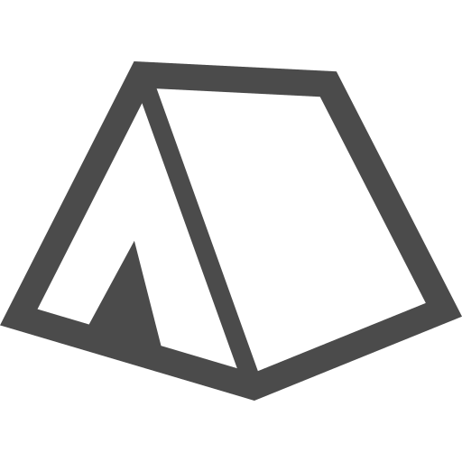

---
link:
  - rel: "stylesheet"
    href: "../css/style.css"
---

<!---->

<h3 class="break-verso" id="camp-improve">キャンプの設備</h3>

キャンプの設備には以下の要素があります。

  <table class="chart" id="camp-equipment-element-summary">
<tbody>
  <tr>
    <th>名前
      <td>設備名。</td>
    </th>
  </tr>
  <tr>
    <th>必要CP
      <td>設備を入手・レベルアップするために必要なCP。</td>
    </th>
  </tr>
  <tr>
    <th>タイプ
      <td>タイプによって使用タイミングが決まる。支援、常駐の2つ。</td>
    </th>
  </tr>
  <tr>
    <th>指定特技
      <td> 設備を使うために必要な判定の《指定特技》。</td>
    </th>
  </tr>
  <tr>
    <th>レベル
      <td>設備のレベル。入手時はレベル1</td>
    </th>
  </tr>
  <tr>
    <th>最大レベル
      <td> 設備の最大レベル。</td>
    </th>
  </tr>
  <tr>
    <th>前提
      <td> 前提となる設備がキャンプにない場合、効果を発揮しない。</td>
    </th>
  </tr>
  <tr>
    <th>効果
      <td> 設備の効果。</td>
    </th>
  </tr>
</tbody>

  </table>

<dl>
  <dt>名前</dt>
  <dd>設備の名前です。</dd>
  <dt>必要CP</dt>
  <dd>
    設備を入手するために必要なCPです。
    既に設備を入手している状態でこのCPを払うと、レベルを上げることができます。
    また、1C（缶詰）を1CPとして扱うことができます。
  </dd>
  <dt>タイプ</dt>
  <dd>
    常駐、支援があります。常駐は常に効果を発揮しています。
    支援はキャンプフェイズに使用することで効果を受けることができます。
  </dd>
  <dt>指定特技</dt>
  <dd>設備を使用するのに必要な特技です。なしの場合は判定の必要なく使用できます。</dd>
  <dt>レベル</dt>
  <dd>設備のレベルです。設備を入手したときは1レベルになります。</dd>
  <dt>最大レベル</dt>
  <dd>設備の最大レベルです。</dd>
  <dt>前提</dt>
  <dd>前提のある設備は前提となる設備がキャンプにない場合、効果を発揮しません。</dd>
  <dt>効果</dt>
  <dd>施設や人材を使用した時の効果です。</dd>
</dl>

### 設備一覧表{.break-verso}

<h4>設備（施設）</h4>

  

    

    
屋根

  

  

    

      
タイプ

      
常駐

    

    

      
CP

      
3

    

    

      
最大Lv

      
2

    

    

      
前提

      

    

  

  

    

      
指定特技

      
-

    

  

  
全員の【精神力】にプラス[レベル]する。1レベルでは雨漏りしている。

  

    

    
壁

  

  

    

      
タイプ

      
常駐

    

    

      
CP

      
3

    

    

      
最大Lv

      
2

    

    

      
前提

      

    

  

  

    

      
指定特技

      
-

    

  

  
全員の【精神力】にプラス[レベル]する。1レベルでは隙間風が吹く。

  

    

    
寝床

  

  

    

      
タイプ

      
常駐

    

    

      
CP

      
8

    

    

      
最大Lv

      
3

    

    

      
前提

      

    

  

  

    

      
指定特技

      
-

    

  

  
全員の【精神力】にプラス[レベル×2]する。1レベルでは茸が生えたぼろ毛布。

  

    

    
水場

  

  

    

      
タイプ

      
常駐

    

    

      
CP

      
10

    

    

      
最大Lv

      
1

    

    

      
前提

      

    

  

  

    

      
指定特技

      
-

    

  

  
全員の【精神力】にプラス3する。水を汲める川が近くにある。

  

    

    
水路

  

  

    

      
タイプ

      
常駐

    

    

      
CP

      
10

    

    

      
最大Lv

      
1

    

    

      
前提

      
水場

    

  

  

    

      
指定特技

      
-

    

  

  
全員の【精神力】にプラス2する。川からキャンプまで水を引く。

  

    

    
井戸

  

  

    

      
タイプ

      
常駐

    

    

      
CP

      
15

    

    

      
最大Lv

      
1

    

    

      
前提

      

    

  

  

    

      
指定特技

      
-

    

  

  
全員の【精神力】にプラス3する。水を汲める井戸がキャンプにある。

  

    

    
物見やぐら

  

  

    

      
タイプ

      
常駐

    

    

      
CP

      
6

    

    

      
最大Lv

      
1

    

    

      
前提

      

    

  

  

    

      
指定特技

      
-

    

  

  
全員の【精神力】にプラス1する。

  

    

    
倉庫

  

  

    

      
タイプ

      
常駐

    

    

      
CP

      
2

    

    

      
最大Lv

      
10

    

    

      
前提

      

    

  

  

    

      
指定特技

      
-

    

  

  
[レベル×10]個までのアイテムを保存できる。出し入れはキャンプでのみ可能。

  

    

    
食料庫

  

  

    

      
タイプ

      
常駐

    

    

      
CP

      
20

    

    

      
最大Lv

      
1

    

    

      
前提

      

    

  

  

    

      
指定特技

      
-

    

  

  
全員の【生命力】をプラス２する。

  

    

    
ドラムカン

  

  

    

      
タイプ

      
-

    

    

      
CP

      
1

    

    

      
最大Lv

      
1

    

    

      
前提

      

    

  

  

    

      
指定特技

      
-

    

  

  
水などを貯めることができる。

  

    

    
お風呂

  

  

    

      
タイプ

      
支援

    

    

      
CP

      
3

    

    

      
最大Lv

      
3

    

    

      
前提

      
水場、ドラムカン

    

  

  

    

      
指定特技

      
なし

    

  

  
あなたの【精神力】にプラス[レベル]点する。

  

    

    
温泉

  

  

    

      
タイプ

      
支援

    

    

      
CP

      
15

    

    

      
最大Lv

      
3

    

    

      
前提

      

    

  

  

    

      
指定特技

      
なし

    

  

  
あなたの【精神力】と【生命力】にプラス[レベル]点する。

  

    

    
畑

  

  

    

      
タイプ

      
支援

    

    

      
CP

      
2

    

    

      
最大Lv

      
5

    

    

      
前提

      

    

  

  

    

      
指定特技

      
《作る》

    

  

  
指定特技の判定に成功すると、あなたは[レベル]Jを得る。最大レベルに達している場合、食堂の効果にプラス1する。

  

    

    
食堂

  

  

    

      
タイプ

      
支援

    

    

      
CP

      
5

    

    

      
最大Lv

      
1

    

    

      
前提

      
料理人

    

  

  

    

      
指定特技

      
《料理》

    

  

  
指定特技の判定に成功すると、あなたの【生命力】にプラス1する。

  

    

    
牧場

  

  

    

      
タイプ

      
支援

    

    

      
CP

      
3

    

    

      
最大Lv

      
3

    

    

      
前提

      

    

  

  

    

      
指定特技

      
《捕らえる》

    

  

  
指定特技の判定に成功すると、あなたはジャーキーか「毛皮」を[レベル]個まで得ることができる。最大レベルに達している場合、食堂の効果にプラス1する。

  

    

    
薬草園

  

  

    

      
タイプ

      
支援

    

    

      
CP

      
2

    

    

      
最大Lv

      
3

    

    

      
前提

      

    

  

  

    

      
指定特技

      
《鑑定》

    

  

  
指定特技の判定に成功すると、あなたは「コカの葉」を[レベル]個得る。

  

    

    
病院

  

  

    

      
タイプ

      
支援

    

    

      
CP

      
5

    

    

      
最大Lv

      
1

    

    

      
前提

      
医者

    

  

  

    

      
指定特技

      
《手当》

    

  

  
指定特技の判定に成功すると、あなたは「鎮痛剤」を1つ得る。

  

    

    
図書館

  

  

    

      
タイプ

      
支援

    

    

      
CP

      
5

    

    

      
最大Lv

      
1

    

    

      
前提

      

    

  

  

    

      
指定特技

      
《見つける》

    

  

  
指定特技の判定に成功すると、あなたはセッション中1度だけ、ダイスの出目をプラス1できる。これは、あの時の本でみたことある！

  

    

    
工房

  

  

    

      
タイプ

      
支援

    

    

      
CP

      
6

    

    

      
最大Lv

      
3

    

    

      
前提

      

    

  

  

    

      
指定特技

      
《作る》

    

  

  
任意個のアイテムを消費する。指定特技の判定に成功すると、あなたは武器か防具を1つ作ることができる。消費するアイテムの合計額は作りたい武具の価格から[レベル]J引いた価格となる。ここで消費できるアイテムは「毛皮」「殻」「羽」「武器」「防具」である。

  

    

    
広場

  

  

    

      
タイプ

      
常駐

    

    

      
CP

      
2

    

    

      
最大Lv

      
3

    

    

      
前提

      

    

  

  

    

      
指定特技

      
-

    

  

  
[レベル]人が、追加で1回散策表を振れる。

  

    

    
映画館

  

  

    

      
タイプ

      
常駐

    

    

      
CP

      
2

    

    

      
最大Lv

      
10

    

    

      
前提

      

    

  

  

    

      
指定特技

      
なし

    

  

  
キャンプを出発するとき、全員の【体力】を[Lv]点増加する。

  

    

    
太陽電池

  

  

    

      
タイプ

      
支援

    

    

      
CP

      
4

    

    

      
最大Lv

      
5

    

    

      
前提

      

    

  

  

    

      
指定特技

      
なし

    

  

  
あなたが所持しているか装備しているアイテムを[レベル]個まで「充電」できる。

  

    

    
ラジオ局

  

  

    

      
タイプ

      
支援

    

    

      
CP

      
15

    

    

      
最大Lv

      
1

    

    

      
前提

      
物見やぐら、太陽電池、技術屋

    

  

  

    

      
指定特技

      
《伝える》

    

  

  
指定特技の判定に成功すると、キャンプは結果フェイズに、任意の人材1人を獲得する。同じ種類の人材を獲得した場合レベルが上がる。この判定にはマイナス[獲得したい人材の必要CP]の修正がつく。

  

    

    
鐘

  

  

    

      
タイプ

      
支援

    

    

      
CP

      
5

    

    

      
最大Lv

      
1

    

    

      
前提

      
物見やぐら、鍛冶屋

    

  

  

    

      
指定特技

      
なし

    

  

  
使用すると、1サイクルごとに、全員の【気力】が1点増加する。

  

    

    
砦

  

  

    

      
タイプ

      
常駐

    

    

      
CP

      
10

    

    

      
最大Lv

      
3

    

    

      
前提

      
物見やぐら

    

  

  

    

      
指定特技

      
なし

    

  

  
＜ヌシ＞の回避判定にマイナス[レベル]の修正を与える。

  

    

    
ドラムカン砲

  

  

    

      
タイプ

      
支援

    

    

      
CP

      
5

    

    

      
最大Lv

      
5

    

    

      
前提

      
物見やぐら

    

  

  

    

      
指定特技

      
なし

    

  

  
使用すると、セッション中に1回、割込みでキャンプの「ドラムカン」を破壊して、＜ヌシ＞に[レベル]×3点のダメージを与える効果を使えるようになる

<h4 class="break-page">設備（人材）</h4>

  

    

    
商人

  

  

    

      
タイプ

      
支援

    

    

      
CP

      
4

    

    

      
最大Lv

      
3

    

    

      
前提

      

    

  

  

    

      
指定特技

      
《伝える》

    

  

  
指定特技の判定に成功すると、あなたはアイテムを[レベル+3]個まで買うことができる。

  

    

    
先生

  

  

    

      
タイプ

      
支援

    

    

      
CP

      
5

    

    

      
最大Lv

      
1

    

    

      
前提

      

    

  

  

    

      
指定特技

      
《考える》

    

  

  
指定特技の判定に成功すると、あなたはそのセッションの間、ランダムに特技を1つ習得する。1D6を振り分野を決め、2D6を振って習得する特技を決める。

  

    

    
歌姫

  

  

    

      
タイプ

      
支援

    

    

      
CP

      
3

    

    

      
最大Lv

      
1

    

    

      
前提

      

    

  

  

    

      
指定特技

      
《歌う》

    

  

  
指定特技の判定に成功すると、あなたの【気力】が2D6点上昇する。

  

    

    
料理人

  

  

    

      
タイプ

      
支援

    

    

      
CP

      
3

    

    

      
最大Lv

      
3

    

    

      
前提

      

    

  

  

    

      
指定特技

      
《料理》

    

  

  
指定特技の判定に成功すると、あなたの所持する1Jを「嗜好品」１つと交換する。1回の判定で[レベル]個まで交換可能。

  

    

    
大工

  

  

    

      
タイプ

      
常駐

    

    

      
CP

      
5

    

    

      
最大Lv

      
3

    

    

      
前提

      

    

  

  

    

      
指定特技

      
-

    

  

  
施設を作るのに必要なCPを[レベル]点減少する。（最低1)

  

    

    
リーダー

  

  

    

      
タイプ

      
支援

    

    

      
CP

      
5

    

    

      
最大Lv

      
3

    

    

      
前提

      

    

  

  

    

      
指定特技

      
《休まない》

    

  

  
指定特技の判定に成功すると、キャンプは[レベル]点のCPを得る。

  

    

    
医者

  

  

    

      
タイプ

      
支援

    

    

      
CP

      
5

    

    

      
最大Lv

      
3

    

    

      
前提

      

    

  

  

    

      
指定特技

      
《手当》

    

  

  
指定特技の判定に成功すると、あなたは「なんこう」を[レベル]個得る。

  

    

    
司書

  

  

    

      
タイプ

      
常駐

    

    

      
CP

      
3

    

    

      
最大Lv

      
3

    

    

      
前提

      

    

  

  

    

      
指定特技

      
-

    

  

  
「図書館」の効果の使用回数をプラス[レベル]回する。

  

    

    
鍛冶屋

  

  

    

      
タイプ

      
常駐

    

    

      
CP

      
3

    

    

      
最大Lv

      
3

    

    

      
前提

      

    

  

  

    

      
指定特技

      
-

    

  

  
「工房」のレベルにプラス[レベル]する。また、「工房」の判定に失敗した時に一度だけ振り直せる。

  

    

    
働き者

  

  

    

      
タイプ

      
常駐

    

    

      
CP

      
3

    

    

      
最大Lv

      
1

    

    

      
前提

      

    

  

  

    

      
指定特技

      
-

    

  

  
任意の人材1人のレベルをプラス1して扱う。

  

    

    
猟師

  

  

    

      
タイプ

      
支援

    

    

      
CP

      
3

    

    

      
最大Lv

      
3

    

    

      
前提

      

    

  

  

    

      
指定特技

      
《捕らえる》

    

  

  
指定特技の判定に成功すると、あなたは「毛皮」か「ジャーキー」を[レベル]J分得る。また、常に牧場の必要CPをマイナス1する。

  

    

    
技術屋

  

  

    

      
タイプ

      
常駐

    

    

      
CP

      
8

    

    

      
最大Lv

      
5

    

    

      
前提

      

    

  

  

    

      
指定特技

      
-

    

  

  
施設を使う時に必要な判定の達成値にプラス[レベル]の修正をつける。

  

    

    
戦士

  

  

    

      
タイプ

      
支援

    

    

      
CP

      
6

    

    

      
最大Lv

      
3

    

    

      
前提

      

    

  

  

    

      
指定特技

      
《振る》

    

  

  
指定特技の判定に成功すると、あなたはセッション中[レベル]回、ダメージ適用のタイミングで与えるダメージを[レベル]点増加させることができる。

  

    

    
旅人

  

  

    

      
タイプ

      
支援

    

    

      
CP

      
5

    

    

      
最大Lv

      
1

    

    

      
前提

      

    

  

  

    

      
指定特技

      
《雑学》

    

  

  
指定特技の判定に成功すると、あなたはセッション中1回、1体に『暴露』の変調を与えることができる。

  

    

    
危険物取扱者

  

  

    

      
タイプ

      
常駐

    

    

      
CP

      
5

    

    

      
最大Lv

      
1

    

    

      
前提

      

    

  

  

    

      
指定特技

      
-

    

  

  
「ドラムカン砲」の威力を[レベル]×3から[レベル]×5に変更する。

