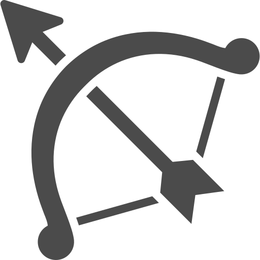

---
link:
  - rel: "stylesheet"
    href: "../css/style.css"
---

<!---->

## ワールド{#world-title .break-verso }

### 世界は滅びました{#world-apocalipus}

5 年前、富士山に隕石が落ちて噴火しました。その 3 日後、日本中に未知の感染症が流行しました。
感染してすぐに発症、高熱を出して意識を失うものでした。
致死率は年齢が高くなるほど高くなり 20 歳で 100%。
意識を失った後、目覚めたのは子供たちだけでした。
維持していた大人たちがいなくなり、インフラは壊滅。あちこちで火災が発生しました。

子供たちは、学校や公民館に集まり、キャンプをしながら生き延びました。
焼け跡からはすぐに芽がでました。それは、見たこともない速度で成長する新種の植物でした。
日本中が森に覆われました。森には、角の生えたうさぎや巨大な昆虫が棲みつき、生態系は一変しました。

変異は動植物に留まらず、人間の幼子にも現れました。大人並に発育した身体を持つ十歳児、生え変わった原色の髪、超能力の発現……その変化は様々でした。

### でも頑張って生きています{world-alive}

現在、人々は集まったキャンプを単位にコミュニティを作り、森に囲まれた中で生きています。食料は保存食を食べ繋いでいましたが、近年は森で捕れる獣の肉も食べています。
キャンプ間は森により遮られ、交流は困難なものとなっています。
電話や TV はもちろん使えず、なんとか電力を確保したキャンプはアマチュア無線や
ラジオ放送で情報を交換しています。
都市にはいくつかのキャンプが合流した大きなコミュニティがあり、
そこがラジオの発信を行なっているようです。

### 冒険者{#world-explorers}

森には、＜フィールド＞と呼ばれる危険地域があり、そこには強力な＜ヌシ＞がいます。5 年のうちに、比較的安全な場所の物資は全て取り尽くしてしまいました。
物資を得るためには、＜フィールド＞に挑まなくてはなりません。
また、交流のあるキャンプ間の森に＜フィールド＞が現れることもあります。
交流を続けるためには、＜ヌシ＞を倒し＜フィールド＞を消滅させる必要があるでしょう。

危険を承知で、＜フィールド＞に挑む者。彼らは今、冒険者と呼ばれています。

## キャンプ{#title-camp}

キャンプでは、生き残っている人々が協力して暮らしています。[オンラインの場合、公開されているキャンプを見ることができます。](https://create-now.vercel.app/lostrpg)

キャンプの作成手順を説明します。

### 1.名前の決定

まず、プレイヤーキャラクター全員が所属するキャンプの名前を決めましょう。近くの公民館や学校をキャンプにするのも、イメージの共有がしやすくておススメです。サイコロを握って[キャンプ名表](./chart.html#campname)を使うのも楽しいでしょう。

### 2.設備・人材の決定

#### 基本の初期設備

初期作成のキャンプには、「雨漏りする屋根」「隙間風の吹く壁」「キノコの生えた寝床」「水場」「小さな倉庫」「生命線の食料庫」という基本の初期設備があります。
キャンプは 5 年の間にぼろぼろになっており、ガタがきているのです。

基本の初期設備の効果をまとめると、以下のようになります。

- 「パーティ全員の【精神力】プラス 7」
- 「パーティ全員の【生命力】プラス 2」
- 「キャンプに 10 個までのアイテムを置いておける」

#### 追加の初期設備

次に 1D6 を振り、さらにそのキャンプにあるものを決定します。[追加設備決定表](./chart.html#camp-equipment_first)を参照してください。

設備はキャンプフェイズに利用できます。

###### 追加設備決定表

| d6  | 名前     | タイプ | 指定特技   | Lv  | 効果                                                                                                          |
| :-: | -------- | ------ | ---------- | :-: | ------------------------------------------------------------------------------------------------------------- |
|  1  | 商人     | 支援   | 《伝える》 |  1  | 指定特技の判定に成功すると、あなたはアイテムを[レベル+3]個まで買うことができる。                              |
|  2  | 先生     | 支援   | 《考える》 |  1  | 指定特技の判定に成功すると、あなたはそのセッションの間、[ランダム](#faq-skill)に特技を 1 つ習得する。         |
|  3  | 歌姫     | 支援   | 《歌う》   |  1  | 指定特技の判定に成功すると、あなたの【気力】が 2D6 点増加する。                                               |
|  4  | 畑       | 支援   | 《作る》   |  3  | 指定特技の判定に成功すると、あなたは[レベル]J を得る。最大レベルに達している場合、食堂の効果にプラス 1 する。 |
|  5  | 太陽電池 | 支援   | なし       |  1  | あなたが所持しているか装備しているアイテムを[レベル]個まで「充電」できる。                                    |
|  6  | お風呂   | 支援   | なし       |  1  | あなたの【精神力】にプラス[レベル]点する。                                                                    |
|  6  | ドラム缶 | -      | -          |  1  | 水などを貯めることができる。                                                                                  |

## キャラクター{#character .break-verso}

プレイヤーはキャンプに暮らす子どもたちの中でも、＜フィールド＞に挑む力のあるキャラクターを演じます。  
危険を冒して森に挑む彼らは、冒険者と呼ばれています。

キャラクターの作成手順を説明します。

### 1. クラスの決定

クラスはキャラクターの才能や立ち位置を表したものです。これを以下の 12 クラスから２つまで選び、キャラクターを作成します。

クラスを１つしか選ばなかった場合、後述のアビリティを１つ余分に取得できます。

|                                                               |    クラス    | 説明                                                                                                                                                                                                                                                             |
| :-----------------------------------------------------------: | :----------: | ---------------------------------------------------------------------------------------------------------------------------------------------------------------------------------------------------------------------------------------------------------------- |
|         |    ビッグ    | 体が大きいことを表すクラス。恵まれた体格を活かしたアビリティを習得できる。チビと同時に選ぶことはできない。                                                                                                                                                       |
|       |     チビ     | 体が小さいことを表すクラス。 小器用な立ち回りを活かしたアビリティを習得できる。 ビッグと同時に選ぶことはできない。                                                                                                                                               |
|       |    オトナ    | オトナの立ち位置であることを表すクラス。 経験に裏打ちされたアビリティを習得できる。 ２０歳以上でなければ取得できない。                                                                                                                                           |
|      | ニューエイジ | ５年前の災害により、変異を起こしたことを表すクラス。 超能力のアビリティを習得できる。 １０歳以下でなければ取得できない。                                                                                                                                         |
|  |   キズモノ   | 消えない傷を受けてしまったことを表すクラス。 その不利を補い生きていくためのアビリティを習得できる。  このクラスを選択した場合、部位ダメージを 1 受けている状態でスタートする。 その「身体部位」を＜キズ＞と呼ぶ。   ＜キズ＞はいかなる手段でも回復しない。 |
|     |    センシ    | 戦闘が得意なことを表すクラス。 戦闘に必要なアビリティを習得できる。                                                                                                                                                                                              |
|       |   スカウト   | 偵察・調査が得意なことを表すクラス。 探索を有利にするアビリティを習得できる。                                                                                                                                                                                    |
|      |   ハンター   | 狩りが得意なことを表すクラス。 飛び道具や罠を用いたアビリティを習得できる。                                                                                                                                                                                      |
|      |    ハカセ    | 物知りであることを表すクラス。 知識を活かしたアビリティを習得できる。                                                                                                                                                                                            |
|    |  ショクニン  | 手先が器用であることを表すクラス。 モノづくりに関するアビリティを習得できる。                                                                                                                                                                                    |
|        |    ホープ    | 皆の希望である表すクラス。 希望を持つことで運命を変えるアビリティを習得できる。                                                                                                                                                                                  |
|        |     ママ     | おかんな立ち位置を表すクラス。 周囲に活力を与えるアビリティを習得できる。                                                                                                                                                                                        |

### 2. 特技の決定{.break-page}

キャラクターの特技を特技表の中から 6 つ選んで決定します。

後述のアビリティによって指定特技が指定されるので、アビリティから先に決定してもよいでしょう。

特技には「身体部位」と「アクション」というカテゴリがあります。どちらも同様に取得できます。

「身体部位」は身体にある様々な場所のことを表し「※心臓」のように表記されます。

「アクション」は身体部位を使って行う様々なことを表しています。

特技は６つの分野に分かれています。縦列が分野となっています。

分野と分野の間の細い空白マスをギャップと呼びます。代用判定（後述）のときには、このマスも数えます。

【アビリティ】の効果で、このギャップを塗りつぶす場合があります。 ギャップを塗りつぶした場合、そのマスは数えないことになります。

通常のキャラクターはギャップを塗りつぶしません。

「特技を修得する」ということは、アクションの場合は「その動作が得意」、身体部位の場合は「その部位が高性能または丈夫」ということです。

### 3. アビリティの決定

アビリティとは、キャラクターがゲーム中に使う技や能力のことです。

キャラクターはアビリティを 3 つ選んで習得します。クラスが１つの場合、さらに 1 つ習得します。

### 4.生命力・体力の決定

| 初期生命力 | 初期設備込みの生命力 | 体力 |
| :--------: | :------------------: | :--: |
|     3      |          5           |  10  |

#### 生命力

【生命力】は後述する【体力】の初期値やセッション中での増加量および【所持限界】に関わる数値です。【生命力】の初期値は 3 点です。ここに、アビリティなどによる修正を加えてください

特にアビリティを取得していない場合、キャンプの初期設備による修正を含めて初期作成のキャラクターの【生命力】は 5 点になります。

#### 体力

【体力】はダメージへの耐久を表す数値です。ダメージを受けることで減少し、【体力】が 0 になると部位ダメージを受ける可能性が発生します。

【体力】に上限はありません。

ゲーム開始時には【生命力】の 2 倍の【体力】を所持しています。

### 5. 精神力・気力の決定{.break-page}

| 初期精神力 | 初期設備込みの精神力 | 気力 |
| :--------: | :------------------: | :--: |
|     3      |          10          |  10  |

#### 精神力

【精神力】は後述する【気力】の初期値やセッション中での増加量に関わる数値です。【精神力】の初期値は 3 点です。ここに、キャンプの設備やアビリティなどによる修正を加えてください。

特にアビリティを取得していない場合、キャンプの初期設備による修正を含めて初期作成のキャラクターの【精神力】は 10 点になります。

#### 気力

【気力】はやる気や心の余裕を表す数値です。 アビリティの使用などで減少し、【気力】が 0 になると『無力化状態』になり行動不能になります。

【気力】に上限はありません。

ゲーム開始時には【精神力】と同じ値の【気力】を所持しています。

### 6.所持限界の決定

所持品、つまり装備せずに持ち運べるアイテムの総重量の最大値を【所持限界】といいます。【所持限界】の初期値は【生命力】と同じ値です。ここにアビリティなどによる修正を加えてください。

特にアビリティを取得していない場合、初期作成のキャラクターの【所持限界】は 5 になります。

### 7.アイテムの購入

アイテムを購入します。現在、通貨は食料でやり取りされています。 通貨単位は一日分の干し肉＝ 1J（ジャーキー）です。 また、10J=1C(缶詰）となっています。

 

キャラクターは初期状態でリュックサック 1 つと 10J を所持しています。最初にこれらを使って買い物します。

買い物で使いきらなかったジャーキーはそのまま所持品となります。ジャーキーも重量 1 なので、【所持限界】を超えていないか注意してください。

 

アイテムは戦闘中以外ならば行動を使うことなく、自由に受け渡しできます。

 

セッション中にアイテムを買うことができる機会があります。その際、既に所持しているアイテムを J 換算して買い物を行えます。 11（例：「価格 3J のほうちょう 3 つと 1J」で「10J の缶詰 1 つ」を買うことができます）

### 8. 名前の決定{.break-page}

キャラクターの名前を決めましょう。

[名前表を使ってランダムに決めることもできます。](./chart.html#table-firstname)

### 9. 性別・年齢の決定

キャラクターの性別は自由に決めることができます。

キャラクターの年齢は 25 歳までです。年齢によって制限のかかるクラスがあります。

### （10.背景の決定）

望むならば [経験表](./chart.html#table-experience)を振り、キャラクターの過去を決定することができます。

 
