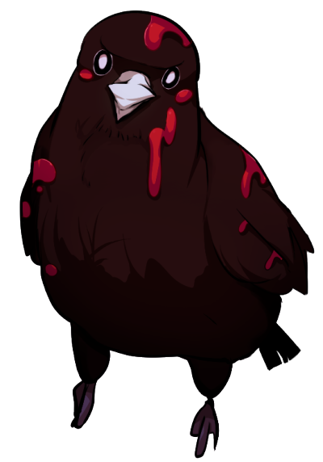
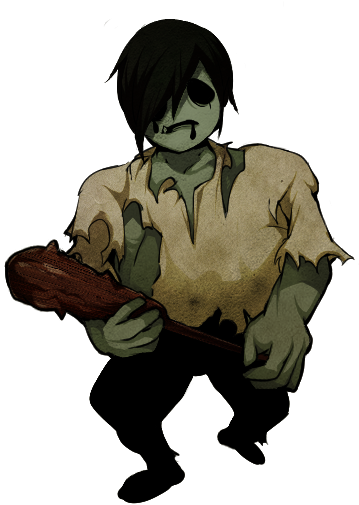
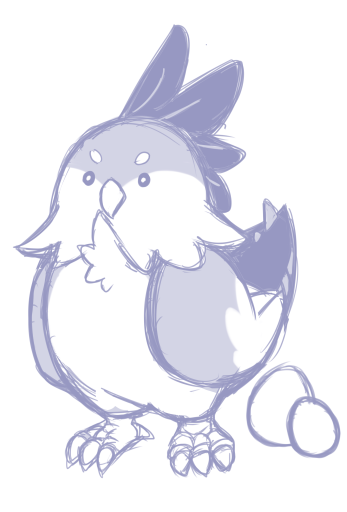

---
link:
  - rel: "stylesheet"
    href: "../css/style.css"
---

<!---->

<section id="check" class="break-verso">

## 行為判定

  
キャラクターが成功するか失敗するか分からない行動をとったときには行為判定を行います。

  <h3 id="check-flow">行為判定の流れ</h3>
  
行為判定は以下の順番で行います。

  <h4>A:指定特技の決定</h4>
  

    行為判定を行う場合、ゲームマスターがその行為判定に使うのにふさわしい特技を選んで決定します。これを《指定特技》といいます。
    アビリティを使用するときの行為判定などは、
    あらかじめルールで特技が指定されています。
  

  <h4>B:特技の確認</h4>
  
プレイヤーは、決定された特技を自分のキャラクターが習得しているかどうかを確認します。

  

    指定された特技を習得していなかった場合、習得している特技の中から、《指定特技》に最も近いものを探します。そして、探し出した特技をスタート地点として
    《指定特技》まで上下左右に何マス離れているか数えて下さい。特技リストの各分野の
    間にあるギャップも1マスと数えます。
    ただし、塗りつぶされているギャップはないものとして扱います。
  

  
こうして、習得している特技で別の特技の判定を行うことを、特技の代用による代用判定といいます。

  <h4>C:目標値の確認</h4>
  
行為判定の目標値を算出します。目標値が高ければ高いほど、その行為判定は難しいことになります。

  

    行為判定の目標値は「5＋習得している特技から《指定特技》までのマス数」です。習得している特技が《指定特技》と同じ場合、マス数は0です。

  <h4>D:サイコロを振る</h4>
  

    目標値の算出が終わったら2D6を振ります。その目が目標値以上であれば、行為判定は成功です。目標値未満の目が出た場合、行為判定は失敗です。

  

    
<code>2D6 ≧ 目標値</code> 成功！

    
<code>2D6 <  目標値 </code> 失敗！

  

  
このようにして行為判定で行動の成功と失敗が決まります。

  
また、行為判定には「修正」「特別な出目」「プレイヤーの提案」という3つの特例があります。

  <h3 id="check-adjusting">修正</h3>
  

    成功しやすい行動や失敗しやすい行動には修正が発生する可能性があります。成功しやすい行動にはプラスの修正がつき、失敗しやすい行動にはマイナスの修正がつきます。

  

    判定に修正がついた場合、2D6の目に修正の値を加えます。2D6に修正を加えた値を達成値と呼びます。

  
達成値が目標値以上の場合、行為判定は成功となります。

  <h3 id="check-special"> 特別な出目</h3>
  

    行為判定で特別な出目を出すと、特殊な状況が発生します。特殊な出目にはファンブルとスペシャルがあります。

  <h4>○ファンブル</h4>
  

    行為判定で2D6の出目が2つとも1だった場合、ファンブルが発生します。ファンブルとは思いもよらぬ大失敗です。
    修正により達成値が目標値以上になったとしても、
    必ず行為判定は失敗になります。
  

  

    命中判定や回避判定でのファンブルでは、さらに<a href="#fumble-attack">ファンブル表</a>を振りその効果を適用します。

  
判定へのマイナス修正によってファンブルが起こることはありません。

  
大失敗からは得るものも多いです。結果フェイズで、[ファンブル回数]点の経験点を得ます。ファンブルの回数はメモしておきましょう。

  <h4 class=" break-page">○スペシャル</h4>
  

    行為判定の2D6の出目が2つとも6だった場合、スペシャルが発生します。スペシャルとは偶然に助けられた素晴らしい成功です。達成値が目標値未満だったとしても、
    必ず行為判定は成功になります。
  

  
スペシャルが発生した場合、【気力】が1D6点増加し、変調が1つ解除されます。

  
命中判定でのスペシャルでは、さらに <a href="#special-attack">命中判定スペシャル表</a> を振りその効果を適用します。

  
判定へのプラス修正によってスペシャルが起こることはありません。

  <caption>命中判定スペシャル表</caption>
  <thead>
    <tr>
      <th>d6 
        <th>説明</th> 
      </th>
    </tr>
  </thead>
  <tr>
    <td>1</td>
    <td>渾身の一撃！ 与えるダメージにプラス1D6されます。</td>
  </tr>
  <tr>
    <td>2</td>
    <td>スキマを直撃！この攻撃によるダメージは軽減されません。</td>
  </tr>
  <tr>
    <td>3</td>
    <td>鋭い太刀筋！ 武器の攻撃力を2倍としてダメージを算出します。</td>
  </tr>
  <tr>
    <td>4</td>
    <td>強力な一撃が相手を揺るがす！ 対象に『転倒』の変調を与えます。</td>
  </tr>
  <tr>
    <td>5</td>
    <td>みなぎる力！【気力】が1D6点増加します。</td>
  </tr>
  <tr>
    <td>6</td>
    <td>チャンス！ あなたは追加行動を得ます。</td>
  </tr>
</table>
  
  <h3 id="check-pl-proposal" class="break-page">プレイヤーの提案</h3>
  
プレイヤーは、ロールプレイによって《指定特技》の変更を提案することができます。

  
プレイヤーは、まずキャラクターが特技をどのように使って技能判定を行うか、具体的に説明します。

  

    ゲームマスターが説明に納得した場合、《指定特技》は変更されます。また説明の内容によっては、修正をいれて判定を行わせることもできます。
    相応しいロールプレイを行い、行為判定の処理を続けてください。
    納得できなかった場合、
    ゲームマスターは提案を拒否することができます。
  

  

    例1：撤退判定を行う時、プレイヤーから周囲に物が多いので《指定特技》を《隠れる》に変更できないか、と提案されました。戦闘が障害物の多い建物で行われていたため、GMは納得し、指定特技の変更を許可します。PCは棚の後ろに隠れ、屈みこんでやり過ごして逃げて行きました。

  

    例2：撤退判定を行う時、プレイヤーから周囲に茂みが多いので《指定特技》を《隠れる》に変更できないか、と提案されました。戦闘が森の中で行われていますが、音の立てやすい茂みに隠れてやり過ごすのは難しいと感じたため、マイナス3の修正で《隠れる》で判定することを許可しました。

  <h3 id="check-when"  class="break-page">判定するときしないとき</h3>
  
ゲームマスターは、セッションが楽しくなるように、判定を行うかどうか判断します。

  <h4>判定するとき</h4>
  <ul> 
    <li>キャラクターが成功するか失敗するか分からない行動をとったとき</li>
    <li>ダイスを振ったほうが盛り上がるとき</li>
  </ul>
  <h4>判定しないとき</h4>
  <ul> 
    <li>キャラクターの行動が確実に成功するとき</li>
    <li>キャラクターの行動が確実に失敗するとき</li>
    <li>キャラクターの行動の成否が問題にならないとき</li>
    <li>ダイスを振っても盛り上がらないとき</li>
  </ul>
</section>

  <section id="session" class="break-verso">
    <hgroup>
      <h1 id="session-title">セッション</h1>
      
一回のゲームのことをセッションと呼びます。

      

        セッションは、いくつかのフェイズに分かれています。
        各フェイズは順番に進行していきます。
      

      <ol>
        <li>キャンプフェイズ</li>
        <li>探索フェイズ</li>
        <li>決戦フェイズ</li>
        <li>結果フェイズ</li>
      </ol>
    </hgroup>
  </section>

<section id="cycle">
  <hgroup>
    <h1 id="session-cycle-title">サイクル</h1>
    

      このゲームでは、セッション中のプレイヤーの行動機会を均等にするために、
      サイクルという概念を使用します。
      基本的に、各プレイヤーは1サイクルに1回、主要な行動を行えます。
      どんな行動ができるかはフェイズによって異なります。仲間と相談したり、
      周囲の様子を確かめたりといった簡単な行動には、回数の制限はありません。
    

    

      サイクル中に行動を行うプレイヤーの順番は、それぞれのフェイズのルールで決めます。
      同じタイミングで行動を行うプレイヤーが複数いる場合には、
      その順番はプレイヤー間で相談して決めます。
    

    
行動はプレイヤー1人ごとに処理します。

    

      全プレイヤーの行動が終了した時に、サイクルは終了します。そして、また新しいサイクルが
      はじまり、プレイヤー全員が1回ずつ主要な行動をとれます。
    

    

    <h3 id="session-cycle-ready-done">未行動と行動済み</h3>
    
サイクル中にキャラクターが行動を終わらせた後の状態のことを、行動済みと呼びます。

    

      行動を終わらせていないキャラクターは未行動という状態です。
      未行動のキャラクターは、そのサイクルにまだ行動をとることができます。
    

    
新しいサイクルが始まった時に、行動済みのキャラクターは全員が未行動になります。

  </hgroup>
</section>

<section id="campF" class="break-page">
  <hgroup>
    <h2 id="campF-title">キャンプフェイズ</h2>
    

      冒険者のキャンプでの行動を処理するフェイズです。
      このフェイズでは事件の発端と探索の準備を行います。
    

    <h3 id="campF-prologue">プロローグ</h3>
    

      キャンプフェイズが始まったら、GMはプロローグの処理を行います。
      ここでは、シナリオの背景や＜フィールド＞へ冒険者たちが向かうための動機を描写します。
      また、探索フェイズが何サイクルで終了するかのリミットを伝えて下さい。
    

    

      主な動機として、物資の調達、他のキャンプへの護衛、迷い込んだ仲間の救出、＜フィールド＞の
      拡大を防ぐなどが考えられるでしょう。
    

    

      シナリオによっては判定や戦闘を行なえます。探索に出るまでの経緯を簡単に説明するだけでもよいです。
    

<h3 id="campF-actions">行動の処理</h3>

プロローグが終了すると、各キャラクターは探索の準備をすることができます。

  行動の処理は1サイクルです。
  各キャラクターは以下の行動から1つ選んで行動の処理を行なって下さい。

<dl>
<dt>散策</dt>
<dd>
2D6を振って、散策表の結果を適用します。
複数人が散策を行い、同じ結果が出た場合、表の効果は重複します。

<table class="chart" id="walking">
<caption>散策表</caption>
<thead>
<tr>
<th>2d6 
<th>結果</th> 
</th>
</tr>
</thead>
<tr>
<td>2</td>
<td>出発前の宴だ！カンパーイ！全員の【体力】が2点増加します。</td>
</tr>
<tr>
<td>3</td>
<td>キャンプの仲間に成長の兆しがみえます。結果フェイズで人材を獲得する際の必要CPが-1されます。</td>
</tr>
<tr>
<td>4</td>
<td>今回の＜ヌシ＞にキャンプの仲間がやられたことがあります。セッション中に一度だけ、＜ヌシ＞へのダメージ決定時にダメージを2点増加させることができます。また、あなたの攻撃で＜ヌシ＞が死亡した場合、あなたは経験点を1点獲得します。ダメージを1点も与えることができなかった場合、あなたの獲得できる経験点は1点減少します。</td>
</tr>
<tr>
<td>5</td>
<td>キャンプに新たな仲間が増えました。名前をつけてあげてと頼まれます。【気力】が2D6点増加します。</td>
</tr>
<tr>
<td>6</td>
<td>子供たちが元気に遊んでいるところに遭遇しました。【気力】が1D6点増加します。</td>
</tr>
<tr>
<td>7</td>
<td>キャンプに食料が足りていないことを相談されます。セッション中に食料を5個手に入れるたび、全員の【気力】が1点増加します。また、10個以上手に入れた場合、全員は経験点を1点獲得します。1つも手に入れられなかった場合、全員の獲得できる経験点が1点減少します。</td>
</tr>
<tr>
<td>8</td>
<td>配給係から食料を多めに準備してもらえました。リミットが1サイクル増加します。</td>
</tr>
<tr>
<td>9</td>
<td>キャンプの奥から掘り出しものが出て来ました。1D6を振り、1、2ならバッテリー、3、4なら1J、5ならほうちょう、6なら缶詰を手に入れます。</td>
</tr>
<tr>
<td>10</td>
<td>他のキャンプから商人がやってきています。結果フェイズで報酬獲得後、任意個のアイテムを取引できます。</td>
</tr>
<tr>
<td>11</td>
<td>キャンプの大工が張りきっています。結果フェイズで獲得する施設の必要CPが-1されます。ただし１未満にはなりません。</td>
</tr>
<tr>
<td>12</td>
<td>嵐の気配。キャンプの補修に使える材料を集めてきて欲しいと頼まれます。結果フェイズに1CPを消費して嵐への備えを行えます。嵐への備えができない場合、キャンプの施設が1つランダムに破壊されます。また、このセッション中、探索フェイズで行える行動に＜資材集め＞が追加されます。＜資材集め＞は支援行動として扱い、《探索》の判定に成功するとCPを1点得ることができます。</td>
</tr>
</table>

</dd>
<dt >施設の利用</dt>
<dd>キャンプにある施設の効果を使用します。</dd>
<dt>人材の利用</dt>
<dd>キャンプにいる人材の効果を使用します。</dd>
<dt>アビリティなどの使用</dt>
<dd>タイプが支援のアビリティやアイテムを使用します。</dd>
<dt>パス</dt>
<dd>特に何もしません。</dd>
</dl>
  </hgroup>
</section>

<section id="exploration" class="break-verso">
  <hgroup>
    <h2 id="exploration-title">探索フェイズ</h2>
    

      探索フェイズは、キャンプから目的の＜フィールド＞に侵入し、
      訪れる場所である＜チェックポイント＞ごとに障害の突破と探索を繰り返すフェイズです。
    

    

      探索フェイズにはリミットが存在し、
      プロローグで伝えられたリミットのサイクルが経過すると終了します。
      冒険者は探索フェイズの終了までに＜チェックポイント＞を辿り、
      ＜ヌシ＞のいる所まで辿り着いてください。
    

    

      探索フェイズの1サイクルは「移動」→「描写」
      →「行動の処理」の順に処理を行います。探索フェイズの1サイクルで経過する時間は
      およそ1日が目安です。GMの任意で1サイクルの時間は自由に調整してかまいません。
    

    
GMは <a href="https://create-now.vercel.app/lostrpg/public/ja/scenario?id=gCEg1GNpTmbkjPwy1g8g" target="_brank">サンプルシナリオ2:嵐の濁流</a>のチャートも参考にしてください。（※PLはネタバレ注意)

<h3 id="exploration-move">移動</h3>

  隣接する＜チェックポイント＞へ移動します。
  ただし、その間に＜障害＞が設置されている＜チェックポイント＞への移動は行えません。

  移動の際には敵の遭遇が発生する可能性があります。
  GMはランダムエンカウント表Aを振り、その結果を適用してください。

  移動はパスすることもできます。その場合ランダムエンカウントは発生しません。
  障害の突破が行えなかったなどの理由で、次の＜チェックポイント＞に向かえない時には移動をパスしてください。

 

<table class="chart" id="table-randomencountA">
<caption>ランダムエンカウント表A</caption>
<thead>
<tr>
<th>d6 
<th>説明</th> 
</th>
</tr>
</thead>
<tr>
<td>1</td>
<td>ツノウサギ[1D6+PT人数]体と戦闘になります。</td>
</tr>
<tr>
<td>2</td>
<td>ナガムカデ[1D3]体と戦闘になります。</td>
</tr>
<tr>
<td>3</td>
<td>ヨロイバチ[PT人数÷2]体と戦闘になります。</td>
</tr>
<tr>
<td>4</td>
<td>ゾンビ[1D6]体と戦闘になります。</td>
</tr>
<tr>
<td>5</td>
<td>オニトンボ[1D6+PT人数]体と戦闘になります。</td>
</tr>
<tr>
<td>6</td>
<td>ランダムエンカウント表Bを振ります。</td>
</tr>
</table>
<table class="chart" id="table-randomencountB">
<caption>ランダムエンカウント表B</caption>
<thead>
<tr>
<th>d6 
<th>説明</th> 
</th>
</tr>
</thead>
<tr>
<td>1</td>
<td>なにもなし</td>
</tr>
<tr>
<td>2</td>
<td>デブドリ[1d6]体と戦闘になります</td>
</tr>
<tr>
<td>3</td>
<td>冒険商人と出会います。1人1つアイテムを買うことができます。</td>
</tr>
<tr>
<td>4</td>
<td>他の冒険者と出くわし、語らいます。全員【気力】が1D6点増加します。</td>
</tr>
<tr>
<td>5</td>
<td>屍を見つけます。ほうちょうを1つ手に入れます。</td>
</tr>
<tr>
<td>6</td>
<td>休憩できる「水場：リミット増加用オブジェクト」を見つけます。全員【体力】が1点増加します。</td>
</tr>
</table>

<h2 id="exploration-view"class="break-page">描写</h2>

  ＜チェックポイント＞の描写を行います。
  ＜チェックポイント＞とは、＜フィールド＞に存在する構造物や地形で、
  冒険者たちが訪れる場所のことです。
  GMは＜チェックポイント＞がどのような場所か、何があるか、道はどちらに続いているか、
  どんな生き物がいるか、などの説明をします。

  その場所にいる生き物によっては戦闘になる可能性もあります。
  また、他の冒険者や行商人などとは交渉が発生する場合もあります。

場所によっては特殊な効果が発生することもあります。例えば、寒い場所なので行為判定マイナス1、花畑なので休憩時【気力】プラス1などです。

風景描写・戦闘・交渉などが終わったら、行動の処理になります。

<h3 id="exploration-actions" class="break-page">行動の処理</h3>

  各キャラクターは以下の行動から１つ選んで、
  行動の処理を行います。

<dl class="table-dl">
  <dt>障害の突破</dt>
  <dd>障害の突破を試みます。</dd>
  <dt>探索</dt>
  <dd>森の探索を行いアイテムを入手します。</dd>
  <dt>休憩</dt>
  <dd>休んで【気力】を増加させます。</dd>
  <dt>支援行動</dt>
  <dd>
    支援タイプのアビリティやアイテムを使用します。
    または、GMが支援行動とみなした行動を行います。
  </dd>
  <dt>オブジェクトへの接触</dt>
  <dd>
    ＜チェックポイント＞にあるオブジェクトに対して行動します。
    オブジェクトとは、木や建物、人物や動物などGMがオブジェクトとして設定したものをいいます。
    オブジェクトへの接触で何が起こるかはGMが決めます。
  </dd>
  <dt>パス</dt>
  <dd>特に何もしません。</dd>
</dl>
<h3 class="break-page" id="exploration-actions-toppa">■障害の突破</h3>
<h4>＜障害＞</h4>

  GMは新たな＜チェックポイント＞へ続く道に任意の数の＜障害＞を設置できます。
  ＜障害＞ごとに突破するための《指定特技》を決定してください。
  同じ＜障害＞を複数設置することも可能です。
  また、2つの道を塞ぐように＜障害＞を設置することも可能です。

<h4>突破</h4>

  冒険者は、＜障害＞に設定された《指定特技》の判定に成功することで、
  障害を1つ突破できます。これを突破判定と呼びます。

  新たな＜チェックポイント＞への道に設置された＜障害＞が全て突破されるまで、
  その＜チェックポイント＞へは移動できません。＜障害＞が全て突破された時、GMは
  道の先の＜チェックポイント＞の簡単な説明をしてください。
  道の先に＜ヌシ＞がいる場合、そのことも伝えて下さい。

<h4>《指定特技》の変更</h4>

  プレイヤーは、突破判定の《指定特技》の変更を提案することができます。
  GMはその提案を聞き、納得した場合、《指定特技》を提案されたものに変更します。

<h3  class="break-page" id="exploration-actions-explorer">■探索</h3>
<h4>アイテムの探索</h4>

2D6を振り、探索表の結果を適用します。

  <table class="chart" id="table-explorer">
    <caption>探索表</caption>
    <thead>
      <tr>
        <th>2d6 
          <th>説明</th> 
        </th>
      </tr>
    </thead>
    <tr>
      <td>2</td>
      <td>侵食がすすまず、そのままキャンプの施設に使えそうな建物を発見する。 問題は、ここまで道が引けるかだが……。《地理/環境2》の判定に成功すると、 現在キャンプにある施設1つのレベルを上げることができる。</td>
    </tr>
    <tr>
      <td>3</td>
      <td>これは、施設の材料に使えるんじゃないか？ 《雑学/技術6》の判定に成功すると、CPを1点得る。</td>
    </tr>
    <tr>
      <td>4</td>
      <td>「シェルター：リミット増加用オブジェクト」を見つける。 ここでは休憩がしやすそうだ。《休む/環境7》の判定に成功すると、休憩表を振ってその効果を適用した上に、【体力】が1点増加する。</td>
    </tr>
    <tr>
      <td>5</td>
      <td>「泉：リミット増加用オブジェクト」をみつける。泉にはかつての民家が水没している。その底にきらり光るものが。 《泳ぐ/脚部2》の判定に成功した場合、1D6をふる。出目が1～3の場合、棍棒を1個手に入れる。4,5の場合、なべぶたを1個手に入れる。 6の場合、なべを1個手に入れる。</td>
    </tr>
    <tr>
      <td>6</td>
      <td>たぶんコカの葉が生えている。 《鑑定/技術4》の判定に成功すると、「コカの葉」を1個手に入れる。 失敗した場合、「なぞの葉」を[1D3]個手に入れる。</td>
    </tr>
    <tr>
      <td>7</td>
      <td>腰掛けるのに丁度いい場所をみつけ、そこから風景を眺めながら仲間1人と語り合う。 1D6を振って話のテーマを決める（1.失った/失いたくないもの、2.キャンプのこと、3.今回の冒険、4.欲しいもの、5.過去、6.恋バナ）。 その後、仲間を1人選び、話をする。話ができたら、あなたは[【生命力】の半分]点、仲間は1点【体力】が増加する。 話が浮かばない場合、《聞く/頭部2》の判定に成功したら、 【体力】を獲得してもよい。</td>
    </tr>
    <tr>
      <td>8</td>
      <td>この辺りは森が茂っている。 キノコ、野草、木の実、ウサギ……《探索/技術3》に成功すると、[1D6]Jを手に入れる。</td>
    </tr>
    <tr>
      <td>9</td>
      <td>探索中、足元が抜ける。部屋の天井が脆くなっているところに落ち葉が積もっていたようだ。 《落ちる/胴部10》の判定に成功すると、うまく着地し部屋の探索を行える。価格3J以下のアイテムを 1個手に入れる。失敗した場合、1点のダメージをうけ、探索している場合ではない。 仲間に助けてもらうこと。</td>
    </tr>
    <tr>
      <td>10</td>
      <td>野鶏クルックコッコをみつける。《歌う/技術12》の判定に成功すると、クルックコッコは 卵を産む。栄養価は満点だ。全員の【体力】が1点増加する。</td>
    </tr>
    <tr>
      <td>11</td>
      <td>崩れてダンジョンのようになった廃屋をみつける。 《探索/技術3》の判定に成功すると、[達成値]J以下のアイテムを1個手に入れる。</td>
    </tr>
    <tr>
      <td>12</td>
      <td>森のざわつく気配。《見つける/頭部4》の判定を行う。 成功すると、＜ヌシ＞を遠目で眺め、来る決戦に身を引き締める。【体力】が【生命力】点増加する。 失敗した場合、あなたと＜ヌシ＞は1ラウンドのみ1対1で戦闘する。</td>
    </tr>
  </table>

<h3  class="break-page" id="exploration-actions-rest">■休憩</h3>

2D6を振り、休憩表の結果を適用します。

  <table class="chart" id="table-rest">
    <caption>休憩表</caption>
    <thead>
      <tr>
        <th>2d6 
          <th>説明</th> 
        </th>
      </tr>
    </thead>
    <tr>
      <td>2</td>
      <td>茂みががさがさとなっている。《隠れる/環境6》の判定に失敗すると、ランダムエンカウント表を振る。成功した場合、【気力】が[【精神力】の半分]点増加する。</td>
    </tr>
    <tr>
      <td>3</td>
      <td>地上に安全なところが見つからない。木の上で休まなければ。《バランス/環境8》の判定に成功すれば、【気力】が3点増加する。失敗した場合、落下して1点のダメージを受ける。「ロープ」があれば、判定の必要なく休むことができる。</td>
    </tr>
    <tr>
      <td>4</td>
      <td>ケモノの声がうるさい。あなた以外の誰か1人を見張りとして選ぶ。見張りが《聴く/頭部2》の判定に成功しないとあなたは休めない。休めた場合、あなたの【気力】が4点増加する。</td>
    </tr>
    <tr>
      <td>5</td>
      <td>今夜はとても冷える。「毛布」か「寝袋」があれば【気力】が3点増加する。「火付け道具」があれば【気力】が3点増加する。</td>
    </tr>
    <tr>
      <td>6</td>
      <td>雨が降ってくる。雨宿りできるものがあるか、《見つける/頭部4》の判定に成功すれば休める。休むと、【気力】が3点増加する。「火付け道具」があれば、さらに【気力】が3点増加する。</td>
    </tr>
    <tr>
      <td>7</td>
      <td>眠れない夜。仲間1人と語り合う。1D6を振って話をテーマを決める（1.悩み、2.将来・夢、3.好きなもの、4.嫌いなもの、5.過去、6.恋バナ）。その後、仲間を1人選び、話をする。話ができたら、あなたは[【精神力】の半分]点、仲間は2点【気力】が増加する。話が浮かばない場合、《伝える/技術11》の判定に成功したら、【気力】を獲得してもよい。</td>
    </tr>
    <tr>
      <td>8</td>
      <td>目が覚めたら、仲間の料理がちょうどできていた。【気力】を3点増加させる。さらに、料理当番として仲間を1人選ぶ。料理当番が《料理/技術10》に成功した場合、全員が2点の【気力】を増加させる。失敗した場合、全員の【気力】が1点減少する。</td>
    </tr>
    <tr>
      <td>9</td>
      <td>仲間と模擬戦をしてから眠りにつく。【気力】が3点増加する。相手として仲間1人を選ぶ。相手が《振る/腕部11》の判定に成功すると、次の戦闘であなたの与えるダメージが1点増加する。</td>
    </tr>
    <tr>
      <td>10</td>
      <td>あなたは泥のように深く眠る。【気力】が[【精神力】の半分]点増加する。眠ったあなたの荷物を狙ってネズミリスがやってくる。仲間を1人選ぶ。選ばれた仲間は《反応/頭部5》の判定を行う。成功すると1Jを得る。失敗した場合、あなたの所持品が1つランダムに失われる。</td>
    </tr>
    <tr>
      <td>11</td>
      <td>野営に最適な場所を見つけ、気持ちよく寝ることができる。【気力】が[【精神力】の半分]点と【体力】が1点増加する。そして幸せだった時代の夢をみる。あなたは幸せそうなシチュエーションを考え、仲間やGMに伝える。その夢が、幸せそうだと感じる者がいたら、さらに【気力】が3点増加する。</td>
    </tr>
    <tr>
      <td>12</td>
      <td>森のざわつく気配。《予感/頭部9》の判定を行う。成功すると、＜ヌシ＞を遠目で眺め、来る決戦に身を引き締める。【気力】が【精神力】点増加する。失敗した場合、あなたと＜ヌシ＞は1ラウンドのみ1対1で戦闘する。</td>
    </tr>
  </table>

<h3 id="exploration-actions-use-ability" class="break-page">■アビリティなどの使用</h3>

支援タイプのアビリティやアイテムを使用できます。

<h3 id="exploration-actions-touch-object">■オブジェクトへの接触</h3>

  オブジェクトを調べたり、会話したりできます。GMは判定が必要な場合、《指定特技》を決定し、
  成功したら何が起こるか決めておいてください。

例1：オブジェクトの行商人から買い物を行う。

例2：オブジェクトの果物の木から収穫する。指定特技は《掴む/腕部7》で成功すると果物(2J)を得る。

例3：オブジェクトの商店街を探索する。1D6を振って商店街探索表を参照する。「1:何もなし/2,3:食料発見(1J)/4,5:嗜好品/6:好みのおもちゃ発見(気力+3)」

<h3 id="exploration-pass">■パス</h3>

なにもしません

<h2 id="exploration-limit" class="break-verso">リミット</h2>

  探索フェイズのサイクル数にはリミットが定められています。これは、冒険者たちが所持している
  食料の残量や疲労による探索の限界を表しています。リミットであるサイクルが終了するまでに、
  ＜ヌシ＞のいる場所への＜障害＞を突破できていない場合、セッションは失敗となります。

  リミットのサイクル数は、[＜チェックポイント＞の数+1]程度が目安です。
  キャラクターの人数や＜障害＞の数で増減してください。

<h3 id="exploration-limit-add">リミットの増加</h3>

  GMは＜チェックポイント＞に、「水場」や「シェルター」など安全に休めそうなオブジェクトを「リミット増加用オブジェクト」として設置できます。
  リミット増加用オブジェクトがある場合、
  人数分の食料を消費し、誰か1人が指定特技《休む／環境7》の判定に成功することでリミットを1増加させることができます。

  リミットの増加は試みる度にマイナス[リミットの増加を試みた回数]の
  修正がはいります。最初の挑戦なら修正なし、
  2回めにはマイナス1、3回めはマイナス2…のようになります。

リミットの増加は割込み行動として1サイクルに1度行うことができ、試みても行動済みとなりません。

  </hgroup>

  

</section>

<section id="battle">
<hgroup>
<h2  class="break-verso"  id="h1-battle">戦闘</h2>

  戦闘では、サイクルの代わりにラウンドという単位を使用します。
  プレイヤーの行動順は、先制判定で決めます。

<h3 id="battle-round">1.ラウンドの流れ</h3>

戦闘のラウンドは、以下のA～Eの順番に処理します。

<ul>
  <li>A:先制判定</li>
  <li>B:冒険者の行動（先攻）</li>
  <li>C:敵の行動</li>
  <li>D:冒険者の行動（後攻）</li>
  <li>E:追加行動</li>
</ul>
<h3 id="battle-initiative">2.先制判定</h3>

  各プレイヤーは、キャラクターがラウンドのどのタイミングで行動を行うか決定するため、先制判定と呼ばれる行為判定を行います。
  先制判定の《指定特技》は、以下の表で決定されます。

 

<figure>
  <table class="chart float-left" id="table-initiative" style="margin-right: 2mm">
    <caption>先制判定指定特技表</caption>
    <thead>
      <tr>
        <th>d6 
          <th>説明</th> 
        </th>
      </tr>
    </thead>
    <tr>
      <td>1</td>
      <td>《反応／頭部5》</td>
    </tr>
    <tr>
      <td>2</td>
      <td>《予感／頭部9》</td>
    </tr>
    <tr>
      <td>3</td>
      <td>《動かない／胴部5》</td>
    </tr>
    <tr>
      <td>4</td>
      <td>《走る／脚部3》</td>
    </tr>
    <tr>
      <td>5</td>
      <td>《隠れる／環境6》</td>
    </tr>
    <tr>
      <td>6</td>
      <td>《追い込む／環境10》</td>
    </tr>
  </table>
</figure>

  先制判定に成功した場合は「冒険者の行動（先攻）」、失敗した場合は「冒険者の行動（後攻）」のタイミングで行動を行います。

先攻もしくは後攻での行動のタイミング内での行動順は自由です。

<h3 id="battle-action">3.冒険者の行動</h3>

各プレイヤーのキャラクターは、ラウンドごとに以下の行動のうち一つを行います。

<dl>
  <dt>攻撃</dt>
  <dd>
    

      習得している攻撃タイプのアビリティから一つを選び、目標を選びます。
      または、アイテムの武器を使用して同様に目標を選びます。
      アビリティまたは武器の《指定特技》の行為判定に成功すると、その効果が目標に適用されます。
      この判定を命中判定ともいいます。
    

    
命中判定でスペシャル/ファンブルをした場合、<a href="#battle-special">スペシャル表/ファンブル表</a>を振って効果を適用します。

  </dd>
  <dt>連携攻撃</dt>
  <dd>
    

      自分以外の冒険者を1体目標とし、可能なら自分の補助タイプのアビリティから1つ選択します。
      判定は必要ありません。目標は次に行う攻撃に、選択されたアビリティを組み合わせられます。
    

    

      連携攻撃に寄って組み合わされたアビリティは、「行為判定に組み合わせられる補助タイプのアビリティは一つだけ」
      というルールの例外として扱います。組み合わせるアビリティの反動は、連携攻撃を行うキャラクターが連携攻撃を宣言したときに受けます。
    

    
連携攻撃の効果はラウンド終了時に失われます。

  </dd>
  <dt>支援行動</dt>
  <dd>
    取得している支援タイプのアビリティかアイテムを使用します。
    また、GMが支援行動とした行動ができます。
  </dd>
  <dt>撤退</dt>
  <dd> 
    
指定特技《逃げる／環境11》の判定に成功すると戦闘から撤退できます。

    
拡張ルール：<a href="supplement-strange-fields.html#escape">撤退の指定特技をランダムにする</a>

  </dd>
  <dt>武器の装備</dt>
  <dd>所持品にある武器を装備状態にできます。</dd>
  <dt>アイテムの受け渡し</dt>
  <dd>アイテムを1つ、味方1人に渡すか受け取れます。</dd>
  <dt>アイテムの取り出し</dt>
  <dd>アイテムを1つ、袋の中から取り出すか、袋の中に入れます。</dd>
  <dt>パス</dt>
  <dd>何もせず行動済みとなります。</dd>
</dl>

<h4 class="break-page"></h4>

<h3 class="break-verso" id="battle-damage">4.ダメージと部位ダメージ</h3>

  攻撃によってダメージが発生する際、
  【体力】が0でない場合、ダメージ分の【体力】を減少させます。
  これによって【体力】が0未満になる場合や、既に【体力】が0のときにダメージを受けた場合、部位ダメージが発生し、【体力】は0となります。

  部位ダメージが発生した場合、身体部位決定表を振り、その攻撃が命中した部位を決定します。
  既にダメージを受けている部位が出たら振り直しです。

  <table class="chart" id="table-hitarea">
    <caption>身体部位決定表</caption>
    <thead>
      <tr>
        <th>2d6 
          <th>説明</th> 
        </th>
      </tr>
    </thead>
    <tr>
      <td>2</td>
      <td>《脳／頭部7》</td>
    </tr>
    <tr>
      <td>3</td>
      <td>《利き腕／腕部5》</td>
    </tr>
    <tr>
      <td>4</td>
      <td>《利き足／脚部5》</td>
    </tr>
    <tr>
      <td>5</td>
      <td>《消化器／胴部11》</td>
    </tr>
    <tr>
      <td>6</td>
      <td>《感覚器／頭部3》</td>
    </tr>
    <tr>
      <td>7</td>
      <td>攻撃したキャラクターの任意</td>
    </tr>
    <tr>
      <td>8</td>
      <td>《口／頭部11》</td>
    </tr>
    <tr>
      <td>9</td>
      <td>《呼吸器／胴部3》</td>
    </tr>
    <tr>
      <td>10</td>
      <td>《逆足／脚部9》</td>
    </tr>
    <tr>
      <td>11</td>
      <td>《逆腕／腕部9》</td>
    </tr>
    <tr>
      <td>12</td>
      <td>《心臓／胴部7》</td>
    </tr>
  </table>

  部位ダメージを受けた「身体部位」は使用不能になり、
  行為判定に使用できなくなります。
  さらに、部位ダメージが入った「身体部位」に隣接する周囲8マスにある特技も使用不能になります。
  この時、ギャップは無視します。

#### ダメージ例

逆腕に部位ダメージが入った例です。
この場合、習得している《逸らす》が使用不能になります。

<h3 class="break-page" id="battle-damage-dead">4.1.死亡</h3>
<h4>死亡判定</h4>

  戦闘によって部位ダメージを受けた場合、死亡判定を行います。
  1D6を振り、受けている部位ダメージの数を超える出目をだせば成功です。
  部位ダメージ数以下の出目の場合、死亡判定失敗となり死亡します。

<h4>武器破壊</h4>

死亡判定を行う前に、装備している武器を1つ破壊すると宣言することで死亡判定をキャンセルできます。

<h4>【気力】を振り絞る</h4>

  死亡判定のダイスを振った後、
  任意の点数の【気力】を消費してその分だけ出目にプラスの修正を与えられます。

『本気状態』（後述）の＜ヌシ＞はこの行動を行えません。

<h3 id="battle-damage-dead-enemies">4.2.敵の死亡</h3>

＜ヌシ＞は冒険者と同じように【体力】が0になった後、死亡判定を行います。

  ＜ヌシ＞以外の敵は、【体力】が0になったら死亡します。
  GMは、死亡の代わりに『無力化状態』になることにしてもかまいません。

  <h3 id="battle-neutralization" class="break-page">5.無力化状態</h3>
  

    【気力】が0となり、戦闘終了まで全ての行動を行えなくなります。
    戦闘終了後、『無力化状態』は解除されます。
    『無力化状態』が解除されたとき、【気力】の値は1となります。
    また、なんらかの要因で【気力】が1以上になった場合、この『無力化状態』は解除されます。
    無力化状態のキャラクターは常に行動済み状態です。
  

  
「先制判定」など行動を消費しない判定は行うことができます。

  

    戦闘中以外で無力化状態となった場合、行動解決後、
    気力1となって無力化状態が解除されます。
  

<h3 id="battle-enemy" class="break-page">6.敵の行動</h3>

敵も冒険者と同じように行動します。

<dl>
  <dt>攻撃</dt>
  <dd>
    冒険者の行動と同様です。
    ＜ヌシ＞は判定に組み合わせられる補助アビリティの数が、レベルにより増加します。
  </dd>
  <dt>支援</dt>
  <dd>冒険者の行動と同様です。</dd>
  <dt>本気を出す</dt>
  <dd>
    これは＜ヌシ＞のみが行うことのできる行動です。
    ＜ヌシ＞の【気力】が[半分以下]の状態ならいつでも宣言でき、宣言しても行動済みになりません。
    この宣言を行った瞬間から＜ヌシ＞は『本気状態』となります。
    通常状態から『本気状態』となったラウンドに＜ヌシ＞は追加行動を一回得ます。
    『本気状態』では、＜ヌシ＞は以下の状態となります。
    <ul>
      <li>全ての【アビリティ】の反動が0になる</li>
      <li>「回避判定」にマイナス2の修正がつく</li>
      <li>死亡判定に【気力】を消費できない</li>
    </ul>
  </dd>
  <dt>復活</dt>
  <dd>
    ＜ヌシ＞が『無力化状態』の時、1ラウンドに1回宣言できる割込み行動です。
    《叫ぶ》の判定に成功した場合、自身の【気力】が1点となります。
    この行動は『無力化状態』でも特別に行うことが出来ます。
  </dd>
  <dt>パス</dt>
  <dd>冒険者の行動と同様です。</dd>
</dl>

<h3 id="battle-dodge">7.回避</h3>

冒険者と敵は、【気力】を1点消費することで攻撃に対して回避を行うことができます。

  回避は命中判定が成功し、ダメージを決定した後で行います。
  部位ダメージが入るダメージの場合、命中した部位を決定した後に回避を行うことができます。

  攻撃目標は、命中判定の《指定特技》を、回避するための《指定特技》とした行為判定を行います。
  回避判定の目標値は通常の行為判定と異なり、「<b>【命中判定の達成値】＋習得している特技から《指定特技》までのマス数</b>」となります。
    命中判定がスペシャルの場合、回避判定でスペシャルをだすことでのみ回避できます。

  
この判定に成功すると、攻撃は失敗となり、攻撃に付随する全ての効果が無効化されます。この判定を回避判定と呼びます。

  

    一度の攻撃に対して、回避は一度だけ可能です。
  

  
回避判定でファンブルした場合、<a href="#battle-special">ファンブル表</a>を振って効果を適用します。

  <h3 id="battle-secondaction" class="break-page">8.追加行動</h3>
  

    ＜ヌシ＞は特定の条件でラウンドの行動回数が増えることがあります。
    これを追加行動と呼びます。
    追加行動は冒険者の行動（後攻）が終わった後に行われます。
  

  

    まれに冒険者が追加行動を行うこともあります。このときも冒険者の行動（後攻）のあとに追加行動を行いますが、
    ＜ヌシ＞の追加行動より早いか遅いかは、そのラウンドの先制判定の結果によります。
  

  

    1ラウンド中にアビリティ【習性】の条件を何度も満たしたり、スペシャル表により、同じキャラクターが追加行動を複数回得ることがあります。
    その場合は追加行動が複数回発生します。
  

  <h3 id="battle-special">9.戦闘中のスペシャルやファンブル</h3>
  

    戦闘中に、命中判定でスペシャルを発生させた場合、通常の効果に加えて、
    スペシャル表を振りその効果を適用します。
    逆にファンブルを発生させた場合、命中ファンブル表を振りその結果を適用します。
    回避判定でファンブルを発生させた場合、回避ファンブル表を振りその結果を適用します。
  

<table class="chart break-page" id="special-attack">
  <caption>命中判定スペシャル表
    <thead>
      <tr>
        <th>d6 
          <th>説明</th> 
        </th>
      </tr>
    </thead>
    <tr>
      <td>1</td>
      <td>渾身の一撃！ 与えるダメージにプラス1D6される。</td>
    </tr>
    <tr>
      <td>2</td>
      <td>スキマを直撃！この攻撃によるダメージは軽減されない。</td>
    </tr>
    <tr>
      <td>3</td>
      <td>鋭い太刀筋！ 武器の攻撃力を2倍としてダメージを算出する。</td>
    </tr>
    <tr>
      <td>4</td>
      <td>強力な一撃が相手を揺るがす！ 対象に『転倒』の変調を与える。</td>
    </tr>
    <tr>
      <td>5</td>
      <td>みなぎる力！【気力】が1D6点増加する。</td>
    </tr>
    <tr>
      <td>6</td>
      <td>チャンス！ あなたは追加行動を得る。</td>
    </tr>
  </caption>
</table>
<table class="chart" id="fumble-attack">
  <caption>命中判定ファンブル表</caption>
  <thead>
    <tr>
      <th>d6 
        <th>説明</th> 
      </th>
    </tr>
  </thead>
  <tr>
    <td>1</td>
    <td>何を間違えたか、攻撃が自分に命中する。</td>
  </tr>
  <tr>
    <td>2</td>
    <td>おおっと！ 武器を落とす。 落とした武器は支援行動で拾って装備できる。</td>
  </tr>
  <tr>
    <td>3</td>
    <td>嫌な音が！ 装備している武器が壊れてしまう。武器がない場合は軽減不可の2点のダメージを受ける。</td>
  </tr>
  <tr>
    <td>4</td>
    <td>すってん！『転倒』の変調を受ける。</td>
  </tr>
  <tr>
    <td>5</td>
    <td>……。【気力】が1D6点減少する。</td>
  </tr>
  <tr>
    <td>6</td>
    <td>ヤツは！？ 相手の一体が追加行動を得る。 誰が動くかは相手が選ぶ。</td>
  </tr>
</table>
<table class="chart" id="fumble-dodge">
  <caption>回避判定ファンブル表</caption>
  <thead>
    <tr>
      <th>d6 
        <th>説明</th> 
      </th>
    </tr>
  </thead>
  <tr>
    <td>1</td>
    <td>痛恨！ 受けるダメージにプラス1D6される。</td>
  </tr>
  <tr>
    <td>2</td>
    <td>おおっと！ 隙間を抜けて命中します。この攻撃によるダメージは軽減できない。</td>
  </tr>
  <tr>
    <td>3</td>
    <td>嫌な音が！ 装備している防具が1つ壊れてしまいます。防具がない場合は軽減不可の2点のダメージを受ける。</td>
  </tr>
  <tr>
    <td>4</td>
    <td>すってん！『転倒』の変調を受ける。</td>
  </tr>
  <tr>
    <td>5</td>
    <td>……。【気力】が1D6点減少する。</td>
  </tr>
  <tr>
    <td>6</td>
    <td>ヤツは！？ 相手の一体が追加行動を得る。 誰が動くかは相手が選ぶ。</td>
  </tr>
</table>
  
  <h3 id="badstatus">10.変調</h3>
  

    キャラクターはアビリティの効果やアイテムなどによって、変調という特殊な効果をうけることがあります。
    変調は、戦闘が終了すれば解除されます。
    スペシャル、アイテム、アビリティの効果などでも解除されます。
  

  
同名の変調を受けることはありません。

  
<dl>
  <dt>毒
    <dd>ラウンド終了時に【体力】が1D6点減少します。 部位ダメージは発生しません。</dd>
  </dt>
  <dt>炎上
    <dd>ラウンド終了時に【体力】と【気力】が1点減少します。</dd>
  </dt>
  <dt>麻痺
    <dd>全ての行為判定の達成値にマイナス1の修正がつきます。</dd>
  </dt>
  <dt>捕縛
    <dd>命中判定の達成値にマイナス1の修正がつきます。</dd>
  </dt>
  <dt>転倒
    <dd>回避判定の達成値にマイナス2の修正がつきます。</dd>
  </dt>
  <dt>重傷
    <dd>死亡判定にマイナス1の修正がつきます。</dd>
  </dt>
  <dt>暴露
    <dd>キャラクターのデータが公開されます。また、攻撃により受けるダメージが 1点増加します。</dd>
  </dt>
</dl>

  </hgroup>
</section>

  <section id="lastbattle">
    <hgroup>
      <h1 class="break-verso" id="h1-lastbattle">決戦フェイズ</h1>
      <h2 id="h2-lastbattle-move">移動</h2>
      

        ＜ヌシ＞のいる場所への＜障害＞を突破している場合、
        リミットであるサイクルが終わると＜ヌシ＞のいる＜チェックポイント＞へと移動し、
        決戦フェイズになります。
        また、リミット前でも＜ヌシ＞のいる＜チェックポイント＞へ
        移動すれば決戦フェイズになります。
      

      
シナリオに特記がない限り、この移動でもランダムエンカウントは発生します。

      <h2 id="h2-lastbattle-view">描写</h2>
      

        決戦フェイズでは、GMはまず＜ヌシ＞のいる場所の風景描写、
        そして＜ヌシ＞の描写を行なって下さい。
      

      <h2 id="h2-lastbattle-battle">ヌシとの戦闘</h2>
      

        描写が終了したら、＜ヌシ＞との戦闘になります。
        強力なチカラをもつヌシと冒険者たちとの死闘がはじまります。
      

    </hgroup>

  </section>

  <section id="ending" class="break-verso" >
    <hgroup>
      <h1 id="ending-title">結果フェイズ</h1>
      <h2 id="endig-view">終幕シーン</h2>
      
このフェイズでは、＜ヌシ＞との戦いのすえ、どんな結末を迎えたかを描写します。

      

        物資を求めに行ったのならば、＜フィールド＞が解除された森にキャンプの皆で調達に入り、
        収穫祭をひらき、冒険者たちを称えるでしょう。
      

      <h2 id="endig-get-reward">報酬の獲得</h2>
      

        解放された＜フィールド＞に残されていた手付かずの物資を、キャンプの皆と分け合います。
        冒険者たちは、解放の主役としてその物資を最初に手に入れる権利があります。
        「冒険者1人につき、[＜ヌシ＞のレベル×3]J以下の好きなアイテムを1つ手に入れる」
        程度が目安です。
        GMは状況によって増やしてもいいですし、キャンプの施設の増加などの報酬を与えてもかまいません。
      

      <h2 id="camp-improve">キャンプの成長</h2>
      

        キャンプは[＜ヌシ＞のレベル]点のCP（キャンプポイント）を手に入れます。
        これを使ってキャンプの施設や人材を増やしたりレベルをあげることができます。
        以降、施設と人材をあわせて設備といいます。
      

      

        CPのある限り、設備はいくらでも入手することができます。
        余ったCPは次回以降に繰越しとなります。
      

## 称号の入手{#ending-get-trophy}

「称号」とは、冒険者がどんな振る舞いをしていたかで獲得するものです。「アビリティの習得」で経験点を消費して、称号アビリティが習得できるようになります。

「称号の入手」では、生き残った冒険者ごとに、今回の冒険の振る舞いを振り返ります。
各プレイヤーの、パーティメンバーのメモ欄を順番に確認していき、ふさわしい称号を称号表から、相談あるいは多数決で 1 つ決定します。票が割れた時はそのキャラクターのプレイヤーが選ぶとよいでしょう。

<table class="responsive" id="trophy">
  <caption>称号表</caption>
  <thead>
    <tr>
      <th>名前
        <th>説明</th>
      </th>
    </tr>
  </thead>
  <tr>
    <td class="txt-center">パッション</td>
    <td data-title="説明">元気に熱くフィールドに向かっていったもの</td>
  </tr>
  <tr>
    <td class="txt-center">クール</td>
    <td data-title="説明">冷静に物事を見つめていたもの</td>
  </tr>
  <tr>
    <td class="txt-center">ピンク</td>
    <td data-title="説明">甘い雰囲気や恋をしていたもの</td>
  </tr>
  <tr>
    <td class="txt-center">癒し</td>
    <td data-title="説明">のんびり皆を和ませていたもの</td>
  </tr>
  <tr>
    <td class="txt-center">スター</td>
    <td data-title="説明">大きな活躍をしたもの</td>
  </tr>
  <tr>
    <td class="txt-center">ハシラ</td>
    <td data-title="説明">堅実に皆を支えていたもの</td>
  </tr>
  <tr>
    <td class="txt-center">サムライ</td>
    <td data-title="説明">戦闘で活躍したもの</td>
  </tr>
  <tr>
    <td class="txt-center">シノビ</td>
    <td data-title="説明">探索で活躍したもの</td>
  </tr>
  <tr>
    <td class="txt-center">ボケ</td>
    <td data-title="説明">笑いで盛り上げたもの</td>
  </tr>
  <tr>
    <td class="txt-center">ツッコミ</td>
    <td data-title="説明">ボケに流されず軌道修正をきちんとしたもの</td>
  </tr>
  <tr>
    <td class="txt-center">グンシ</td>
    <td data-title="説明">支援や閃きなどでうまく他人をサポートしたもの</td>
  </tr>
</table>

  <h2 id="ending-get-exp" class="break-page">経験値の獲得</h2>
  

    経験値は生き残った冒険者ごとに与えられます。
    経験値は以下の項目の条件を満たすことにより獲得できます。
  

  <ol>
    <li>生き残った！(3点)</li>
    <li>キャンプに希望を与えた(1点)</li>
    <li>失敗を糧にした(ファンブル1回につき1点)</li>
    <li>＜ヌシ＞を倒した(ヌシのレベル点)</li>
    <li>＜チェックポイント＞を訪れた（1箇所につき1点)</li>
    <li>障害を突破した(1つにつき1点)</li>
    <li>リミットよりも早く終わった（1サイクル早いごとに1点）</li>
    <li>よいロールプレイをした(1点)</li>
    <li>他の人を助けた(1点)</li>
    <li>セッションの進行を助けた(1点)</li>
  </ol>
</hgroup>

  </section>

<section id="afterplay">
  <hgroup>
    <h1 id="afterplay-title">セッション終了後</h1>  セッションが終了すると、キャラクターは以下の効果を受けます。
    <ul>
      <li>【体力】が「【生命力】×2」になる。</li>
      <li>【気力】が「【精神力】」になる。</li>
      <li>受けている部位ダメージが全て回復する。（キズモノの＜キズ＞は回復しない）</li>
      <li>（任意）《特技》の組み換え。（習得している特技を未習得にし、別の特技を習得する）</li>
      <li>（任意）【アビリティ】の組み換え。（習得しているアビリティを未習得にし、別のアビリティを習得する）</li>
    </ul>
  </hgroup>
</section>

<section id="improve">
  <hgroup>
    <h1 id="improve-title">キャラクターの成長</h1>
    

      冒険者はセッションを通して成長していきます。獲得した経験点を消費して成長することができます。
      使用しなかった経験点は次回以降に持ち越すことができます。
    

    <dl>
      <dt>特技の習得（15点）</dt>
      <dd>新たな《特技》を１つ習得します。</dd>
      <dt>アビリティの習得（15点）</dt>
      <dd>
        

汎用グループ、自身のクラスグループ、称号グループから選び、
        新たな【アビリティ】を１つ習得します。
      </dd>
      <dt>精神力の上昇（10点）</dt>
      <dd>精神力が1点上昇します。</dd>
      <dt>生命力の上昇（20点）</dt>
      <dd>生命力が1点上昇します。</dd>
      <dt>クラスの取得（30点）</dt>
      <dd>
        新たなクラスを１つ取得し、取得したクラスグループの【アビリティ】を1つ習得します。
        1人のキャラクターが取得できるクラスは3つまでです。
      </dd>
    </dl>
  </hgroup>
</section>
