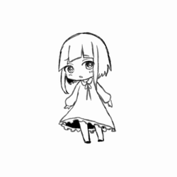

---
link:
  - rel: "stylesheet"
    href: "../css/style.css"
---

## はじめに {.break-verso}

大人たちは死に絶えた。子どもたちは残された。

日本中を森が覆い、異形の獣たちが我が物顔で闊歩する。

 

変わり果てた世界。

 

その中で、彼らは生きることを選択した。

自分たちだけのサバイバル。

 
 

――これは、文明崩壊から５年後の物語。

  

本ゲームは、文明崩壊後の日本を生き延びる人々を演じるゲームです。

プレイヤーの分身であるキャラクター（以下、PC)は、 物資を求めて危険な森を探索する冒険者となります。

### このルールの読み方

### かっこの種類

- 【】：キャラクターの能力値やアビリティを表します。
- 《》：特技を表します。
- ＜＞：このゲームで使われる固有名詞を表します。

### 端数の処理

このゲームでは、割り算を行う場合常に端数は切り上げになります。

### 用語

<dl>
<dt>ゲームマスター(GM)</dt>
<dd>ゲームを遊ぶ時の進行役です。ゲームを遊ぶときは、本ルールよりもGMの裁定が最優先となります。</dd>
<dt>プレイヤー(PL)</dt>
<dd>GMと一緒にゲームを遊ぶ人です。本ゲームの目的は、参加者全員が楽しいときを過ごすことです。</dd>
</dl>

<!---->

## 目次{ .break-verso }

<nav id="toc" role="doc-toc">

- <a class="toc-chapter" href="#world-title">ワールド</a>
- <a class="toc-chapter" href="#title-camp">キャンプ</a>
- <a class="toc-chapter" href="#character">キャラクター</a>
  - <a class="toc-section" href="#ability">アビリティ</a>
  - <a class="toc-section" href="#items">アイテム</a>
- <a class="toc-chapter" href="#check">行為判定</a>
- <a class="toc-chapter" href="#session">セッション</a>
- <a class="toc-chapter" href="#FAQ">FAQ</a>
- <a class="toc-chapter" href="#sankou">参考作品</a>

</nav>
<!---->

## ワールド{#world-title .break-verso }

### 世界は滅びました{#world-apocalipus}

5 年前、富士山に隕石が落ちて噴火しました。その 3 日後、日本中に未知の感染症が流行しました。
感染してすぐに発症、高熱を出して意識を失うものでした。
致死率は年齢が高くなるほど高くなり 20 歳で 100%。
意識を失った後、目覚めたのは子供たちだけでした。
維持していた大人たちがいなくなり、インフラは壊滅。あちこちで火災が発生しました。

子供たちは、学校や公民館に集まり、キャンプをしながら生き延びました。
焼け跡からはすぐに芽がでました。それは、見たこともない速度で成長する新種の植物でした。
日本中が森に覆われました。森には、角の生えたうさぎや巨大な昆虫が棲みつき、生態系は一変しました。

変異は動植物に留まらず、人間の幼子にも現れました。大人並に発育した身体を持つ十歳児、生え変わった原色の髪、超能力の発現……その変化は様々でした。

### でも頑張って生きています{world-alive}

現在、人々は集まったキャンプを単位にコミュニティを作り、森に囲まれた中で生きています。食料は保存食を食べ繋いでいましたが、近年は森で捕れる獣の肉も食べています。
キャンプ間は森により遮られ、交流は困難なものとなっています。
電話や TV はもちろん使えず、なんとか電力を確保したキャンプはアマチュア無線や
ラジオ放送で情報を交換しています。
都市にはいくつかのキャンプが合流した大きなコミュニティがあり、
そこがラジオの発信を行なっているようです。

### 冒険者{#world-explorers}

森には、＜フィールド＞と呼ばれる危険地域があり、そこには強力な＜ヌシ＞がいます。5 年のうちに、比較的安全な場所の物資は全て取り尽くしてしまいました。
物資を得るためには、＜フィールド＞に挑まなくてはなりません。
また、交流のあるキャンプ間の森に＜フィールド＞が現れることもあります。
交流を続けるためには、＜ヌシ＞を倒し＜フィールド＞を消滅させる必要があるでしょう。

危険を承知で、＜フィールド＞に挑む者。彼らは今、冒険者と呼ばれています。

## キャンプ{#title-camp}

キャンプでは、生き残っている人々が協力して暮らしています。[オンラインの場合、公開されているキャンプを見ることができます。](https://create-now.vercel.app/lostrpg)

キャンプの作成手順を説明します。

### 1.名前の決定

まず、プレイヤーキャラクター全員が所属するキャンプの名前を決めましょう。近くの公民館や学校をキャンプにするのも、イメージの共有がしやすくておススメです。サイコロを握って[キャンプ名表](./chart.html#campname)を使うのも楽しいでしょう。

### 2.設備・人材の決定

#### 基本の初期設備

初期作成のキャンプには、「雨漏りする屋根」「隙間風の吹く壁」「キノコの生えた寝床」「水場」「小さな倉庫」「生命線の食料庫」という基本の初期設備があります。
キャンプは 5 年の間にぼろぼろになっており、ガタがきているのです。

基本の初期設備の効果をまとめると、以下のようになります。

- 「パーティ全員の【精神力】プラス 7」
- 「パーティ全員の【生命力】プラス 2」
- 「キャンプに 10 個までのアイテムを置いておける」

#### 追加の初期設備

次に 1D6 を振り、さらにそのキャンプにあるものを決定します。[追加設備決定表](./chart.html#camp-equipment_first)を参照してください。

設備はキャンプフェイズに利用できます。

###### 追加設備決定表

| d6  | 名前     | タイプ | 指定特技   | Lv  | 効果                                                                                                          |
| :-: | -------- | ------ | ---------- | :-: | ------------------------------------------------------------------------------------------------------------- |
|  1  | 商人     | 支援   | 《伝える》 |  1  | 指定特技の判定に成功すると、あなたはアイテムを[レベル+3]個まで買うことができる。                              |
|  2  | 先生     | 支援   | 《考える》 |  1  | 指定特技の判定に成功すると、あなたはそのセッションの間、[ランダム](#faq-skill)に特技を 1 つ習得する。         |
|  3  | 歌姫     | 支援   | 《歌う》   |  1  | 指定特技の判定に成功すると、あなたの【気力】が 2D6 点増加する。                                               |
|  4  | 畑       | 支援   | 《作る》   |  3  | 指定特技の判定に成功すると、あなたは[レベル]J を得る。最大レベルに達している場合、食堂の効果にプラス 1 する。 |
|  5  | 太陽電池 | 支援   | なし       |  1  | あなたが所持しているか装備しているアイテムを[レベル]個まで「充電」できる。                                    |
|  6  | お風呂   | 支援   | なし       |  1  | あなたの【精神力】にプラス[レベル]点する。                                                                    |
|  6  | ドラム缶 | -      | -          |  1  | 水などを貯めることができる。                                                                                  |

## キャラクター{#character .break-verso}

プレイヤーはキャンプに暮らす子どもたちの中でも、＜フィールド＞に挑む力のあるキャラクターを演じます。  
危険を冒して森に挑む彼らは、冒険者と呼ばれています。

キャラクターの作成手順を説明します。

### 1. クラスの決定

クラスはキャラクターの才能や立ち位置を表したものです。これを以下の 12 クラスから２つまで選び、キャラクターを作成します。

クラスを１つしか選ばなかった場合、後述のアビリティを１つ余分に取得できます。

|                                                               |    クラス    | 説明                                                                                                                                                                                                                                                             |
| :-----------------------------------------------------------: | :----------: | ---------------------------------------------------------------------------------------------------------------------------------------------------------------------------------------------------------------------------------------------------------------- |
|         |    ビッグ    | 体が大きいことを表すクラス。恵まれた体格を活かしたアビリティを習得できる。チビと同時に選ぶことはできない。                                                                                                                                                       |
|       |     チビ     | 体が小さいことを表すクラス。 小器用な立ち回りを活かしたアビリティを習得できる。 ビッグと同時に選ぶことはできない。                                                                                                                                               |
|       |    オトナ    | オトナの立ち位置であることを表すクラス。 経験に裏打ちされたアビリティを習得できる。 ２０歳以上でなければ取得できない。                                                                                                                                           |
|      | ニューエイジ | ５年前の災害により、変異を起こしたことを表すクラス。 超能力のアビリティを習得できる。 １０歳以下でなければ取得できない。                                                                                                                                         |
|  |   キズモノ   | 消えない傷を受けてしまったことを表すクラス。 その不利を補い生きていくためのアビリティを習得できる。  このクラスを選択した場合、部位ダメージを 1 受けている状態でスタートする。 その「身体部位」を＜キズ＞と呼ぶ。   ＜キズ＞はいかなる手段でも回復しない。 |
|     |    センシ    | 戦闘が得意なことを表すクラス。 戦闘に必要なアビリティを習得できる。                                                                                                                                                                                              |
|       |   スカウト   | 偵察・調査が得意なことを表すクラス。 探索を有利にするアビリティを習得できる。                                                                                                                                                                                    |
|      |   ハンター   | 狩りが得意なことを表すクラス。 飛び道具や罠を用いたアビリティを習得できる。                                                                                                                                                                                      |
|      |    ハカセ    | 物知りであることを表すクラス。 知識を活かしたアビリティを習得できる。                                                                                                                                                                                            |
|    |  ショクニン  | 手先が器用であることを表すクラス。 モノづくりに関するアビリティを習得できる。                                                                                                                                                                                    |
|        |    ホープ    | 皆の希望である表すクラス。 希望を持つことで運命を変えるアビリティを習得できる。                                                                                                                                                                                  |
|        |     ママ     | おかんな立ち位置を表すクラス。 周囲に活力を与えるアビリティを習得できる。                                                                                                                                                                                        |

### 2. 特技の決定{.break-page}

キャラクターの特技を特技表の中から 6 つ選んで決定します。

後述のアビリティによって指定特技が指定されるので、アビリティから先に決定してもよいでしょう。

特技には「身体部位」と「アクション」というカテゴリがあります。どちらも同様に取得できます。

「身体部位」は身体にある様々な場所のことを表し「※心臓」のように表記されます。

「アクション」は身体部位を使って行う様々なことを表しています。

特技は６つの分野に分かれています。縦列が分野となっています。

分野と分野の間の細い空白マスをギャップと呼びます。代用判定（後述）のときには、このマスも数えます。

【アビリティ】の効果で、このギャップを塗りつぶす場合があります。 ギャップを塗りつぶした場合、そのマスは数えないことになります。

通常のキャラクターはギャップを塗りつぶしません。

「特技を修得する」ということは、アクションの場合は「その動作が得意」、身体部位の場合は「その部位が高性能または丈夫」ということです。

### 3. アビリティの決定

アビリティとは、キャラクターがゲーム中に使う技や能力のことです。

キャラクターはアビリティを 3 つ選んで習得します。クラスが１つの場合、さらに 1 つ習得します。

### 4.生命力・体力の決定

| 初期生命力 | 初期設備込みの生命力 | 体力 |
| :--------: | :------------------: | :--: |
|     3      |          5           |  10  |

#### 生命力

【生命力】は後述する【体力】の初期値やセッション中での増加量および【所持限界】に関わる数値です。【生命力】の初期値は 3 点です。ここに、アビリティなどによる修正を加えてください

特にアビリティを取得していない場合、キャンプの初期設備による修正を含めて初期作成のキャラクターの【生命力】は 5 点になります。

#### 体力

【体力】はダメージへの耐久を表す数値です。ダメージを受けることで減少し、【体力】が 0 になると部位ダメージを受ける可能性が発生します。

【体力】に上限はありません。

ゲーム開始時には【生命力】の 2 倍の【体力】を所持しています。

### 5. 精神力・気力の決定{.break-page}

| 初期精神力 | 初期設備込みの精神力 | 気力 |
| :--------: | :------------------: | :--: |
|     3      |          10          |  10  |

#### 精神力

【精神力】は後述する【気力】の初期値やセッション中での増加量に関わる数値です。【精神力】の初期値は 3 点です。ここに、キャンプの設備やアビリティなどによる修正を加えてください。

特にアビリティを取得していない場合、キャンプの初期設備による修正を含めて初期作成のキャラクターの【精神力】は 10 点になります。

#### 気力

【気力】はやる気や心の余裕を表す数値です。 アビリティの使用などで減少し、【気力】が 0 になると『無力化状態』になり行動不能になります。

【気力】に上限はありません。

ゲーム開始時には【精神力】と同じ値の【気力】を所持しています。

### 6.所持限界の決定

所持品、つまり装備せずに持ち運べるアイテムの総重量の最大値を【所持限界】といいます。【所持限界】の初期値は【生命力】と同じ値です。ここにアビリティなどによる修正を加えてください。

特にアビリティを取得していない場合、初期作成のキャラクターの【所持限界】は 5 になります。

### 7.アイテムの購入

アイテムを購入します。現在、通貨は食料でやり取りされています。 通貨単位は一日分の干し肉＝ 1J（ジャーキー）です。 また、10J=1C(缶詰）となっています。

 

キャラクターは初期状態でリュックサック 1 つと 10J を所持しています。最初にこれらを使って買い物します。

買い物で使いきらなかったジャーキーはそのまま所持品となります。ジャーキーも重量 1 なので、【所持限界】を超えていないか注意してください。

 

アイテムは戦闘中以外ならば行動を使うことなく、自由に受け渡しできます。

 

セッション中にアイテムを買うことができる機会があります。その際、既に所持しているアイテムを J 換算して買い物を行えます。 11（例：「価格 3J のほうちょう 3 つと 1J」で「10J の缶詰 1 つ」を買うことができます）

### 8. 名前の決定{.break-page}

キャラクターの名前を決めましょう。

[名前表を使ってランダムに決めることもできます。](./chart.html#table-firstname)

### 9. 性別・年齢の決定

キャラクターの性別は自由に決めることができます。

キャラクターの年齢は 25 歳までです。年齢によって制限のかかるクラスがあります。

### （10.背景の決定）

望むならば [経験表](./chart.html#table-experience)を振り、キャラクターの過去を決定することができます。

 
<!---->

## アビリティ{#ability .break-verso}

アビリティには、以下の要素があります。

| アビリティの要素 | 概要                                                                          |
| ---------------- | ----------------------------------------------------------------------------- |
| 名前             | 同名アビリティの効果は重複しない。                                            |
| グループ         | 取得したクラスと汎用のグループのアビリティを習得できる。                      |
| タイプ           | タイプによって使用タイミングが決まる。攻撃、支援、補助、割込み、常駐の 5 つ。 |
| 反動             | アビリティを使うために消費する【気力】。                                      |
| 指定特技         | アビリティを使うために必要な判定の《指定特技》。                              |
| 対象             | アビリティの効果の対象。                                                      |
| 効果             | アビリティの効果。                                                            |

<dl class="small-dl">
  <dt>名前</dt>
  <dd>
    アビリティの名前です。同じ名前のアビリティの効果は重複しません。</dd>
  <dt>グループ</dt>
  <dd>汎用、クラスのグループがあります。
    <dl>
      <dt>汎用グループ</dt>
      <dd>冒険者なら誰でも習得できます。</dd>
      <dt>クラスグループ</dt>
      <dd>クラスを選択していれば習得できます。</dd>
    </dl>
  </dd>
  <dt>タイプ</dt>
  <dd>攻撃、支援、補助、割込み、常駐の５つのタイプがあります。
    <dl>
      <dt>攻撃タイプ</dt>
      <dd>自分の手番に使います。相手を攻撃するために使います。</dd>
      <dt>支援タイプ</dt>
      <dd>自分の手番に使います。攻撃以外の行動をするために使います。</dd>
      <dt>補助タイプ</dt>
      <dd>特技の行為判定に組み合わせて使います。１つの行為判定に組み合わせられる補助タイプのアビリティは一つだけです。</dd>
      <dt>割込みタイプ</dt>
      <dd>
        誰かの行動に割りこんで使います。同じ名前の割込みタイプのアビリティは、１サイクル（戦闘中ならば1ラウンド）１回のみ使えます。 </dd>
      <dt>常駐タイプ</dt>
      <dd>習得していれば常に効果を発揮します。</dd>
    </dl>
  </dd>
   
  <dt>反動</dt>
  <dd>
    アビリティを使うことで消費する【気力】の値です。【気力】がマイナスになるようには消費できません。</dd>
  <dt>指定特技</dt>
  <dd>アビリティを使用するために判定が必要な特技です。</dd>
  <dl> 
    <dt>《指定特技》</dt>
    <dd>《指定特技》の判定に成功すると効果を発揮します。</dd>
    <dt>なし</dt>
    <dd>判定をすることなく効果を発揮します。</dd>
    <dt>自由</dt>
    <dd>アビリティを習得したときに自由に特技を１つ選択します。</dd>
    <dt>任意</dt>
    <dd>判定をする時に自由に特技を選ぶことができます。</dd>
    <dt>可変</dt>
    <dd>判定をする時にランダムに特技を決定します。1d6を振って分野を、2d6を振って特技を決定してください。</dd>
    <dt>-</dt>
    <dd>
      常駐・補助アビリティです。 常に効果を発揮、または他の判定に組み合わせることで効果を発揮します。 </dd>
  </dl>
  <dt>対象</dt>
  <dd>アビリティの効果の対象です。</dd>
  <dt>効果</dt>
  <dd>アビリティの効果です。</dd>
</dl>

  

### 汎用{.break-verso}

冒険者なら誰でも取得できるアビリティです。
手に馴染んだ武器による【武器攻撃】で＜ヌシ＞へのとどめを確実に成功させましょう。

 

  

    

    
武器攻撃

  

  

    

      
タイプ

      
攻撃

    

    

      
反動

      
0

    

    

      
対象

      
単体

    

  

  

    
指定特技

    
自由

  

  
指定特技の判定に成功すると、装備中の《指定特技》が一致している武器1つの[攻撃力]点のダメージを与える。この時、命中判定の達成値にプラス2の修正がつく。指定特技ごとに別の【アビリティ】として扱う。

  

    

    
かばう

  

  

    

      
タイプ

      
割込み

    

    

      
反動

      
2

    

    

      
対象

      
単体

    

  

  

    
指定特技

    
《受ける》

  

  
指定特技の判定に成功すると、キャラクター1人のダメージを肩代わりできる。

  

    

    
見切り

  

  

    

      
タイプ

      
補助

    

    

      
反動

      
2

    

    

      
対象

      
-

    

  

  

    
指定特技

    
-

  

  
回避判定に組み合わせて使用する。回避判定の指定特技を《かわす/胴部9》に変更する。

  

    

    
強打

  

  

    

      
タイプ

      
補助

    

    

      
反動

      
2

    

    

      
対象

      
-

    

  

  

    
指定特技

    
-

  

  
命中判定に組み合わせて使用する。命中した攻撃のダメージを1増加させる。

  

    

    
応急手当

  

  

    

      
タイプ

      
支援

    

    

      
反動

      
3

    

    

      
対象

      
単体

    

  

  

    
指定特技

    
《手当》

  

  
指定特技の判定に成功すると、対象の【体力】が1点増加する。

  

    

    
足払い

  

  

    

      
タイプ

      
攻撃

    

    

      
反動

      
3

    

    

      
対象

      
単体

    

  

  

    
指定特技

    
《しゃがむ》

  

  
指定特技の判定に成功すると、対象に『転倒』の変調を与える。

  

    

    
乱舞

  

  

    

      
タイプ

      
補助

    

    

      
反動

      
8

    

    

      
対象

      
-

    

  

  

    
指定特技

    
-

  

  
命中判定に組み合わせて使用する。命中した攻撃のダメージを3増加させる。

  

    

    
集中

  

  

    

      
タイプ

      
補助

    

    

      
反動

      
2

    

    

      
対象

      
-

    

  

  

    
指定特技

    
-

  

  
命中判定に組み合わせて使用する。命中判定の達成値にプラス1の修正がつく。

  

    

    
たからもの

  

  

    

      
タイプ

      
割込み

    

    

      
反動

      
3

    

    

      
対象

      
自身

    

  

  

    
指定特技

    
-

  

  
自身の振ったダイス1つの出目を6にする。シナリオ1回。また、生死判定に失敗したとき、この【アビリティ】を失うことでそれを成功にできる。これには気力を消費しない。

  

    

    
説得

  

  

    

      
タイプ

      
攻撃

    

    

      
反動

      
6

    

    

      
対象

      
単体

    

  

  

    
指定特技

    
自由

  

  
指定特技の判定に成功すると、対象の気力を2点減少させる。

### ビッグ{.break-verso}

 

<!-- 
恵まれた体格を活かしたアビリティを習得できます。
 -->

  

    

    
におうだち

  

  

    

      
タイプ

      
割込み

    

    

      
反動

      
5

    

    

      
対象

      
自身

    

  

  

    
指定特技

    
《塞ぐ》

  

  
指定特技の判定に成功すると、今行われている攻撃の対象を自分1人に変更する。

  

    

    
鉄拳

  

  

    

      
タイプ

      
攻撃

    

    

      
反動

      
0

    

    

      
対象

      
単体

    

  

  

    
指定特技

    
《殴る》

  

  
指定特技の判定に成功すると、1点のダメージを与える。このとき命中判定の達成値にプラス3の修正がつく。

  

    

    
怪力

  

  

    

      
タイプ

      
常駐

    

    

      
反動

      
-

    

    

      
対象

      
自身

    

  

  

    
指定特技

    
-

  

  
白兵攻撃や肉体を使った攻撃により与えるダメージが1点上昇する。

  

    

    
頑強

  

  

    

      
タイプ

      
常駐

    

    

      
反動

      
-

    

    

      
対象

      
自身

    

  

  

    
指定特技

    
-

  

  
あなたの【生命力】をプラス2点する。

  

    

    
馬鹿力

  

  

    

      
タイプ

      
常駐

    

    

      
反動

      
-

    

    

      
対象

      
自身

    

  

  

    
指定特技

    
-

  

  
あなたは「装備部位：両手」のアイテムを「装備部位：片手」として扱うことができる。

  

    

    
押し倒し

  

  

    

      
タイプ

      
補助

    

    

      
反動

      
2

    

    

      
対象

      
-

    

  

  

    
指定特技

    
-

  

  
白兵攻撃や肉体を使った攻撃の命中判定に組み合わせて使用する。対象に『転倒』の変調を与える。

### チビ{.break-verso}

 

<!-- 
小器用な立ち回りを活かしたアビリティを習得できます。
 -->

  

    

    
痩身

  

  

    

      
タイプ

      
常駐

    

    

      
反動

      
-

    

    

      
対象

      
自身

    

  

  

    
指定特技

    
-

  

  
回避判定の達成値にプラス1の修正がつく。

  

    

    
両手利き

  

  

    

      
タイプ

      
常駐

    

    

      
反動

      
-

    

    

      
対象

      
自身

    

  

  

    
指定特技

    
-

  

  
《利き腕》と《逆腕》の特技を追加で習得する。さらに、代用判定の時、腕部分野の上下のリストが繋がっているように扱う。

  

    

    
奇襲

  

  

    

      
タイプ

      
割込み

    

    

      
反動

      
5

    

    

      
対象

      
自身

    

  

  

    
指定特技

    
《隠れる》

  

  
戦闘開始時の先制判定の前に使用する。指定特技の判定に成功すると、追加行動を得る。

  

    

    
アクロバット

  

  

    

      
タイプ

      
補助

    

    

      
反動

      
2

    

    

      
対象

      
-

    

  

  

    
指定特技

    
-

  

  
回避判定に組み合わせて使用する。達成値にプラス2の修正がつく。

  

    

    
うろちょろ

  

  

    

      
タイプ

      
補助

    

    

      
反動

      
2

    

    

      
対象

      
-

    

  

  

    
指定特技

    
-

  

  
命中判定に組み合わせて使用する。対象の気力を1点減少させる。

  

    

    
死角

  

  

    

      
タイプ

      
補助

    

    

      
反動

      
2

    

    

      
対象

      
-

    

  

  

    
指定特技

    
-

  

  
命中判定に組み合わせて使用する。達成値にプラス2の修正がつく。

### オトナ{.break-verso}

 

<!-- 
経験に裏打ちされたアビリティを習得できます。
 -->

  

    

    
手練

  

  

    

      
タイプ

      
常駐

    

    

      
反動

      
-

    

    

      
対象

      
自身

    

  

  

    
指定特技

    
-

  

  
「アクション」の特技から１つ選択する。その特技は隣接する部位にダメージを受けても使用不能とならない。

  

    

    
百戦錬磨

  

  

    

      
タイプ

      
常駐

    

    

      
反動

      
-

    

    

      
対象

      
自身

    

  

  

    
指定特技

    
-

  

  
命中判定の達成値にプラス1の修正がつく。

  

    

    
人生経験

  

  

    

      
タイプ

      
常駐

    

    

      
反動

      
-

    

    

      
対象

      
自身

    

  

  

    
指定特技

    
-

  

  
ギャップを2列塗りつぶすことができる。塗りつぶされたギャップは代用判定の際数えない。

  

    

    
遭遇歴

  

  

    

      
タイプ

      
支援

    

    

      
反動

      
3

    

    

      
対象

      
単体

    

  

  

    
指定特技

    
《雑学》

  

  
指定特技の判定に成功すると、対象に『暴露』の変調を与える。

  

    

    
へそくり

  

  

    

      
タイプ

      
常駐

    

    

      
反動

      
-

    

    

      
対象

      
自身

    

  

  

    
指定特技

    
-

  

  
キャラメイク時の初期Jにプラス3Jする。また、セッション開始時に3J獲得できる。

  

    

    
旧友

  

  

    

      
タイプ

      
常駐

    

    

      
反動

      
-

    

    

      
対象

      
自身

    

  

  

    
指定特技

    
-

  

  
あなたを訪ねて古い友人がやってくる。あなたはキャンプフェイズに任意の[タイミング：支援]のキャンプ人材表1つの効果を使用できる。人材のレベルは1とする。指定特技の判定は行うこと。

### ニューエイジ{.break-verso}

 

<!-- 
経験に裏打ちされたアビリティを習得できます。
 -->

  

    

    
火炎弾

  

  

    

      
タイプ

      
攻撃

    

    

      
反動

      
2

    

    

      
対象

      
単体

    

  

  

    
指定特技

    
《投げる》

  

  
指定特技の判定に成功すると、対象に『炎上』の変調を与える。

  

    

    
発電

  

  

    

      
タイプ

      
割込み

    

    

      
反動

      
2

    

    

      
対象

      
アイテム

    

  

  

    
指定特技

    
《機械》

  

  
指定特技の判定に成功すると、アイテム１つを「充電」できる。

  

    

    
念動力

  

  

    

      
タイプ

      
割込み

    

    

      
反動

      
2

    

    

      
対象

      
単体

    

  

  

    
指定特技

    
《逸らす》

  

  
ダメージ適用の直前に使用する。指定特技の判定に成功するとダメージを1点軽減できる。

  

    

    
治癒

  

  

    

      
タイプ

      
支援

    

    

      
反動

      
6

    

    

      
対象

      
単体

    

  

  

    
指定特技

    
《手当》

  

  
指定特技の判定に成功すると、対象の部位ダメージを1つ回復できる。ただし、この判定の達成値には[対象の部位ダメージ数]だけのマイナス修正がつく。

  

    

    
突然変異

  

  

    

      
タイプ

      
常駐

    

    

      
反動

      
-

    

    

      
対象

      
自身

    

  

  

    
指定特技

    
-

  

  
ムシ、ケモノ、ミュータントのグループアビリティからランダムに１つアビリティを習得できる。ただし、その反動が1増加する。常駐タイプのアビリティを習得した場合、【精神力】が2点減少する。

  

    

    
瞬間移動

  

  

    

      
タイプ

      
補助

    

    

      
反動

      
5

    

    

      
対象

      
-

    

  

  

    
指定特技

    
-

  

  
回避判定に組み合わせて使用する。回避に成功したとき、あなた以外のキャラクター1人も回避できたことになる。このアビリティを使用する場合、あなたが攻撃の対象でない場合にも回避判定を行える。

### キズモノ{.break-verso}

 

<!-- 
経験に裏打ちされたアビリティを習得できます。
 -->

  

    

    
銀の腕

  

  

    

      
タイプ

      
常駐

    

    

      
反動

      
-

    

    

      
対象

      
自身

    

  

  

    
指定特技

    
-

  

  
あなたはダメージを受ける時、先にそのダメージの命中部位を決める。＜キズ＞の部位に攻撃が命中した場合、そのダメージを無効化する。

  

    

    
克服

  

  

    

      
タイプ

      
常駐

    

    

      
反動

      
-

    

    

      
対象

      
自身

    

  

  

    
指定特技

    
-

  

  
ギャップを2列塗りつぶすことができる。塗りつぶされたギャップは代用判定の際数えない。

  

    

    
肉を斬らせて

  

  

    

      
タイプ

      
割込み

    

    

      
反動

      
4

    

    

      
対象

      
自身

    

  

  

    
指定特技

    
《耐える》

  

  
自身が部位ダメージを受けた時に使用できる。指定特技の判定に成功すると自身は追加行動を得る。

  

    

    
悪運

  

  

    

      
タイプ

      
割込み

    

    

      
反動

      
3

    

    

      
対象

      
単体

    

  

  

    
指定特技

    
なし

  

  
対象の判定の直後に使用。サイコロ1つの出目をマイナス1する。シナリオ3回。

  

    

    
リハビリ

  

  

    

      
タイプ

      
常駐

    

    

      
反動

      
-

    

    

      
対象

      
自身

    

  

  

    
指定特技

    
-

  

  
＜キズ＞に隣接する8つのアクションの《特技》から１つ選び追加で習得する。このアクションは使用可能になる。

  

    

    
刺し違え

  

  

    

      
タイプ

      
割込み

    

    

      
反動

      
5

    

    

      
対象

      
単体

    

  

  

    
指定特技

    
《撃つ》

  

  
あなたが部位ダメージを受けた時に割り込んで使用する。指定特技の判定に成功すると、対象に、受けた部位ダメージと同じ部位ダメージを与える。

### センシ{.break-verso}

 

<!-- 
経験に裏打ちされたアビリティを習得できます。
 -->

  

    

    
渾身撃

  

  

    

      
タイプ

      
攻撃

    

    

      
反動

      
3

    

    

      
対象

      
単体

    

  

  

    
指定特技

    
自由

  

  
指定特技の判定に成功すると対象に[装備している武器1つの攻撃力+3]点のダメージを与える。

  

    

    
追撃

  

  

    

      
タイプ

      
補助

    

    

      
反動

      
1

    

    

      
対象

      
-

    

  

  

    
指定特技

    
-

  

  
命中判定に組み合わせて使用する。命中した攻撃のダメージを1増加させる。

  

    

    
切り返し

  

  

    

      
タイプ

      
割込み

    

    

      
反動

      
1

    

    

      
対象

      
自身

    

  

  

    
指定特技

    
なし

  

  
命中判定の直後に使用する。その判定を振り直す。

  

    

    
急所狙い

  

  

    

      
タイプ

      
補助

    

    

      
反動

      
2

    

    

      
対象

      
-

    

  

  

    
指定特技

    
-

  

  
命中判定に組み合わせて使用する。その攻撃によるダメージは軽減されない。

  

    

    
なぎ払い

  

  

    

      
タイプ

      
攻撃

    

    

      
反動

      
3

    

    

      
対象

      
3体

    

  

  

    
指定特技

    
《振る》

  

  
指定特技の判定に成功すると、3体までの対象に装備中の武器1つの[攻撃力]点のダメージを与える。

  

    

    
一刀流

  

  

    

      
タイプ

      
常駐

    

    

      
反動

      
-

    

    

      
対象

      
-

    

  

  

    
指定特技

    
-

  

  
装備している武器が1つだけの場合、武器の攻撃力が1点増加する。

### スカウト{.break-verso}

 

<!-- 
経験に裏打ちされたアビリティを習得できます。
 -->

  

    

    
偵察

  

  

    

      
タイプ

      
割込み

    

    

      
反動

      
5

    

    

      
対象

      
全体

    

  

  

    
指定特技

    
《見つける》

  

  
ランダムエンカウントの表を振る直前に使用する。指定特技の判定に成功すると、表を振った後に、その遭遇を無視できるようになる。

  

    

    
マルチワーク

  

  

    

      
タイプ

      
割込み

    

    

      
反動

      
2

    

    

      
対象

      
自身

    

  

  

    
指定特技

    
《休まない》

  

  
探索フェイズの行動前に使用する。判定に成功すると、行動を2回行うことができる。同じ行動を選んでもよい。

  

    

    
とんずら

  

  

    

      
タイプ

      
支援

    

    

      
反動

      
3

    

    

      
対象

      
全体

    

  

  

    
指定特技

    
《逃げる》

  

  
指定特技の判定に成功すると、味方を好きなだけ選んで（自身含む）戦闘から撤退させることができる。ただし、この判定の達成値にはマイナス[自身以外に撤退させる人数]の修正がつく。

  

    

    
踏破

  

  

    

      
タイプ

      
常駐

    

    

      
反動

      
-

    

    

      
対象

      
自身

    

  

  

    
指定特技

    
-

  

  
突破判定及び探索表による判定の達成値にプラス1の修正がつく。

  

    

    
先手必勝

  

  

    

      
タイプ

      
常駐

    

    

      
反動

      
-

    

    

      
対象

      
-

    

  

  

    
指定特技

    
-

  

  
先制判定の達成値にプラス1の修正がつく。先攻で攻撃した場合のみ、あなたの与えるダメージにプラス1の修正がつく。

  

    

    
小器用

  

  

    

      
タイプ

      
常駐

    

    

      
反動

      
-

    

    

      
対象

      
自身

    

  

  

    
指定特技

    
-

  

  
あなたは補助タイプの特技を2つまで組み合わせられるようになる。

### ハンター{.break-verso}

 

<!-- 
経験に裏打ちされたアビリティを習得できます。
 -->

  

    

    
毒矢

  

  

    

      
タイプ

      
攻撃

    

    

      
反動

      
3

    

    

      
対象

      
単体

    

  

  

    
指定特技

    
《撃つ》

  

  
指定特技の判定に成功すると、1点のダメージを与える。その結果対象の【体力】が減少した場合、対象に『毒』の変調を与える。

  

    

    
狙い撃ち

  

  

    

      
タイプ

      
補助

    

    

      
反動

      
1

    

    

      
対象

      
-

    

  

  

    
指定特技

    
-

  

  
命中判定に組み合わせて使用する。攻撃が命中した時、命中する部位が必ず任意となる。

  

    

    
罠設置

  

  

    

      
タイプ

      
攻撃

    

    

      
反動

      
2

    

    

      
対象

      
単体

    

  

  

    
指定特技

    
《罠》

  

  
指定特技の判定に成功すると、対象に『捕縛』の変調を与える。

  

    

    
打込み

  

  

    

      
タイプ

      
補助

    

    

      
反動

      
2

    

    

      
対象

      
-

    

  

  

    
指定特技

    
-

  

  
命中判定に組み合わせて使用する。攻撃が命中した時、対象に『重傷』の変調を与える。

  

    

    
火炎瓶

  

  

    

      
タイプ

      
攻撃

    

    

      
反動

      
3

    

    

      
対象

      
単体

    

  

  

    
指定特技

    
《投げる》

  

  
指定特技の判定に成功すると、対象に『炎上』の変調と1点のダメージを与える。

  

    

    
影牢

  

  

    

      
タイプ

      
支援

    

    

      
反動

      
3

    

    

      
対象

      
単体

    

  

  

    
指定特技

    
《追い込む》

  

  
指定特技の判定に成功すると、[対象が受けている変調]点のダメージを与える。

### ハカセ{.break-verso}

 

<!-- 
経験に裏打ちされたアビリティを習得できます。
 -->

  

    

    
観察眼

  

  

    

      
タイプ

      
支援

    

    

      
反動

      
3

    

    

      
対象

      
単体

    

  

  

    
指定特技

    
《考える》

  

  
指定特技の判定に成功すると、対象に『暴露』の変調を与える。

  

    

    
弱点看破

  

  

    

      
タイプ

      
支援

    

    

      
反動

      
3

    

    

      
対象

      
単体

    

  

  

    
指定特技

    
《見つける》

  

  
指定特技の判定に成功すると、そのラウンドの間、味方の与えるダメージは軽減されない。

  

    

    
戦術

  

  

    

      
タイプ

      
補助

    

    

      
反動

      
3

    

    

      
対象

      
全体

    

  

  

    
指定特技

    
-

  

  
先制判定に組み合わせて使用する。先制判定の達成値にプラス1の修正がつく。先制判定に成功した場合、味方全員が先攻で行動できる。

  

    

    
爆発物

  

  

    

      
タイプ

      
攻撃

    

    

      
反動

      
4

    

    

      
対象

      
全体

    

  

  

    
指定特技

    
《科学》

  

  
指定特技の判定に成功すると敵全体に2点のダメージを与える。判定に失敗した場合、味方全員に2点のダメージを与える。この攻撃によるダメージは軽減できない。

  

    

    
応用と実践

  

  

    

      
タイプ

      
常駐

    

    

      
反動

      
-

    

    

      
対象

      
自身

    

  

  

    
指定特技

    
-

  

  
あなたの特技リストは技術と環境の分野が繋がっているものとして扱うことができる。

  

    

    
ピタゴラ

  

  

    

      
タイプ

      
支援

    

    

      
反動

      
2

    

    

      
対象

      
単体

    

  

  

    
指定特技

    
《地理》

  

  
指定特技の判定に成功すると、ラウンドの終了時に対象に2点のダメージを与える。この攻撃によるダメージは軽減できない。周囲の環境を利用した攻撃を行う。

### ショクニン{.break-verso}

 

<!-- 
経験に裏打ちされたアビリティを習得できます。
 -->

  

    

    
改造

  

  

    

      
タイプ

      
支援

    

    

      
反動

      
3

    

    

      
対象

      
アイテム

    

  

  

    
指定特技

    
《作る》

  

  
武器1つを対象にする。指定特技の判定に成功すると、セッション中その武器の攻撃力にプラス1の修正を与える。

  

    

    
愛刀

  

  

    

      
タイプ

      
常駐

    

    

      
反動

      
-

    

    

      
対象

      
自身

    

  

  

    
指定特技

    
-

  

  
装備している武器1つを愛刀として指定する。愛刀を使った命中判定の達成値にプラス1の修正がつく。さらに愛刀の[攻撃力]が1点増加する。

  

    

    
限界突破

  

  

    

      
タイプ

      
補助

    

    

      
反動

      
-

    

    

      
対象

      
-

    

  

  

    
指定特技

    
-

  

  
武器を使用した攻撃の命中判定に組み合わせて使用する。攻撃に使用する武器の[攻撃力]を2倍にする。攻撃が終わった後、その武器は破壊される。

  

    

    
目利き

  

  

    

      
タイプ

      
割込み

    

    

      
反動

      
1

    

    

      
対象

      
-

    

  

  

    
指定特技

    
《鑑定》

  

  
指定特技の判定に成功すると、ランダムにアイテムを入手する時の表の出目にプラス1かマイナス1の修正をつけることができる。

  

    

    
修理

  

  

    

      
タイプ

      
割込み

    

    

      
反動

      
2

    

    

      
対象

      
アイテム

    

  

  

    
指定特技

    
《耐える》

  

  
武器が破壊される時に割り込んで使用する。指定特技の判定に成功した場合、1D6を振る。5か6の出目が出た場合、その武器を修理しすぐにもう一度装備する。

  

    

    
試作品

  

  

    

      
タイプ

      
攻撃

    

    

      
反動

      
3

    

    

      
対象

      
単体

    

  

  

    
指定特技

    
《作る》

  

  
食料・消耗品以外のアイテムを1つ消費する。指定特技の判定に成功すると、対象に1D6点のダメージを与える。

### ホープ{.break-verso}

 

<!-- 
経験に裏打ちされたアビリティを習得できます。
 -->

  

    

    
みなぎる力

  

  

    

      
タイプ

      
常駐

    

    

      
反動

      
-

    

    

      
対象

      
自身

    

  

  

    
指定特技

    
-

  

  
あなたの【精神力】にプラス3する。

  

    

    
希望の光

  

  

    

      
タイプ

      
割込み

    

    

      
反動

      
3

    

    

      
対象

      
単体

    

  

  

    
指定特技

    
なし

  

  
対象の判定の直後に使用。サイコロ1つの出目をプラス1する。シナリオ3回。

  

    

    
幸運の星

  

  

    

      
タイプ

      
常駐

    

    

      
反動

      
-

    

    

      
対象

      
自身

    

  

  

    
指定特技

    
-

  

  
あなたの行う行為判定では出目が6,5の時にもスペシャルとなる。

  

    

    
揺らぐ運命

  

  

    

      
タイプ

      
割込み

    

    

      
反動

      
5

    

    

      
対象

      
単体

    

  

  

    
指定特技

    
なし

  

  
対象の行為判定の直後に使用。その判定を振り直す。

  

    

    
努力

  

  

    

      
タイプ

      
割込み

    

    

      
反動

      
3

    

    

      
対象

      
単体

    

  

  

    
指定特技

    
《休まない》

  

  
対象が何らかの表を振った直後に使用。その出目をプラス1かマイナス1する。

  

    

    
因果応報

  

  

    

      
タイプ

      
補助

    

    

      
反動

      
6

    

    

      
対象

      
-

    

  

  

    
指定特技

    
-

  

  
回避判定に組み合わせて使用する。回避が成功した場合、あなたが受ける予定の攻撃の対象を攻撃者に移し替える。

### ママ{.break-verso}

 

<!-- 
経験に裏打ちされたアビリティを習得できます。
 -->

  

    

    
声援

  

  

    

      
タイプ

      
割込み

    

    

      
反動

      
3

    

    

      
対象

      
単体

    

  

  

    
指定特技

    
《伝える》

  

  
自分以外の判定の直前に使用する。指定特技の判定に成功すると対象の達成値にプラス2の修正がつく。

  

    

    
ごちそう

  

  

    

      
タイプ

      
支援

    

    

      
反動

      
2

    

    

      
対象

      
全体

    

  

  

    
指定特技

    
《料理》

  

  
人数分の食料を消費する。指定特技の判定に成功すると全員の【気力】が1D6点増加し、【体力】が1点増加する。戦闘中は使用できない。

  

    

    
激励

  

  

    

      
タイプ

      
支援

    

    

      
反動

      
2

    

    

      
対象

      
単体

    

  

  

    
指定特技

    
《叫ぶ》

  

  
指定特技の判定に成功すると対象の【気力】が3点増加する。

  

    

    
ちちんぷいぷい

  

  

    

      
タイプ

      
割込み

    

    

      
反動

      
5

    

    

      
対象

      
単体

    

  

  

    
指定特技

    
《手当》

  

  
指定特技の判定に成功すると、対象の【体力】が3点増加する。

  

    

    
節約

  

  

    

      
タイプ

      
常駐

    

    

      
反動

      
-

    

    

      
対象

      
アイテム

    

  

  

    
指定特技

    
-

  

  
自身が消耗品を使用した時に、1D6を振る。5か6が出た場合、そのアイテムは失われない。

  

    

    
なだめる

  

  

    

      
タイプ

      
割込み

    

    

      
反動

      
2

    

    

      
対象

      
単体

    

  

  

    
指定特技

    
《止める》

  

  
対象が本気状態を宣言した時に使用する。指定特技の判定に成功すると、そのラウンドの間、＜ヌシ＞は本気状態になれない。

<!---->

## アイテム{#items .break-verso }

アイテムには以下の要素があります。

<table class="chart" id="item-element-summary">
  <tbody> 
    <tr>
      <th>名前  
        <td>アイテム名。</td> 
      </th>
    </tr>
    <tr>
      <th>価格  
        <td>アイテムの価格。単位はJ(ジャーキー)。</td> 
      </th>
    </tr>
    <tr>
      <th>重量  
        <td>アイテムの重量。単位はW。【所持限界】までのアイテムを持てる。</td> 
      </th>
    </tr>
    <tr>
      <th>タイプ  
        <td>タイプによって使用タイミングが決まる。装備、支援、割込み、道具の4つ。</td> 
      </th>
    </tr>
    <tr>
      <th>部位  
        <td>アイテムの装備部位。同部位に装備できるアイテムは1つ。</td> 
      </th>
    </tr>
    <tr>
      <th>指定特技  
        <td>アイテムを使うために必要な判定の《指定特技》。</td> 
      </th>
    </tr>
    <tr>
      <th>対象  
        <td>アイテムの効果の対象。</td> 
      </th>
    </tr>
    <tr>
      <th>特性  
        <td>アイテムの特性。武器、防具、袋など。</td> 
      </th>
    </tr>
    <tr>
      <th>効果  
        <td>アイテムの効果。</td> 
      </th>
    </tr>
  </tbody>
</table>

<dl class="small-dl">
  <dt>名前</dt>
  <dd>アイテムの名前です。</dd>
  <dt>価格</dt>
  <dd>アイテムの価格です。単位は1Jで表されています。</dd>
  <dt>重量</dt>
  <dd>
    アイテムの重量です。重量1=1Wと略すこともあります。キャラクターは総重量が【所持限界】までの所持品を持ち運ぶことができます。
    所持品とは装備していないアイテムのことを指します。
  </dd>
  <dt>タイプ</dt>
  <dd>装備、支援、割込み、道具の4つのタイプがあります。
    <dl>
      <dt>装備タイプ</dt>
      <dd>
        装備している限り常に効果を発揮します。装備しているアイテムの重量は【所持限界】から無視されます。</dd>
      <dt>支援タイプ</dt>
      <dd>探索フェイズや戦闘中の自分の手番に使います。支援タイプのアイテムを使用すると行動済みになります。</dd>
      <dt>割込みタイプ</dt>
      <dd>
        誰かの行動に割りこんで使います。同じ名前の割込みタイプのアイテムは、1サイクル（戦闘中ならば1ラウンド）1個のみ使えます。
        ただし消耗品は、同じ名前のアイテムを1サイクルに複数個使えます。
      </dd>
      <dt>道具タイプ</dt>
      <dd>所持していると判定に有利になることがあります。</dd>
    </dl>
  </dd>
  <dt class="break-page">部位</dt>
  <dd>装備タイプのアイテムには装備する部位が書かれています。
    <ul> 
      <li>同じ部位に2つのアイテムを装備することはできません。</li>
      <li>片手には装備する代わりに、任意のタイプのアイテムを1つ持つこともできます。</li>
      <li>片手に持ったアイテムの重量は所持限界から無視されます。</li>
    </ul>
  </dd>
  <dt>指定特技</dt>
  <dd>
    アイテムを使用するために判定が必要な特技です。「-」の場合、判定をすることなく効果を発揮します。
      2つ以上の《指定特技》の場合、どちらの特技を使用しても構いません。
  </dd>
  <dt>対象</dt>
  <dd>アイテムの効果の対象です</dd>
  <dt>特性</dt>
  <dd>アイテムの特性です。下記に特殊な処理が必要な特性を記載します。
    <dl>
      <dt>武器</dt>
      <dd>武器です。《指定特技》の判定に成功すると対象に[攻撃力]点のダメージを与えます。 </dd>
      <dt>袋</dt>
      <dd>
        <ul>
          <li>このアイテムは所持しているだけで効果を発揮します。</li>
          <li>袋の中に入れたアイテムの重量を所持限界から無視します。</li>
          <li>袋の中に入れた袋は上記の効果を発揮しません。</li>
          <li>袋の中に入れたアイテムを戦闘中に使用することはできません。</li>
          <li>戦闘中に袋からアイテムを取り出す行為は支援行動です。</li>
        </ul>
      </dd>
      <dt>収納不可</dt>
      <dd>このアイテムは袋の中に入れることができません。</dd>
      <dt>食料</dt>
      <dd>食料です。食料として使用すると失われます。</dd>
      <dt>消耗品</dt>
      <dd>使用回数がない場合、一度使用すると失われます。</dd>
      <dt>充電</dt>
      <dd>
        使用するには充電が必要です。 使用回数がない場合、一度充電したらセッション終了まで使用できます。</dd>
      <dt>使用回数：x</dt>
      <dd>
        消耗品ならば、x回使用すると失われます。充電ならば、x回使用すると再度充電が必要です。
      </dd>
      <dt>購入不可</dt>
      <dd>探索やドロップにより手に入るアイテムです。GMが特別に許可した場合を除き、購入はできません。</dd>
    </dl>
  </dd>
  <dt>効果</dt>
  <dd>アイテムの効果です。</dd>
</dl>

### アイテム一覧 {#items-list .break-verso }

  

    

    
ジャーキー

  

  

    

      
タイプ

      
支援

    

    

      
価格

      
1

    

    

      
重量

      
1

    

    

      
対象

      
自身

    

  

  

    

      
指定特技

      
-

    

    

      
部位

      
-

    

    

      
特性

      
食料

    

  

  
1日分の食料。【気力】が1点増加する。通貨単位J。

  

    

    
缶詰

  

  

    

      
タイプ

      
支援

    

    

      
価格

      
10

    

    

      
重量

      
1

    

    

      
対象

      
自身

    

  

  

    

      
指定特技

      
-

    

    

      
部位

      
-

    

    

      
特性

      
食料

    

  

  
缶詰1つ。文明の味。【気力】が【精神力】点増加する。通貨単位10J=1C。

  

    

    
ベルトポーチ

  

  

    

      
タイプ

      
道具

    

    

      
価格

      
3

    

    

      
重量

      
1

    

    

      
対象

      
-

    

  

  

    

      
指定特技

      
-

    

    

      
部位

      
-

    

    

      
特性

      
袋

    

  

  
総重量4まで袋の中にアイテムを入れることができる。袋の中のアイテムの重量は所持限界から無視する。

  

    

    
リュックサック

  

  

    

      
タイプ

      
道具

    

    

      
価格

      
5

    

    

      
重量

      
2

    

    

      
対象

      
-

    

  

  

    

      
指定特技

      
-

    

    

      
部位

      
-

    

    

      
特性

      
袋

    

  

  
総重量10まで袋の中にアイテムを入れることができる。袋の中のアイテムの重量は所持限界から無視する。

  

    

    
大きなリュック

  

  

    

      
タイプ

      
道具

    

    

      
価格

      
10

    

    

      
重量

      
3

    

    

      
対象

      
-

    

  

  

    

      
指定特技

      
-

    

    

      
部位

      
-

    

    

      
特性

      
袋

    

  

  
総重量20まで袋の中にアイテムを入れることができる。袋の中のアイテムの重量は所持限界から無視する。

  

    

    
肩掛けカバン

  

  

    

      
タイプ

      
道具

    

    

      
価格

      
6

    

    

      
重量

      
1

    

    

      
対象

      
-

    

  

  

    

      
指定特技

      
-

    

    

      
部位

      
-

    

    

      
特性

      
袋

    

  

  
総重量4まで袋の中にアイテムを入れることができる。袋の中のアイテムの重量は所持限界から無視する。戦闘中でも袋の中のアイテムを使用できる。

  

    

    
手提げかばん

  

  

    

      
タイプ

      
装備

    

    

      
価格

      
6

    

    

      
重量

      
2

    

    

      
対象

      
-

    

  

  

    

      
指定特技

      
-

    

    

      
部位

      
片手

    

    

      
特性

      
袋

    

  

  
総重量5まで袋の中にアイテムを入れることができる。袋の中のアイテムの重量は所持限界から無視する。戦闘中でも袋の中のアイテムを使用できる。

  

    

    
トランクケース

  

  

    

      
タイプ

      
装備

    

    

      
価格

      
7

    

    

      
重量

      
3

    

    

      
対象

      
単体

    

  

  

    

      
指定特技

      
《殴る》

    

    

      
部位

      
両手

    

    

      
特性

      
袋、武器、白兵

    

  

  
攻撃力3。総重量5まで袋の中にアイテムを入れることができる。袋の中のアイテムの重量は所持限界から無視する。

  

    

    
棍棒

  

  

    

      
タイプ

      
装備

    

    

      
価格

      
1

    

    

      
重量

      
2

    

    

      
対象

      
単体

    

  

  

    

      
指定特技

      
《殴る》

    

    

      
部位

      
片手

    

    

      
特性

      
武器、白兵

    

  

  
攻撃力1。

  

    

    
バール

  

  

    

      
タイプ

      
装備

    

    

      
価格

      
4

    

    

      
重量

      
2

    

    

      
対象

      
単体

    

  

  

    

      
指定特技

      
《殴る》

    

    

      
部位

      
片手

    

    

      
特性

      
武器、白兵

    

  

  
攻撃力2。

  

    

    
槍

  

  

    

      
タイプ

      
装備

    

    

      
価格

      
4

    

    

      
重量

      
4

    

    

      
対象

      
単体

    

  

  

    

      
指定特技

      
《刺す》

    

    

      
部位

      
両手

    

    

      
特性

      
武器、白兵、収納不可

    

  

  
攻撃力3。

  

    

    
ナタ

  

  

    

      
タイプ

      
装備

    

    

      
価格

      
6

    

    

      
重量

      
2

    

    

      
対象

      
単体

    

  

  

    

      
指定特技

      
《斬る》

    

    

      
部位

      
片手

    

    

      
特性

      
武器、白兵

    

  

  
攻撃力3。

  

    

    
ハンマー

  

  

    

      
タイプ

      
装備

    

    

      
価格

      
6

    

    

      
重量

      
5

    

    

      
対象

      
単体

    

  

  

    

      
指定特技

      
《殴る》

    

    

      
部位

      
両手

    

    

      
特性

      
武器、白兵

    

  

  
攻撃力4。硬くて長くて重たいの。

  

    

    
農具

  

  

    

      
タイプ

      
装備

    

    

      
価格

      
15

    

    

      
重量

      
6

    

    

      
対象

      
単体

    

  

  

    

      
指定特技

      
《振る》

    

    

      
部位

      
両手

    

    

      
特性

      
武器、白兵、収納不可

    

  

  
攻撃力5。死神が振るうような鎌、或いは、大地を耕す鍬。

  

    

    
ダガーナイフ

  

  

    

      
タイプ

      
装備

    

    

      
価格

      
6

    

    

      
重量

      
1

    

    

      
対象

      
単体

    

  

  

    

      
指定特技

      
《刺す》

    

    

      
部位

      
片手

    

    

      
特性

      
武器、白兵

    

  

  
攻撃力1。先制判定の達成値にプラス1の修正がつく。この武器は割込みのタイミングで装備できる。取り回しやすい本格的なナイフ。

  

    

    
カタナ

  

  

    

      
タイプ

      
装備

    

    

      
価格

      
15

    

    

      
重量

      
2

    

    

      
対象

      
単体

    

  

  

    

      
指定特技

      
《斬る》

    

    

      
部位

      
片手

    

    

      
特性

      
武器、白兵

    

  

  
攻撃力4。命中判定でスペシャルを振った場合、攻撃力にプラス1D6する。

  

    

    
ほうちょう

  

  

    

      
タイプ

      
装備

    

    

      
価格

      
3

    

    

      
重量

      
1

    

    

      
対象

      
単体

    

  

  

    

      
指定特技

      
《斬る》《刺す》

    

    

      
部位

      
片手

    

    

      
特性

      
武器、白兵

    

  

  
攻撃力1。この武器は割込みのタイミングで装備できる。この武器は破壊して死亡判定をキャンセルできない。

  

    

    
手斧

  

  

    

      
タイプ

      
装備

    

    

      
価格

      
6

    

    

      
重量

      
2

    

    

      
対象

      
単体

    

  

  

    

      
指定特技

      
《斬る》《投げる》

    

    

      
部位

      
片手

    

    

      
特性

      
武器、射撃

    

  

  
攻撃力2。《投げる》を使って判定した場合、手元から失われる。支援行動で回収できる。

  

    

    
杭

  

  

    

      
タイプ

      
装備

    

    

      
価格

      
7

    

    

      
重量

      
2

    

    

      
対象

      
単体

    

  

  

    

      
指定特技

      
《刺す》《跳ぶ》

    

    

      
部位

      
片手

    

    

      
特性

      
武器、白兵

    

  

  
攻撃力2。くい。突き刺す武器。

  

    

    
斧

  

  

    

      
タイプ

      
装備

    

    

      
価格

      
8

    

    

      
重量

      
4

    

    

      
対象

      
単体

    

  

  

    

      
指定特技

      
《斬る》《振る》

    

    

      
部位

      
片手

    

    

      
特性

      
武器、白兵

    

  

  
攻撃力3。

  

    

    
鎖

  

  

    

      
タイプ

      
装備

    

    

      
価格

      
8

    

    

      
重量

      
3

    

    

      
対象

      
単体

    

  

  

    

      
指定特技

      
《振る》《捕らえる》

    

    

      
部位

      
片手

    

    

      
特性

      
武器、白兵

    

  

  
攻撃力3。

  

    

    
シャベル

  

  

    

      
タイプ

      
装備

    

    

      
価格

      
8

    

    

      
重量

      
4

    

    

      
対象

      
単体

    

  

  

    

      
指定特技

      
《殴る》《斬る》

    

    

      
部位

      
両手

    

    

      
特性

      
武器、白兵

    

  

  
攻撃力3。

  

    

    
ツルハシ

  

  

    

      
タイプ

      
装備

    

    

      
価格

      
9

    

    

      
重量

      
5

    

    

      
対象

      
単体

    

  

  

    

      
指定特技

      
《刺す》《振る》

    

    

      
部位

      
両手

    

    

      
特性

      
武器、白兵

    

  

  
攻撃力4。

  

    

    
百科事典

  

  

    

      
タイプ

      
装備

    

    

      
価格

      
9

    

    

      
重量

      
3

    

    

      
対象

      
単体

    

  

  

    

      
指定特技

      
《殴る》

    

    

      
部位

      
片手

    

    

      
特性

      
武器、白兵

    

  

  
攻撃力2。所持していると《雑学》の判定の達成値にプラス1の修正がつく。

  

    

    
スリング

  

  

    

      
タイプ

      
装備

    

    

      
価格

      
3

    

    

      
重量

      
1

    

    

      
対象

      
単体

    

  

  

    

      
指定特技

      
《投げる》

    

    

      
部位

      
両手

    

    

      
特性

      
武器、射撃

    

  

  
攻撃力2。投石器。弾にする石は何処でも手に入るため明記不要。石以外も投げることができる。装備している間、回避判定にプラス1の修正がつく。

  

    

    
ボウガン

  

  

    

      
タイプ

      
装備

    

    

      
価格

      
8

    

    

      
重量

      
3

    

    

      
対象

      
単体

    

  

  

    

      
指定特技

      
《撃つ》

    

    

      
部位

      
両手

    

    

      
特性

      
武器、射撃

    

  

  
攻撃力3。矢が必要。装備している間、回避判定にプラス2の修正がつく。

  

    

    
スタンガン

  

  

    

      
タイプ

      
装備

    

    

      
価格

      
8

    

    

      
重量

      
1

    

    

      
対象

      
単体

    

  

  

    

      
指定特技

      
《殴る》

    

    

      
部位

      
片手

    

    

      
特性

      
武器、白兵、充電、使用回数：1

    

  

  
攻撃力2。この武器によるダメージは軽減されない。さらに、『麻痺』の変調を与える。

  

    

    
剥ぎ取りナイフ

  

  

    

      
タイプ

      
装備

    

    

      
価格

      
9

    

    

      
重量

      
1

    

    

      
対象

      
単体

    

  

  

    

      
指定特技

      
《斬る》《刺す》

    

    

      
部位

      
片手

    

    

      
特性

      
武器、白兵

    

  

  
攻撃力2。ドロップ表の結果にプラス1の修正がつく。

  

    

    
追打茨のムチ

  

  

    

      
タイプ

      
装備

    

    

      
価格

      
12

    

    

      
重量

      
2

    

    

      
対象

      
単体

    

  

  

    

      
指定特技

      
《振る》《捕らえる》

    

    

      
部位

      
片手

    

    

      
特性

      
武器、白兵

    

  

  
攻撃力3。変調を持つ相手へのダメージをプラス1。変調が2つなら+3、4つ以上で+6。

  

    

    
血染桜のシャベル

  

  

    

      
タイプ

      
装備

    

    

      
価格

      
12

    

    

      
重量

      
3

    

    

      
対象

      
単体

    

  

  

    

      
指定特技

      
《殴る》《斬る》

    

    

      
部位

      
片手

    

    

      
特性

      
武器、白兵

    

  

  
攻撃力3。自身の体力が1以下の時、攻撃力プラス3。

  

    

    
疾風竹の槍

  

  

    

      
タイプ

      
装備

    

    

      
価格

      
13

    

    

      
重量

      
2

    

    

      
対象

      
単体

    

  

  

    

      
指定特技

      
《刺す》《跳ぶ》

    

    

      
部位

      
片手

    

    

      
特性

      
武器、白兵

    

  

  
攻撃力2。先攻での攻撃時、命中判定にプラス1と攻撃力にプラス2の修正がつく。

  

    

    
なべぶた

  

  

    

      
タイプ

      
装備

    

    

      
価格

      
1

    

    

      
重量

      
2

    

    

      
対象

      
単体

    

  

  

    

      
指定特技

      
《殴る》

    

    

      
部位

      
片手

    

    

      
特性

      
武器、白兵、防具

    

  

  
攻撃力0。回避判定の達成値にプラス1の修正がつく。

  

    

    
なべ

  

  

    

      
タイプ

      
装備

    

    

      
価格

      
10

    

    

      
重量

      
2

    

    

      
対象

      
自身

    

  

  

    

      
指定特技

      
-

    

    

      
部位

      
頭部

    

    

      
特性

      
防具

    

  

  
頭部分野の《身体部位》への部位ダメージをキャンセルすることができる。そうした場合、このアイテムを破壊する。

  

    

    
レザー

  

  

    

      
タイプ

      
装備

    

    

      
価格

      
10

    

    

      
重量

      
2

    

    

      
対象

      
自身

    

  

  

    

      
指定特技

      
-

    

    

      
部位

      
胴部

    

    

      
特性

      
防具

    

  

  
胴部分野の《身体部位》への部位ダメージをキャンセルすることができる。そうした場合、このアイテムを破壊する。

  

    

    
ポケットジャケット

  

  

    

      
タイプ

      
装備

    

    

      
価格

      
12

    

    

      
重量

      
2

    

    

      
対象

      
自身

    

  

  

    

      
指定特技

      
-

    

    

      
部位

      
胴部

    

    

      
特性

      

    

  

  
ポケットのたくさんついたジャケット。所持限界プラス1

  

    

    
籠手

  

  

    

      
タイプ

      
装備

    

    

      
価格

      
10

    

    

      
重量

      
2

    

    

      
対象

      
自身

    

  

  

    

      
指定特技

      
-

    

    

      
部位

      
腕部

    

    

      
特性

      
防具

    

  

  
腕部分野の《身体部位》への部位ダメージをキャンセルすることができる。そうした場合、このアイテムを破壊する。

  

    

    
安全ブーツ

  

  

    

      
タイプ

      
装備

    

    

      
価格

      
10

    

    

      
重量

      
3

    

    

      
対象

      
自身

    

  

  

    

      
指定特技

      
-

    

    

      
部位

      
脚部

    

    

      
特性

      
防具

    

  

  
脚部分野の《身体部位》への部位ダメージをキャンセルすることができる。そうした場合、このアイテムを破壊する。

  

    

    
嗜好品

  

  

    

      
タイプ

      
割込み

    

    

      
価格

      
3

    

    

      
重量

      
0

    

    

      
対象

      
自身

    

  

  

    

      
指定特技

      
-

    

    

      
部位

      
-

    

    

      
特性

      
消耗品

    

  

  
おやつやタバコなど。【気力】を2点増加させる。

  

    

    
ライト

  

  

    

      
タイプ

      
装備

    

    

      
価格

      
3

    

    

      
重量

      
1

    

    

      
対象

      
自身

    

  

  

    

      
指定特技

      
-

    

    

      
部位

      
片手

    

    

      
特性

      
充電

    

  

  
《探索》の達成値にプラス1の修正がつく。明るく照らす。暗闇のペナルティを打ち消す。

  

    

    
バッテリー

  

  

    

      
タイプ

      
割込み

    

    

      
価格

      
2

    

    

      
重量

      
1

    

    

      
対象

      
自身

    

  

  

    

      
指定特技

      
-

    

    

      
部位

      
-

    

    

      
特性

      
消耗品

    

  

  
あなたが装備しているか所持しているアイテム1つを「充電」できる。

  

    

    
トランシーバー

  

  

    

      
タイプ

      
支援

    

    

      
価格

      
8

    

    

      
重量

      
1

    

    

      
対象

      
自身

    

  

  

    

      
指定特技

      
《機械》

    

    

      
部位

      
-

    

    

      
特性

      
充電

    

  

  
キャンプの仲間と通信し、【気力】を2点増加させる。

  

    

    
携帯ラジオ

  

  

    

      
タイプ

      
支援

    

    

      
価格

      
8

    

    

      
重量

      
1

    

    

      
対象

      
全体

    

  

  

    

      
指定特技

      
《操作》

    

    

      
部位

      
-

    

    

      
特性

      
充電

    

  

  
探索フェイズに使用可能。全員の【気力】を1D3点増加させる。

  

    

    
矢

  

  

    

      
タイプ

      
道具

    

    

      
価格

      
1

    

    

      
重量

      
1

    

    

      
対象

      
自身

    

  

  

    

      
指定特技

      
-

    

    

      
部位

      
-

    

    

      
特性

      
消耗品、使用回数：10

    

  

  
ボウガンの矢。これを所持していないとボウガンの効果をうけることができない。ボウガンで命中判定を行うごとに1消費する。

  

    

    
矢筒

  

  

    

      
タイプ

      
道具

    

    

      
価格

      
1

    

    

      
重量

      
1

    

    

      
対象

      
-

    

  

  

    

      
指定特技

      
-

    

    

      
部位

      
-

    

    

      
特性

      
袋

    

  

  
名前に『矢』のつくアイテムを3束（使用回数30回分）まで入れることができる。袋の中のアイテムの重量は所持限界から無視する。戦闘中でも袋の中のアイテムを使用できる。

  

    

    
胡椒玉

  

  

    

      
タイプ

      
道具

    

    

      
価格

      
5

    

    

      
重量

      
0

    

    

      
対象

      
自身

    

  

  

    

      
指定特技

      
-

    

    

      
部位

      
-

    

    

      
特性

      
消耗品

    

  

  
スリングで投げることができる。攻撃の対象に『麻痺』の変調を与える。

  

    

    
コカの葉

  

  

    

      
タイプ

      
割込み

    

    

      
価格

      
2

    

    

      
重量

      
0

    

    

      
対象

      
自身

    

  

  

    

      
指定特技

      
-

    

    

      
部位

      
-

    

    

      
特性

      
消耗品

    

  

  
【体力】を2点増加させる。

  

    

    
なんこう

  

  

    

      
タイプ

      
割込み

    

    

      
価格

      
3

    

    

      
重量

      
1

    

    

      
対象

      
自身

    

  

  

    

      
指定特技

      
-

    

    

      
部位

      
-

    

    

      
特性

      
消耗品

    

  

  
変調を１つ回復する。

  

    

    
鎮痛剤

  

  

    

      
タイプ

      
割込み

    

    

      
価格

      
6

    

    

      
重量

      
0

    

    

      
対象

      
自身

    

  

  

    

      
指定特技

      
-

    

    

      
部位

      
-

    

    

      
特性

      
消耗品

    

  

  
【体力】を3点増加させる。変調を1つ回復する。

  

    

    
手書きのメモ

  

  

    

      
タイプ

      
支援

    

    

      
価格

      
5

    

    

      
重量

      
0

    

    

      
対象

      
単体

    

  

  

    

      
指定特技

      
-

    

    

      
部位

      
-

    

    

      
特性

      
消耗品

    

  

  
対象に『暴露』の変調を与える。

  

    

    
ばんそうこう

  

  

    

      
タイプ

      
道具

    

    

      
価格

      
1

    

    

      
重量

      
1

    

    

      
対象

      
-

    

  

  

    

      
指定特技

      
-

    

    

      
部位

      
-

    

    

      
特性

      
消耗品

    

  

  
【応急手当て】【ちちんぷいぷい】の効果プラス1。

  

    

    
ペット

  

  

    

      
タイプ

      
支援

    

    

      
価格

      
10

    

    

      
重量

      
0

    

    

      
対象

      
自身

    

  

  

    

      
指定特技

      
-

    

    

      
部位

      
-

    

    

      
特性

      
食料

    

  

  
【気力】を1D3点増加させる。

  

    

    
ロープ

  

  

    

      
タイプ

      
道具

    

    

      
価格

      
1

    

    

      
重量

      
2

    

    

      
対象

      
-

    

  

  

    

      
指定特技

      
-

    

    

      
部位

      
-

    

    

      
特性

      

    

  

  
丈夫なロープ。使い方次第で休憩しやすくなったり障害の突破に。

  

    

    
たいまつ

  

  

    

      
タイプ

      
装備

    

    

      
価格

      
1

    

    

      
重量

      
1

    

    

      
対象

      
-

    

  

  

    

      
指定特技

      
-

    

    

      
部位

      
片手

    

    

      
特性

      
消耗品

    

  

  
火をつけるには火付け道具が必要、戦闘中の点火は支援行動。効果は1サイクル。暗闇のペナルティを打ち消したり蜘蛛の巣を燃やしたり。

  

    

    
火付け道具

  

  

    

      
タイプ

      
道具

    

    

      
価格

      
2

    

    

      
重量

      
0

    

    

      
対象

      
-

    

  

  

    

      
指定特技

      
-

    

    

      
部位

      
-

    

    

      
特性

      

    

  

  
マッチやライター、火打ち石とほくちのセットなどのこと。焚き火があれば休憩しやすくなる。

  

    

    
毛布

  

  

    

      
タイプ

      
道具

    

    

      
価格

      
1

    

    

      
重量

      
2

    

    

      
対象

      
-

    

  

  

    

      
指定特技

      
-

    

    

      
部位

      
-

    

    

      
特性

      

    

  

  
軽くて丈夫な毛布。寒い日の休憩には必須。

  

    

    
寝袋

  

  

    

      
タイプ

      
道具

    

    

      
価格

      
5

    

    

      
重量

      
3

    

    

      
対象

      
-

    

  

  

    

      
指定特技

      
-

    

    

      
部位

      
-

    

    

      
特性

      

    

  

  
休憩をした時に増加する【気力】プラス1。

  

    

    
ポリタンク

  

  

    

      
タイプ

      
道具

    

    

      
価格

      
5

    

    

      
重量

      
3

    

    

      
対象

      
-

    

  

  

    

      
指定特技

      
-

    

    

      
部位

      
-

    

    

      
特性

      

    

  

  
キャンプや水場で水を補充できる。水が補充されている場合、いつでもリミットの増加を試みることができる。一度使うと水はなくなる。空なら重量3、水を満タンにすると重量は8となる。

  

    

    
釣竿

  

  

    

      
タイプ

      
支援

    

    

      
価格

      
7

    

    

      
重量

      
2

    

    

      
対象

      
-

    

  

  

    

      
指定特技

      
《待つ》

    

    

      
部位

      
-

    

    

      
特性

      

    

  

  
川や池を見つけた時に使用出来る。指定特技の判定に成功すると1Jを得る。

  

    

    
なぞの葉

  

  

    

      
タイプ

      
割込み

    

    

      
価格

      
0

    

    

      
重量

      
0

    

    

      
対象

      
自身

    

  

  

    

      
指定特技

      
-

    

    

      
部位

      
-

    

    

      
特性

      
購入不可、消耗品

    

  

  
使用するときに1D6を振る。出目が偶数の場合、【体力】が2点増加する。奇数の場合、2点のダメージを受ける。

  

    

    
生肉

  

  

    

      
タイプ

      
道具

    

    

      
価格

      
1

    

    

      
重量

      
1

    

    

      
対象

      
-

    

  

  

    

      
指定特技

      
-

    

    

      
部位

      
-

    

    

      
特性

      
購入不可、食料

    

  

  
お肉にくにく。

  

    

    
硬い殻

  

  

    

      
タイプ

      
道具

    

    

      
価格

      
1

    

    

      
重量

      
1

    

    

      
対象

      
-

    

  

  

    

      
指定特技

      
-

    

    

      
部位

      
-

    

    

      
特性

      
購入不可

    

  

  
武器・防具の材料に使える硬い殻

  

    

    
硬い羽

  

  

    

      
タイプ

      
道具

    

    

      
価格

      
1

    

    

      
重量

      
1

    

    

      
対象

      
-

    

  

  

    

      
指定特技

      
-

    

    

      
部位

      
-

    

    

      
特性

      
購入不可

    

  

  
透き通った硬い羽。武器防具以外に窓ガラスの修理にも。

  

    

    
毒針

  

  

    

      
タイプ

      
道具

    

    

      
価格

      
2

    

    

      
重量

      
1

    

    

      
対象

      
-

    

  

  

    

      
指定特技

      
-

    

    

      
部位

      
-

    

    

      
特性

      
購入不可

    

  

  
毒は薬にも。針は武器や工具に使用される。

  

    

    
毛皮

  

  

    

      
タイプ

      
道具

    

    

      
価格

      
1

    

    

      
重量

      
1

    

    

      
対象

      
-

    

  

  

    

      
指定特技

      
-

    

    

      
部位

      
-

    

    

      
特性

      
購入不可

    

  

  
もふもふ

<!---->

<section id="check" class="break-verso">

## 行為判定

  
キャラクターが成功するか失敗するか分からない行動をとったときには行為判定を行います。

  <h3 id="check-flow">行為判定の流れ</h3>
  
行為判定は以下の順番で行います。

  <h4>A:指定特技の決定</h4>
  

    行為判定を行う場合、ゲームマスターがその行為判定に使うのにふさわしい特技を選んで決定します。これを《指定特技》といいます。
    アビリティを使用するときの行為判定などは、
    あらかじめルールで特技が指定されています。
  

  <h4>B:特技の確認</h4>
  
プレイヤーは、決定された特技を自分のキャラクターが習得しているかどうかを確認します。

  

    指定された特技を習得していなかった場合、習得している特技の中から、《指定特技》に最も近いものを探します。そして、探し出した特技をスタート地点として
    《指定特技》まで上下左右に何マス離れているか数えて下さい。特技リストの各分野の
    間にあるギャップも1マスと数えます。
    ただし、塗りつぶされているギャップはないものとして扱います。
  

  
こうして、習得している特技で別の特技の判定を行うことを、特技の代用による代用判定といいます。

  <h4>C:目標値の確認</h4>
  
行為判定の目標値を算出します。目標値が高ければ高いほど、その行為判定は難しいことになります。

  

    行為判定の目標値は「5＋習得している特技から《指定特技》までのマス数」です。習得している特技が《指定特技》と同じ場合、マス数は0です。

  <h4>D:サイコロを振る</h4>
  

    目標値の算出が終わったら2D6を振ります。その目が目標値以上であれば、行為判定は成功です。目標値未満の目が出た場合、行為判定は失敗です。

  

    
<code>2D6 ≧ 目標値</code> 成功！

    
<code>2D6 <  目標値 </code> 失敗！

  

  
このようにして行為判定で行動の成功と失敗が決まります。

  
また、行為判定には「修正」「特別な出目」「プレイヤーの提案」という3つの特例があります。

  <h3 id="check-adjusting">修正</h3>
  

    成功しやすい行動や失敗しやすい行動には修正が発生する可能性があります。成功しやすい行動にはプラスの修正がつき、失敗しやすい行動にはマイナスの修正がつきます。

  

    判定に修正がついた場合、2D6の目に修正の値を加えます。2D6に修正を加えた値を達成値と呼びます。

  
達成値が目標値以上の場合、行為判定は成功となります。

  <h3 id="check-special"> 特別な出目</h3>
  

    行為判定で特別な出目を出すと、特殊な状況が発生します。特殊な出目にはファンブルとスペシャルがあります。

  <h4>○ファンブル</h4>
  

    行為判定で2D6の出目が2つとも1だった場合、ファンブルが発生します。ファンブルとは思いもよらぬ大失敗です。
    修正により達成値が目標値以上になったとしても、
    必ず行為判定は失敗になります。
  

  

    命中判定でファンブルを振った場合、命中ファンブル表を、回避判定でファンブルを振った場合には、回避ファンブル表を振ります。

  
判定へのマイナス修正によってファンブルが起こることはありません。

  
大失敗からは得るものも多いです。結果フェイズで、[ファンブル回数]点の経験点を得ます。ファンブルの回数はメモしておきましょう。

<table class="chart" id="fumble-attack">
  <caption>命中判定ファンブル表</caption>
  <thead>
    <tr>
      <th>d6 
        <th>説明</th> 
      </th>
    </tr>
  </thead>
  <tr>
    <td>1</td>
    <td>何を間違えたか、攻撃が自分に命中します。</td>
  </tr>
  <tr>
    <td>2</td>
    <td>おおっと！ 武器を落としてしまいます。 落とした武器は支援行動で拾って装備できます。</td>
  </tr>
  <tr>
    <td>3</td>
    <td>嫌な音が！ 装備している武器が壊れてしまいます。武器がない場合は軽減不可の2点のダメージを受けます。</td>
  </tr>
  <tr>
    <td>4</td>
    <td>すってん！『転倒』の変調を受けます。</td>
  </tr>
  <tr>
    <td>5</td>
    <td>……。【気力】が1D6点減少します。</td>
  </tr>
  <tr>
    <td>6</td>
    <td>ヤツは！？ 相手の一体が追加行動を得ます。 誰が動くかは相手が選びます。</td>
  </tr>
</table>
<table class="chart" id="fumble-dodge">
  <caption>回避判定ファンブル表</caption>
  <thead>
    <tr>
      <th>d6 
        <th>説明</th> 
      </th>
    </tr>
  </thead>
  <tr>
    <td>1</td>
    <td>痛恨！ 受けるダメージにプラス1D6されます。</td>
  </tr>
  <tr>
    <td>2</td>
    <td>おおっと！ 隙間を抜けて命中します。この攻撃によるダメージは軽減できません。</td>
  </tr>
  <tr>
    <td>3</td>
    <td>嫌な音が！ 装備している防具が1つ壊れてしまいます。防具がない場合は軽減不可の2点のダメージを受けます。</td>
  </tr>
  <tr>
    <td>4</td>
    <td>すってん！『転倒』の変調を受けます。</td>
  </tr>
  <tr>
    <td>5</td>
    <td>……。【気力】が1D6点減少します。</td>
  </tr>
  <tr>
    <td>6</td>
    <td>ヤツは！？ 相手の一体が追加行動を得ます。 誰が動くかは相手が選びます。</td>
  </tr>
</table>
  
  <h4 class=" break-page">○スペシャル</h4>
  

    行為判定の2D6の出目が2つとも6だった場合、スペシャルが発生します。スペシャルとは偶然に助けられた素晴らしい成功です。達成値が目標値未満だったとしても、
    必ず行為判定は成功になります。
  

  
スペシャルが発生した場合、【気力】が1D6点増加し、変調が1つ解除されます。

  
命中判定でのスペシャルでは、さらに命中スペシャル表を振りその効果を適用します。

  
判定へのプラス修正によってスペシャルが起こることはありません。

<table class="chart" id="special-attack">
  <caption>命中判定スペシャル表</caption>
  <thead>
    <tr>
      <th>d6 
        <th>説明</th> 
      </th>
    </tr>
  </thead>
  <tr>
    <td>1</td>
    <td>渾身の一撃！ 与えるダメージにプラス1D6されます。</td>
  </tr>
  <tr>
    <td>2</td>
    <td>スキマを直撃！この攻撃によるダメージは軽減されません。</td>
  </tr>
  <tr>
    <td>3</td>
    <td>鋭い太刀筋！ 武器の攻撃力を2倍としてダメージを算出します。</td>
  </tr>
  <tr>
    <td>4</td>
    <td>強力な一撃が相手を揺るがす！ 対象に『転倒』の変調を与えます。</td>
  </tr>
  <tr>
    <td>5</td>
    <td>みなぎる力！【気力】が1D6点増加します。</td>
  </tr>
  <tr>
    <td>6</td>
    <td>チャンス！ あなたは追加行動を得ます。</td>
  </tr>
</table>
  
  <h3 id="check-pl-proposal">プレイヤーの提案</h3>
  
プレイヤーは、ロールプレイによって《指定特技》の変更を提案することができます。

  
プレイヤーは、まずキャラクターが特技をどのように使って技能判定を行うか、具体的に説明します。

  

    ゲームマスターが説明に納得した場合、《指定特技》は変更されます。また説明の内容によっては、修正をいれて判定を行わせることもできます。
    相応しいロールプレイを行い、行為判定の処理を続けてください。
    納得できなかった場合、
    ゲームマスターは提案を拒否することができます。
  

  

    例1：撤退判定を行う時、プレイヤーから周囲に物が多いので《指定特技》を《隠れる》に変更できないか、と提案されました。戦闘が障害物の多い建物で行われていたため、GMは納得し、指定特技の変更を許可します。PCは棚の後ろに隠れ、屈みこんでやり過ごして逃げて行きました。

  

    例2：撤退判定を行う時、プレイヤーから周囲に茂みが多いので《指定特技》を《隠れる》に変更できないか、と提案されました。戦闘が森の中で行われていますが、音の立てやすい茂みに隠れてやり過ごすのは難しいと感じたため、マイナス3の修正で《隠れる》で判定することを許可しました。

  <h3 id="check-when"  class="break-page">判定するときしないとき</h3>
  
ゲームマスターは、セッションが楽しくなるように、判定を行うかどうか判断します。

  <h4>判定するとき</h4>
  <ul> 
    <li>キャラクターが成功するか失敗するか分からない行動をとったとき</li>
    <li>ダイスを振ったほうが盛り上がるとき</li>
  </ul>
  <h4>判定しないとき</h4>
  <ul> 
    <li>キャラクターの行動が確実に成功するとき</li>
    <li>キャラクターの行動が確実に失敗するとき</li>
    <li>キャラクターの行動の成否が問題にならないとき</li>
    <li>ダイスを振っても盛り上がらないとき</li>
  </ul>
</section>

  <section id="session" class="break-page">
    <hgroup>
      <h1 id="session-title">セッション</h1>
      
一回のゲームのことをセッションと呼びます。

      

        セッションは、いくつかのフェイズに分かれています。
        各フェイズは順番に進行していきます。
      

      <ol>
        <li>キャンプフェイズ</li>
        <li>探索フェイズ</li>
        <li>決戦フェイズ</li>
        <li>結果フェイズ</li>
      </ol>
    </hgroup>
  </section>

<section id="cycle">
  <hgroup>
    <h1 id="session-cycle-title">サイクル</h1>
    

      このゲームでは、セッション中のプレイヤーの行動機会を均等にするために、
      サイクルという概念を使用します。
      基本的に、各プレイヤーは1サイクルに1回、主要な行動を行えます。
      どんな行動ができるかはフェイズによって異なります。仲間と相談したり、
      周囲の様子を確かめたりといった簡単な行動には、回数の制限はありません。
    

    

      サイクル中に行動を行うプレイヤーの順番は、それぞれのフェイズのルールで決めます。
      同じタイミングで行動を行うプレイヤーが複数いる場合には、
      その順番はプレイヤー間で相談して決めます。
    

    
行動はプレイヤー1人ごとに処理します。

    

      全プレイヤーの行動が終了した時に、サイクルは終了します。そして、また新しいサイクルが
      はじまり、プレイヤー全員が1回ずつ主要な行動をとれます。
    

    

    <h3 id="session-cycle-ready-done">未行動と行動済み</h3>
    
サイクル中にキャラクターが行動を終わらせた後の状態のことを、行動済みと呼びます。

    

      行動を終わらせていないキャラクターは未行動という状態です。
      未行動のキャラクターは、そのサイクルにまだ行動をとることができます。
    

    
新しいサイクルが始まった時に、行動済みのキャラクターは全員が未行動になります。

  </hgroup>
</section>

<section id="campF">
  <hgroup>
    <h2 id="campF-title">キャンプフェイズ</h2>
    

      冒険者のキャンプでの行動を処理するフェイズです。
      このフェイズでは事件の発端と探索の準備を行います。
    

    <h3 id="campF-prologue">プロローグ</h3>
    

      キャンプフェイズが始まったら、GMはプロローグの処理を行います。
      ここでは、シナリオの背景や＜フィールド＞へ冒険者たちが向かうための動機を描写します。
      また、探索フェイズが何サイクルで終了するかのリミットを伝えて下さい。
    

    

      主な動機として、物資の調達、他のキャンプへの護衛、迷い込んだ仲間の救出、＜フィールド＞の
      拡大を防ぐなどが考えられるでしょう。
    

    

      シナリオによっては判定や戦闘を行なえます。時間がない場合は
      探索に出るまでの経緯を簡単に説明するだけでもかまいません。
    

<h3 id="campF-actions">行動の処理</h3>

プロローグが終了すると、各キャラクターは探索の準備をすることができます。

  行動の処理は1サイクルです。
  各キャラクターは以下の行動から1つ選んで行動の処理を行なって下さい。

<dl>
<dt>散策</dt>
<dd>
2D6を振って、散策表の結果を適用します。
複数人が散策を行い、同じ結果が出た場合、表の効果は重複します。

<table class="chart" id="walking">
<caption>散策表</caption>
<thead>
<tr>
<th>2d6 
<th>結果</th> 
</th>
</tr>
</thead>
<tr>
<td>2</td>
<td>出発前の宴だ！カンパーイ！全員の【体力】が2点増加します。</td>
</tr>
<tr>
<td>3</td>
<td>キャンプの仲間に成長の兆しがみえます。結果フェイズで人材を獲得する際の必要CPが-1されます。</td>
</tr>
<tr>
<td>4</td>
<td>今回の＜ヌシ＞にキャンプの仲間がやられたことがあります。セッション中に一度だけ、＜ヌシ＞へのダメージ決定時にダメージを2点増加させることができます。また、あなたの攻撃で＜ヌシ＞が死亡した場合、あなたは経験点を1点獲得します。ダメージを1点も与えることができなかった場合、あなたの獲得できる経験点は1点減少します。</td>
</tr>
<tr>
<td>5</td>
<td>キャンプに新たな仲間が増えました。名前をつけてあげてと頼まれます。【気力】が2D6点増加します。</td>
</tr>
<tr>
<td>6</td>
<td>子供たちが元気に遊んでいるところに遭遇しました。【気力】が1D6点増加します。</td>
</tr>
<tr>
<td>7</td>
<td>キャンプに食料が足りていないことを相談されます。セッション中に食料を5個手に入れるたび、全員の【気力】が1点増加します。また、10個以上手に入れた場合、全員は経験点を1点獲得します。1つも手に入れられなかった場合、全員の獲得できる経験点が1点減少します。</td>
</tr>
<tr>
<td>8</td>
<td>配給係から食料を多めに準備してもらえました。リミットが1サイクル増加します。</td>
</tr>
<tr>
<td>9</td>
<td>キャンプの奥から掘り出しものが出て来ました。1D6を振り、1、2ならバッテリー、3、4なら1J、5ならほうちょう、6なら缶詰を手に入れます。</td>
</tr>
<tr>
<td>10</td>
<td>他のキャンプから商人がやってきています。結果フェイズで報酬獲得後、任意個のアイテムを取引できます。</td>
</tr>
<tr>
<td>11</td>
<td>キャンプの大工が張りきっています。結果フェイズで獲得する施設の必要CPが-1されます。ただし１未満にはなりません。</td>
</tr>
<tr>
<td>12</td>
<td>嵐の気配。キャンプの補修に使える材料を集めてきて欲しいと頼まれます。結果フェイズに1CPを消費して嵐への備えを行えます。嵐への備えができない場合、キャンプの施設が1つランダムに破壊されます。また、このセッション中、探索フェイズで行える行動に＜資材集め＞が追加されます。＜資材集め＞は支援行動として扱い、《探索》の判定に成功するとCPを1点得ることができます。</td>
</tr>
</table>

</dd>
<dt class="break-page">施設の利用</dt>
<dd>キャンプにある施設の効果を使用します。</dd>
<dt>人材の利用</dt>
<dd>キャンプにいる人材の効果を使用します。</dd>
<dt>アビリティなどの使用</dt>
<dd>タイプが支援のアビリティやアイテムを使用します。</dd>
<dt>パス</dt>
<dd>特に何もしません。</dd>
</dl>
  </hgroup>
</section>
    

<section id="exploration">
  <hgroup>
    <h2 id="exploration-title">探索フェイズ</h2>
    

      探索フェイズは、キャンプから目的の＜フィールド＞に侵入し、
      訪れる場所である＜チェックポイント＞ごとに障害の突破と探索を繰り返すフェイズです。
    

    

      探索フェイズにはリミットが存在し、
      プロローグで伝えられたリミットのサイクルが経過すると終了します。
      冒険者は探索フェイズの終了までに＜チェックポイント＞を辿り、
      ＜ヌシ＞のいる所まで辿り着いてください。
    

    

      探索フェイズの1サイクルは「移動」→「描写」
      →「行動の処理」の順に処理を行います。探索フェイズの1サイクルで経過する時間は
      およそ1日が目安です。GMの任意で1サイクルの時間は自由に調整してかまいません。
    

    
GMは <a href="https://create-now.vercel.app/lostrpg/public/ja/scenario?id=gCEg1GNpTmbkjPwy1g8g" target="_brank">サンプルシナリオ2:嵐の濁流</a>のチャートも参考にしてください。（※PLはネタバレ注意)

<h3 id="exploration-move">移動</h3>

  隣接する＜チェックポイント＞へ移動します。
  ただし、その間に＜障害＞が設置されている＜チェックポイント＞への移動は行えません。

  移動の際には敵の遭遇が発生する可能性があります。
  GMはランダムエンカウント表Aを振り、その結果を適用してください。

  移動はパスすることもできます。その場合ランダムエンカウントは発生しません。
  障害の突破が行えなかったなどの理由で、次の＜チェックポイント＞に向かえない時には移動をパスしてください。

 

<table class="chart" id="table-randomencountA">
<caption>ランダムエンカウント表A</caption>
<thead>
<tr>
<th>d6 
<th>説明</th> 
</th>
</tr>
</thead>
<tr>
<td>1</td>
<td>ツノウサギ[1D6+PT人数]体と戦闘になります。</td>
</tr>
<tr>
<td>2</td>
<td>ナガムカデ[1D3]体と戦闘になります。</td>
</tr>
<tr>
<td>3</td>
<td>ヨロイバチ[PT人数÷2]体と戦闘になります。</td>
</tr>
<tr>
<td>4</td>
<td>ゾンビ[1D6]体と戦闘になります。</td>
</tr>
<tr>
<td>5</td>
<td>オニトンボ[1D6+PT人数]体と戦闘になります。</td>
</tr>
<tr>
<td>6</td>
<td>ランダムエンカウント表Bを振ります。</td>
</tr>
</table>
<table class="chart" id="table-randomencountB">
<caption>ランダムエンカウント表B</caption>
<thead>
<tr>
<th>d6 
<th>説明</th> 
</th>
</tr>
</thead>
<tr>
<td>1</td>
<td>なにもなし</td>
</tr>
<tr>
<td>2</td>
<td>デブドリ[1d6]体と戦闘になります</td>
</tr>
<tr>
<td>3</td>
<td>冒険商人と出会います。1人1つアイテムを買うことができます。</td>
</tr>
<tr>
<td>4</td>
<td>他の冒険者と出くわし、語らいます。全員【気力】が1D6点増加します。</td>
</tr>
<tr>
<td>5</td>
<td>屍を見つけます。ほうちょうを1つ手に入れます。</td>
</tr>
<tr>
<td>6</td>
<td>休憩できる「水場：リミット増加用オブジェクト」を見つけます。全員【体力】が1点増加します。</td>
</tr>
</table>
    

<table class="responsive break-page" id="enemylist">
<caption>エネミー</caption>
<thead>
<tr>
<th>名前 
<th>レベル</th> 
<th>タイプ</th> 
<th>体力</th>  
<th>気力</th> 
<th>特技</th> 
<th>アビリティ</th> 
<th>ドロップ</th> 
<th>解説</th>
</th>
</tr>
</thead>
<tr>
<td class="txt-center">デブドリ</td>
<td data-title="レベル">1</td>
<td data-title="タイプ">ケモノ</td>
<td data-title="体力">1</td>
<td data-title="気力">1</td>
<td data-title="特技">《蹴る》</td>
<td data-title="アビリティ">【体当たり：《跳ぶ》】</td>
<td data-title="ドロップ">生肉(1J、1W、食料)と卵(2J、1W、食料)</td>
<td data-title="解説">ぼてぼて歩く鳥。何でもよく食べ、よく育ち、よく増える。気づいたら卵産んでる。</td>
</tr>
<tr>
<td class="txt-center">オニトンボ</td>
<td data-title="レベル">2</td>
<td data-title="タイプ">ムシ</td>
<td data-title="体力">1</td>
<td data-title="気力">3</td>
<td data-title="特技">《噛む》《跳ぶ》</td>
<td data-title="アビリティ">【大アゴ】【飛行】</td>
<td data-title="ドロップ">ムシA</td>
<td data-title="解説">40cmはある巨大なトンボ。大きなアゴでばりばり噛む。</td>
</tr>
<tr>
<td class="txt-center">ナガムカデ</td>
<td data-title="レベル">2</td>
<td data-title="タイプ">ムシ</td>
<td data-title="体力">6</td>
<td data-title="気力">2</td>
<td data-title="特技">《噛む》《走る》</td>
<td data-title="アビリティ">【噛みつき】【外骨格】</td>
<td data-title="ドロップ">ムシB</td>
<td data-title="解説">1m級のムカデ。毒はないが、噛まれるとすごく痛い。</td>
</tr>
<tr>
<td class="txt-center">ヨロイバチ</td>
<td data-title="レベル">3</td>
<td data-title="タイプ">ムシ</td>
<td data-title="体力">4</td>
<td data-title="気力">7</td>
<td data-title="特技">《噛む》《跳ぶ》《刺す》</td>
<td data-title="アビリティ">【大アゴ】【外骨格】【毒針】【飛行】</td>
<td data-title="ドロップ">ムシC</td>
<td data-title="解説">20cm程のスズメバチ。ガチガチと音を立てながら飛行する。</td>
</tr>
<tr>
<td class="txt-center">ハガネカブト</td>
<td data-title="レベル">3</td>
<td data-title="タイプ">ムシ</td>
<td data-title="体力">7</td>
<td data-title="気力">3</td>
<td data-title="特技">《跳ぶ》《仕掛ける》</td>
<td data-title="アビリティ">【鋼鱗】【体当たり：《跳ぶ》】</td>
<td data-title="ドロップ">ムシA</td>
<td data-title="解説">金属の甲殻をもつカブトムシ。ロケットのように体当たりをし獲物を仕留め、卵を産み付ける。</td>
</tr>
<tr>
<td class="txt-center">ツノウサギ</td>
<td data-title="レベル">1</td>
<td data-title="タイプ">ケモノ</td>
<td data-title="体力">1</td>
<td data-title="気力">3</td>
<td data-title="特技">《跳ぶ》《刺す》《かわす》</td>
<td data-title="アビリティ">【鋭角】【体当たり：《刺す》】</td>
<td data-title="ドロップ">ケモノA</td>
<td data-title="解説">角の生えたウサギ。信条は攻撃は最大の防御。</td>
</tr>
<tr>
<td class="txt-center">コウモリイヌ</td>
<td data-title="レベル">2</td>
<td data-title="タイプ">ケモノ</td>
<td data-title="体力">6</td>
<td data-title="気力">5</td>
<td data-title="特技">《走る》《聴く》《噛む》</td>
<td data-title="アビリティ">【牙】【撹乱音波】【体当たり：《噛む》】</td>
<td data-title="ドロップ">ケモノA</td>
<td data-title="解説">コウモリのような顔をした目のない犬。超音波で獲物を捕らえる。</td>
</tr>
<tr>
<td class="txt-center">チヌレガラス</td>
<td data-title="レベル">3</td>
<td data-title="タイプ">ケモノ</td>
<td data-title="体力">5</td>
<td data-title="気力">7</td>
<td data-title="特技">《跳ぶ》《叫ぶ》《落ちる》</td>
<td data-title="アビリティ">【飛行】【体当たり：《落ちる》】【ドリル】</td>
<td data-title="ドロップ">ケモノB</td>
<td data-title="解説">白い羽をした大型のカラス。しかし、その羽は常に獲物の血で赤黒く汚れている。獲物の上空からきりもみ回転で体当たりして仕留める。</td>
</tr>
<tr>
<td class="txt-center">ゾンビ</td>
<td data-title="レベル">1</td>
<td data-title="タイプ">ミュータント</td>
<td data-title="体力">8</td>
<td data-title="気力">1</td>
<td data-title="特技">《歩く》《噛む》《殴る》</td>
<td data-title="アビリティ">【武器攻撃：《殴る》】【噛みつき】【腐敗】</td>
<td data-title="ドロップ">棍棒</td>
<td data-title="解説">動く死体。武器攻撃で使用する武器は「棍棒」となる。喋るものもいるが、生前に覚えた言葉を壊れたレコーダーのように繰り返すだけである。知性はなく、人間を目にすると襲い掛かってくる。</td>
</tr>
<tr>
<td class="txt-center">ゴウカギュウ</td>
<td data-title="レベル">3</td>
<td data-title="タイプ">ヌシ</td>
<td data-title="体力">15</td>
<td data-title="気力">13</td>
<td data-title="特技">全て</td>
<td data-title="アビリティ">【単体攻撃】【全体攻撃】【恒常性】【習性:自身の体力0】【火炎放射】【突撃】【鋭角】</td>
<td data-title="ドロップ"></td>
<td data-title="解説">赤く大きな牛。尻尾の先には赤々と火が灯っている。レストランを中心とした＜フィールド＞を作っている。</td>
</tr>
<tr>
<td class="txt-center">アラシノドラゴン</td>
<td data-title="レベル">4</td>
<td data-title="タイプ">ヌシ</td>
<td data-title="体力">20</td>
<td data-title="気力">14</td>
<td data-title="特技">全て</td>
<td data-title="アビリティ">【範囲攻撃】【全体攻撃】【恒常性】【習性：床】【コア：感覚器】【牙】【咆哮】【外骨格】</td>
<td data-title="ドロップ"></td>
<td data-title="解説">青い鱗が細長い身体をびっしり覆った竜。水力発電所跡を中心とした＜フィールド＞を広げている。</td>
</tr>
</table>
<table class="responsive" id="droplist">
<caption>ドロップ</caption>
<thead>
<tr>
<th>1d6 
<th>ムシA</th> 
<th> ムシB</th> 
<th> ムシC</th> 
<th>ケモノA</th>  
<th>ケモノB</th> 
</th>
</tr>
</thead>
<tr>
<td class="txt-center">1</td>
<td data-title="ムシA">なし</td>
<td data-title="ムシB">なし</td>
<td data-title="ムシC">硬い羽(1J、1W)</td>
<td data-title="ケモノA">なし</td>
<td data-title="ケモノB">なし</td>
</tr>
<tr>
<td class="txt-center">2</td>
<td data-title="ムシA">なし</td>
<td data-title="ムシB">なし</td>
<td data-title="ムシC">硬い羽(1J、1W)</td>
<td data-title="ケモノA">なし</td>
<td data-title="ケモノB">生肉(1J、1W、食料)</td>
</tr>
<tr>
<td class="txt-center">3</td>
<td data-title="ムシA">硬い殻(1J、1W)</td>
<td data-title="ムシB">硬い殻(1J、1W)</td>
<td data-title="ムシC">硬い羽(1J、1W)</td>
<td data-title="ケモノA">生肉(1J、1W、食料)</td>
<td data-title="ケモノB">生肉(1J、1W、食料)</td>
</tr>
<tr>
<td class="txt-center">4</td>
<td data-title="ムシA">硬い殻(1J、1W)</td>
<td data-title="ムシB">硬い殻(1J、1W)</td>
<td data-title="ムシC">硬い殻(1J、1W)</td>
<td data-title="ケモノA">生肉(1J、1W、食料)</td>
<td data-title="ケモノB">生肉(1J、1W、食料)</td>
</tr>
<tr>
<td class="txt-center">5</td>
<td data-title="ムシA">硬い羽(1J、1W)</td>
<td data-title="ムシB">コカの葉(3J、0W)</td>
<td data-title="ムシC">硬い殻(1J、1W)</td>
<td data-title="ケモノA">生肉(1J、1W、食料)</td>
<td data-title="ケモノB">生肉(1J、1W、食料)</td>
</tr>
<tr>
<td class="txt-center">6</td>
<td data-title="ムシA">硬い羽(1J、1W)</td>
<td data-title="ムシB">コカの葉(3J、0W)</td>
<td data-title="ムシC">毒針(2J、1W)</td>
<td data-title="ケモノA">毛皮(1J、1W)</td>
<td data-title="ケモノB">生肉(1J、1W、食料)</td>
</tr>
</table>
<table class="responsive" id="ability-enemy">
<caption>エネミーアビリティ</caption>
<thead>
<tr>
<th>名前 
<th>グループ</th>  
<th>タイプ</th> 
<th>反動</th> 
<th>指定特技</th> 
<th>対象</th> 
<th>効果</th>
</th>
</tr>
</thead>
<tr>
<td class="txt-center">大アゴ</td>
<td data-title="グループ">ムシ</td>
<td data-title="タイプ">攻撃</td>
<td data-title="反動">0</td>
<td data-title="指定特技">《噛む》</td>
<td data-title="対象">単体</td>
<td data-title="効果">指定特技の判定に成功すると対象に3点のダメージを与える。</td>
</tr>
<tr>
<td class="txt-center">毒針</td>
<td data-title="グループ">ムシ</td>
<td data-title="タイプ">攻撃</td>
<td data-title="反動">3</td>
<td data-title="指定特技">《刺す》</td>
<td data-title="対象">単体</td>
<td data-title="効果">指定特技の判定に成功すると対象に1点のダメージを与える。その結果1点でも【HP】が減った場合、対象に『毒』の変調を与える。</td>
</tr>
<tr>
<td class="txt-center">外骨格</td>
<td data-title="グループ">ムシ</td>
<td data-title="タイプ">常駐</td>
<td data-title="反動">-</td>
<td data-title="指定特技">-</td>
<td data-title="対象">自身</td>
<td data-title="効果">あなたが受けるダメージを1点軽減する。</td>
</tr>
<tr>
<td class="txt-center">飛行</td>
<td data-title="グループ">ムシ</td>
<td data-title="タイプ">常駐</td>
<td data-title="反動">-</td>
<td data-title="指定特技">-</td>
<td data-title="対象">自身</td>
<td data-title="効果">回避判定の達成値にプラス1の修正がつく。</td>
</tr>
<tr>
<td class="txt-center">大鎌</td>
<td data-title="グループ">ムシ</td>
<td data-title="タイプ">補助</td>
<td data-title="反動">5</td>
<td data-title="指定特技">-</td>
<td data-title="対象">-</td>
<td data-title="効果">命中判定に組み合わせて使用する。ダメージを1D6点増加させる。</td>
</tr>
<tr>
<td class="txt-center">触手</td>
<td data-title="グループ">ムシ</td>
<td data-title="タイプ">攻撃</td>
<td data-title="反動">2</td>
<td data-title="指定特技">《操作》</td>
<td data-title="対象">単体</td>
<td data-title="効果">指定特技の判定に成功すると、対象に1点のダメージを与える。さらに、対象はラウンド終了まで割込みタイプと補助タイプのアビリティが使用不可になる。</td>
</tr>
<tr>
<td class="txt-center">体当たり</td>
<td data-title="グループ">ケモノ</td>
<td data-title="タイプ">攻撃</td>
<td data-title="反動">0</td>
<td data-title="指定特技">自由</td>
<td data-title="対象">単体</td>
<td data-title="効果">指定特技の判定に成功すると対象に1点のダメージを与える。この時命中判定の達成値にプラス2の修正がつく。</td>
</tr>
<tr>
<td class="txt-center">噛みつき</td>
<td data-title="グループ">ケモノ</td>
<td data-title="タイプ">攻撃</td>
<td data-title="反動">0</td>
<td data-title="指定特技">《噛む》</td>
<td data-title="対象">単体</td>
<td data-title="効果">指定特技の判定に成功すると対象に2点のダメージを与える。</td>
</tr>
<tr>
<td class="txt-center">突撃</td>
<td data-title="グループ">ケモノ</td>
<td data-title="タイプ">攻撃</td>
<td data-title="反動">3</td>
<td data-title="指定特技">《走る》</td>
<td data-title="対象">全体</td>
<td data-title="効果">指定特技の判定に成功すると、3点のダメージを与える。ただし、対象は1D6を振って奇数がでた場合、攻撃の対象から外れる。</td>
</tr>
<tr>
<td class="txt-center">鋭角</td>
<td data-title="グループ">ケモノ</td>
<td data-title="タイプ">補助</td>
<td data-title="反動">1</td>
<td data-title="指定特技">-</td>
<td data-title="対象">-</td>
<td data-title="効果">命中判定に組み合わせて使用する。ダメージを1点増加させる。</td>
</tr>
<tr>
<td class="txt-center">牙</td>
<td data-title="グループ">ケモノ</td>
<td data-title="タイプ">補助</td>
<td data-title="反動">2</td>
<td data-title="指定特技">-</td>
<td data-title="対象">-</td>
<td data-title="効果">命中判定に組み合わせて使用する。ダメージを2点増加させる。</td>
</tr>
<tr>
<td class="txt-center">咆哮</td>
<td data-title="グループ">ケモノ</td>
<td data-title="タイプ">攻撃</td>
<td data-title="反動">2</td>
<td data-title="指定特技">《叫ぶ》</td>
<td data-title="対象">全体</td>
<td data-title="効果">指定特技の判定に成功すると、対象に『麻痺』の変調を与える。</td>
</tr>
<tr>
<td class="txt-center">撹乱音波</td>
<td data-title="グループ">ミュータント</td>
<td data-title="タイプ">補助</td>
<td data-title="反動">1</td>
<td data-title="指定特技">-</td>
<td data-title="対象">-</td>
<td data-title="効果">命中判定に組み合わせて使用する。攻撃が命中した相手は、次のラウンドの終了まで全ての行為判定の達成値にマイナス１の修正がつく。</td>
</tr>
<tr>
<td class="txt-center">鋼鱗</td>
<td data-title="グループ">ミュータント</td>
<td data-title="タイプ">常駐</td>
<td data-title="反動">-</td>
<td data-title="指定特技">-</td>
<td data-title="対象">自身</td>
<td data-title="効果">自身が受けるダメージを2点軽減する。ただしその際に気力が1点減少する。</td>
</tr>
<tr>
<td class="txt-center">ドリル</td>
<td data-title="グループ">ミュータント</td>
<td data-title="タイプ">補助</td>
<td data-title="反動">3</td>
<td data-title="指定特技">-</td>
<td data-title="対象">-</td>
<td data-title="効果">命中判定に組み合わせて使用する。ダメージを2点増加させ、対象に『重傷』の変調を与える。</td>
</tr>
<tr>
<td class="txt-center">火炎放射</td>
<td data-title="グループ">ミュータント</td>
<td data-title="タイプ">攻撃</td>
<td data-title="反動">2</td>
<td data-title="指定特技">《呼吸器》</td>
<td data-title="対象">全体</td>
<td data-title="効果">指定特技の判定に成功すると、敵全体に『炎上』の変調を与える。</td>
</tr>
<tr>
<td class="txt-center">冷気</td>
<td data-title="グループ">ミュータント</td>
<td data-title="タイプ">補助</td>
<td data-title="反動">1</td>
<td data-title="指定特技">-</td>
<td data-title="対象">-</td>
<td data-title="効果">命中判定に組み合わせて使用する。対象の特技リストから「腕部」分野の特技を１つランダムに使用不能にする。この効果は重複する。</td>
</tr>
<tr>
<td class="txt-center">腐敗</td>
<td data-title="グループ">ミュータント</td>
<td data-title="タイプ">常駐</td>
<td data-title="反動">-</td>
<td data-title="指定特技">-</td>
<td data-title="対象">-</td>
<td data-title="効果">ラウンド終了時に全体の【気力】を1点減少させる。【腐敗】のアビリティを習得している対象には効果を発揮しない。</td>
</tr>
<tr>
<td class="txt-center">死亡判定</td>
<td data-title="グループ">その他</td>
<td data-title="タイプ">常駐</td>
<td data-title="反動">-</td>
<td data-title="指定特技">-</td>
<td data-title="対象">自身</td>
<td data-title="効果">【体力】が０になっても死亡せず、死亡判定が発生する。</td>
</tr>
<tr>
<td class="txt-center">単体攻撃</td>
<td data-title="グループ">ヌシ</td>
<td data-title="タイプ">攻撃</td>
<td data-title="反動">0</td>
<td data-title="指定特技">任意</td>
<td data-title="対象">単体</td>
<td data-title="効果">指定特技の判定に成功すると、対象に2D6点のダメージを与える。この攻撃の命中判定の達成値にプラス2の修正がつく。</td>
</tr>
<tr>
<td class="txt-center">全体攻撃</td>
<td data-title="グループ">ヌシ</td>
<td data-title="タイプ">攻撃</td>
<td data-title="反動">0</td>
<td data-title="指定特技">任意</td>
<td data-title="対象">全体</td>
<td data-title="効果">指定特技の判定に成功すると、対象に1点のダメージを与える。連続した手番には使用できない。</td>
</tr>
<tr>
<td class="txt-center">範囲攻撃</td>
<td data-title="グループ">ヌシ</td>
<td data-title="タイプ">攻撃</td>
<td data-title="反動">0</td>
<td data-title="指定特技">任意</td>
<td data-title="対象">二体</td>
<td data-title="効果">指定特技の判定に成功すると、対象に3点のダメージを与える。</td>
</tr>
<tr>
<td class="txt-center">恒常性</td>
<td data-title="グループ">ヌシ</td>
<td data-title="タイプ">常駐</td>
<td data-title="反動">-</td>
<td data-title="指定特技">-</td>
<td data-title="対象">自身</td>
<td data-title="効果">変調を受けているとき、自分の手番の前に1D6を振る。その出目が受けている変調の数以下ならば、任意の変調を１つ解除できる。『無力化状態』の時にはラウンドの最後に1D6を振り、[受けている変調の数＋1]以下の出目が出た場合『無力化状態』を回復する。</td>
</tr>
<tr>
<td class="txt-center">習性</td>
<td data-title="グループ">ヌシ</td>
<td data-title="タイプ">常駐</td>
<td data-title="反動">-</td>
<td data-title="指定特技">-</td>
<td data-title="対象">自身</td>
<td data-title="効果">その戦闘中に条件を満たした時、追加行動を得る。条件はセッション前にGMが決定する。（例：自分が死亡判定を行った時、【体力】が0になった時、床にダイスが落ちた時など）</td>
</tr>
<tr>
<td class="txt-center">コア</td>
<td data-title="グループ">ヌシ</td>
<td data-title="タイプ">常駐</td>
<td data-title="反動">-</td>
<td data-title="指定特技">-</td>
<td data-title="対象">自身</td>
<td data-title="効果">死亡判定のダイスを１つ増やす。弱点として「身体部位」を１つ指定する。弱点に部位ダメージが入るとこの効果は失われる。</td>
</tr>
<tr>
<td class="txt-center">とりまき</td>
<td data-title="グループ">ヌシ</td>
<td data-title="タイプ">常駐</td>
<td data-title="反動">-</td>
<td data-title="指定特技">-</td>
<td data-title="対象">-</td>
<td data-title="効果">ヌシ以外のエネミーと同時に登場できる。【とりまき】によって登場するエネミーの合計レベルは[ヌシのレベル×2]、数は[ヌシのレベル]体までとなる。とりまきによって追加されたエネミーは、すべての判定にマイナス2の修正がつく。</td>
</tr>
<tr>
<td class="txt-center">追加体力</td>
<td data-title="グループ">ヌシ</td>
<td data-title="タイプ">常駐</td>
<td data-title="反動">-</td>
<td data-title="指定特技">-</td>
<td data-title="対象">自身</td>
<td data-title="効果">【体力】を[自身のレベル×3]点増加させる。</td>
</tr>
<tr>
<td class="txt-center">追加気力</td>
<td data-title="グループ">ヌシ</td>
<td data-title="タイプ">常駐</td>
<td data-title="反動">-</td>
<td data-title="指定特技">-</td>
<td data-title="対象">自身</td>
<td data-title="効果">【気力】を[自身のレベル×3]点増加させる。</td>
</tr>
<tr>
<td class="txt-center">絶対成功</td>
<td data-title="グループ">ヌシ</td>
<td data-title="タイプ">常駐</td>
<td data-title="反動">-</td>
<td data-title="指定特技">-</td>
<td data-title="対象">自身</td>
<td data-title="効果">達成値が対象値にとどかない場合でも命中判定に成功する。その場合、相手の回避判定には[(対象値-達成値）×2]点の修正がつく。</td>
</tr>
</table>
      

<h2 id="exploration-view">描写</h2>

  ＜チェックポイント＞の描写を行います。
  ＜チェックポイント＞とは、＜フィールド＞に存在する構造物や地形で、
  冒険者たちが訪れる場所のことです。
  GMは＜チェックポイント＞がどのような場所か、何があるか、道はどちらに続いているか、
  どんな生き物がいるか、などの説明をします。

  その場所にいる生き物によっては戦闘になる可能性もあります。
  また、他の冒険者や行商人などとは交渉が発生する場合もあります。

場所によっては特殊な効果が発生することもあります。例えば、寒い場所なので行為判定マイナス1、花畑なので休憩時【気力】プラス1などです。

風景描写・戦闘・交渉などが終わったら、行動の処理になります。

<h3 id="exploration-actions">行動の処理</h3>

  各キャラクターは以下の行動から１つ選んで、
  行動の処理を行います。

<dl class="table-dl">
  <dt>障害の突破</dt>
  <dd>障害の突破を試みます。</dd>
  <dt>探索</dt>
  <dd>森の探索を行いアイテムを入手します。</dd>
  <dt>休憩</dt>
  <dd>休んで【気力】を増加させます。</dd>
  <dt>支援行動</dt>
  <dd>
    支援タイプのアビリティやアイテムを使用します。
    または、GMが支援行動とみなした行動を行います。
  </dd>
  <dt>オブジェクトへの接触</dt>
  <dd>
    ＜チェックポイント＞にあるオブジェクトに対して行動します。
    オブジェクトとは、木や建物、人物や動物などGMがオブジェクトとして設定したものをいいます。
    オブジェクトへの接触で何が起こるかはGMが決めます。
  </dd>
  <dt>パス</dt>
  <dd>特に何もしません。</dd>
</dl>
<h3 class="break-page" id="exploration-actions-toppa">■障害の突破</h3>
<h4>＜障害＞</h4>

  GMは新たな＜チェックポイント＞へ続く道に任意の数の＜障害＞を設置できます。
  ＜障害＞ごとに突破するための《指定特技》を決定してください。
  同じ＜障害＞を複数設置することも可能です。
  また、2つの道を塞ぐように＜障害＞を設置することも可能です。

<h4>突破</h4>

  冒険者は、＜障害＞に設定された《指定特技》の判定に成功することで、
  障害を1つ突破できます。これを突破判定と呼びます。

  新たな＜チェックポイント＞への道に設置された＜障害＞が全て突破されるまで、
  その＜チェックポイント＞へは移動できません。＜障害＞が全て突破された時、GMは
  道の先の＜チェックポイント＞の簡単な説明をしてください。
  道の先に＜ヌシ＞がいる場合、そのことも伝えて下さい。

<h4>《指定特技》の変更</h4>

  プレイヤーは、突破判定の《指定特技》の変更を提案することができます。
  GMはその提案を聞き、納得した場合、《指定特技》を提案されたものに変更します。

<h3  class="break-page" id="exploration-actions-explorer">■探索</h3>
<h4>アイテムの探索</h4>

2D6を振り、探索表の結果を適用します。

  
探索表

  <table class="chart" id="table-explorer">
    <caption>探索表</caption>
    <thead>
      <tr>
        <th>2d6 
          <th>説明</th> 
        </th>
      </tr>
    </thead>
    <tr>
      <td>2</td>
      <td>侵食がすすまず、そのままキャンプの施設に使えそうな建物を発見する。 問題は、ここまで道が引けるかだが……。《地理/環境2》の判定に成功すると、 現在キャンプにある施設1つのレベルを上げることができる。</td>
    </tr>
    <tr>
      <td>3</td>
      <td>これは、施設の材料に使えるんじゃないか？ 《雑学/技術6》の判定に成功すると、CPを1点得る。</td>
    </tr>
    <tr>
      <td>4</td>
      <td>「シェルター：リミット増加用オブジェクト」を見つける。 ここでは休憩がしやすそうだ。《休む/環境7》の判定に成功すると、休憩表を振ってその効果を適用した上に、【体力】が1点増加する。</td>
    </tr>
    <tr>
      <td>5</td>
      <td>「泉：リミット増加用オブジェクト」をみつける。泉にはかつての民家が水没している。その底にきらり光るものが。 《泳ぐ/脚部2》の判定に成功した場合、1D6をふる。出目が1～3の場合、棍棒を1個手に入れる。4,5の場合、なべぶたを1個手に入れる。 6の場合、なべを1個手に入れる。</td>
    </tr>
    <tr>
      <td>6</td>
      <td>たぶんコカの葉が生えている。 《鑑定/技術4》の判定に成功すると、「コカの葉」を1個手に入れる。 失敗した場合、「なぞの葉」を[1D3]個手に入れる。</td>
    </tr>
    <tr>
      <td>7</td>
      <td>腰掛けるのに丁度いい場所をみつけ、そこから風景を眺めながら仲間1人と語り合う。 1D6を振って話をテーマを決める（1.失った/失いたくないもの、2.キャンプのこと、3.今回の冒険、4.欲しいもの、5.過去、6.恋バナ）。 その後、仲間を1人選び、話をする。話ができたら、あなたは[【生命力】の半分]点、仲間は1点【体力】が増加する。 話が浮かばない場合、《聞く/頭部2》の判定に成功したら、 【体力】を獲得してもよい。</td>
    </tr>
    <tr>
      <td>8</td>
      <td>この辺りは森が茂っている。 キノコ、野草、木の実、ウサギ……《探索/技術3》に成功すると、[1D6]Jを手に入れる。</td>
    </tr>
    <tr>
      <td>9</td>
      <td>探索中、足元が抜ける。部屋の天井が脆くなっているところに落ち葉が積もっていたようだ。 《落ちる/胴部10》の判定に成功すると、うまく着地し部屋の探索を行える。価格3J以下のアイテムを 1個手に入れる。失敗した場合、1点のダメージをうけ、探索している場合ではない。 仲間に助けてもらうこと。</td>
    </tr>
    <tr>
      <td>10</td>
      <td>野鶏クルックコッコをみつける。《歌う/技術12》の判定に成功すると、クルックコッコは 卵を産む。栄養価は満点だ。全員の【体力】が1点増加する。</td>
    </tr>
    <tr>
      <td>11</td>
      <td>崩れてダンジョンのようになった廃屋をみつける。 《探索/技術3》の判定に成功すると、[達成値]J以下のアイテムを1個手に入れる。</td>
    </tr>
    <tr>
      <td>12</td>
      <td>森のざわつく気配。《見つける/頭部4》の判定を行う。 成功すると、＜ヌシ＞を遠目で眺め、来る決戦に身を引き締める。【体力】が【生命力】点増加する。 失敗した場合、あなたと＜ヌシ＞は1ラウンドのみ1対1で戦闘する。</td>
    </tr>
  </table>

<h3 id="exploration-actions-rest">■休憩</h3>

2D6を振り、休憩表の結果を適用します。

  
休憩表

  <table class="chart" id="table-rest">
    <caption>休憩表</caption>
    <thead>
      <tr>
        <th>2d6 
          <th>説明</th> 
        </th>
      </tr>
    </thead>
    <tr>
      <td>2</td>
      <td>茂みががさがさとなっている。《隠れる/環境6》の判定に失敗すると、ランダムエンカウント表を振る。成功した場合、【気力】が[【精神力】の半分]点増加する。</td>
    </tr>
    <tr>
      <td>3</td>
      <td>地上に安全なところが見つからない。木の上で休まなければ。《バランス/環境8》の判定に成功すれば、【気力】が3点増加する。失敗した場合、落下して1点のダメージを受ける。「ロープ」があれば、判定の必要なく休むことができる。</td>
    </tr>
    <tr>
      <td>4</td>
      <td>ケモノの声がうるさい。あなた以外の誰か1人を見張りとして選ぶ。見張りが《聴く/頭部2》の判定に成功しないとあなたは休めない。休めた場合、あなたの【気力】が4点増加する。</td>
    </tr>
    <tr>
      <td>5</td>
      <td>今夜はとても冷える。「毛布」か「寝袋」があれば【気力】が3点増加する。また、「火付け道具」があれば【気力】が3点増加する。</td>
    </tr>
    <tr>
      <td>6</td>
      <td>雨が降ってくる。雨宿りできるものがない場合、《見つける/頭部4》の判定に成功しなければ休めない。休める場合、【気力】が3点増加する。「火付け道具」を持っていればさらに【気力】が3点増加する。</td>
    </tr>
    <tr>
      <td>7</td>
      <td>眠れない夜。仲間1人と語り合う。1D6を振って話をテーマを決める（1.悩み、2.将来・夢、3.好きなもの、4.嫌いなもの、5.過去、6.恋バナ）。その後、仲間を1人選び、話をする。話ができたら、あなたは[【精神力】の半分]点、仲間は2点【気力】が増加する。話が浮かばない場合、《伝える/技術11》の判定に成功したら、【気力】を獲得してもよい。</td>
    </tr>
    <tr>
      <td>8</td>
      <td>目が覚めたら、仲間の料理がちょうどできた所だった。【気力】を3点増加させる。さらに、料理当番として仲間を1人選ぶ。料理当番が《料理/技術10》に成功した場合、全員が2点の【気力】を増加させる。失敗した場合、全員の【気力】が1点減少する。</td>
    </tr>
    <tr>
      <td>9</td>
      <td>仲間と模擬戦をしてから眠りにつく。【気力】が3点増加する。相手として仲間1人を選ぶ。相手が《振る/腕部11》の判定に成功すると、次の戦闘であなたの与えるダメージが1点増加する。</td>
    </tr>
    <tr>
      <td>10</td>
      <td>あなたは泥のように深く眠る。【気力】が[【精神力】の半分]点増加する。しかし、あなたの荷物を狙ってネズミリスがやってくる。仲間を1人選ぶ。選ばれた仲間は《反応/頭部5》の判定を行う。成功すると1Jを得る。失敗した場合、あなたの所持品が1つランダムに失われる。</td>
    </tr>
    <tr>
      <td>11</td>
      <td>野営に最適な場所を見つけ、気持ちよく寝ることができる。【気力】が[【精神力】の半分]点と【体力】が1点増加する。そして幸せだった時代の夢をみる。あなたは幸せそうなシチュエーションを考え、仲間やGMに伝える。その夢が、幸せそうだと感じる者がいたら、さらに【気力】が3点増加する。</td>
    </tr>
    <tr>
      <td>12</td>
      <td>森のざわつく気配。《予感/頭部9》の判定を行う。成功すると、＜ヌシ＞を遠目で眺め、来る決戦に身を引き締める。【気力】が【精神力】点増加する。失敗した場合、あなたと＜ヌシ＞は1ラウンドのみ1対1で戦闘する。</td>
    </tr>
  </table>

<h3 id="exploration-actions-use-ability">■アビリティなどの使用</h3>

支援タイプのアビリティやアイテムを使用できます。

<h3 id="exploration-actions-touch-object">■オブジェクトへの接触</h3>

  オブジェクトを調べたり、会話したりできます。GMは判定が必要な場合、《指定特技》を決定し、
  成功したら何が起こるか決めておいてください。

例1：オブジェクトの行商人から買い物を行う。

例2：オブジェクトの果物の木から収穫する。指定特技は《掴む/腕部7》で成功すると果物(2J)を得る。

例3：オブジェクトの商店街を探索する。1D6を振って商店街探索表を参照する。「1:何もなし/2,3:食料発見(1J)/4,5:嗜好品/6:好みのおもちゃ発見(気力+3)」

<h3 id="exploration-pass">■パス</h3>

なにもしません

<h2 id="exploration-limit">リミット</h2>

  探索フェイズのサイクル数にはリミットが定められています。これは、冒険者たちが所持している
  食料の残量や疲労による探索の限界を表しています。リミットであるサイクルが終了するまでに、
  ＜ヌシ＞のいる場所への＜障害＞を突破できていない場合、セッションは失敗となります。

  リミットのサイクル数は、[＜チェックポイント＞の数+1]程度が目安です。
  キャラクターの人数や＜障害＞の数で増減してください。

<h3 id="exploration-limit-add">リミットの増加</h3>

  GMは＜チェックポイント＞に、「水場」や「シェルター」など安全に休めそうなオブジェクトを「リミット増加用オブジェクト」として設置できます。
  リミット増加用オブジェクトがある場合、
  人数分の食料を消費し、誰か1人が指定特技《休む／環境7》の判定に成功することでリミットを1増加させることができます。

  リミットの増加は試みる度にマイナス[リミットの増加を試みた回数]の
  修正がはいります。最初の挑戦なら修正なし、
  2回めにはマイナス1、3回めはマイナス2…のようになります。

リミットの増加は割込み行動として1サイクルに1度行うことができ、試みても行動済みとなりません。

  </hgroup>
</section>

<section id="battle">
<hgroup>
<h2 id="h1-battle">戦闘</h2>

  戦闘では、サイクルの代わりにラウンドという単位を使用します。
  プレイヤーの行動順は、先制判定で決めます。

<h3 id="battle-round">1.ラウンドの流れ</h3>

戦闘のラウンドは、以下のA～Eの順番に処理します。

<ul>
  <li>A:先制判定</li>
  <li>B:冒険者の行動（先攻）</li>
  <li>C:敵の行動</li>
  <li>D:冒険者の行動（後攻）</li>
  <li>E:追加行動</li>
</ul>
<h3 id="battle-initiative">2.先制判定</h3>

  各プレイヤーは、キャラクターがラウンドのどのタイミングで行動を行うか決定するため、先制判定と呼ばれる行為判定を行います。
  先制判定の《指定特技》は、以下の表で決定されます。

<table class="chart" id="table-initiative">
  <caption>先制判定指定特技表</caption>
  <thead>
    <tr>
      <th>d6 
        <th>説明</th> 
      </th>
    </tr>
  </thead>
  <tr>
    <td>1</td>
    <td>《反応／頭部5》</td>
  </tr>
  <tr>
    <td>2</td>
    <td>《予感／頭部9》</td>
  </tr>
  <tr>
    <td>3</td>
    <td>《動かない／胴部5》</td>
  </tr>
  <tr>
    <td>4</td>
    <td>《走る／脚部3》</td>
  </tr>
  <tr>
    <td>5</td>
    <td>《隠れる／環境6》</td>
  </tr>
  <tr>
    <td>6</td>
    <td>《追い込む／環境10》</td>
  </tr>
</table>

  先制判定に成功した場合は「冒険者の行動（先攻）」、失敗した場合は「冒険者の行動（後攻）」のタイミングで行動を行います。

先攻もしくは後攻での行動のタイミング内での行動順は自由です。

<h3 id="battle-action">3.冒険者の行動</h3>

各プレイヤーのキャラクターは、ラウンドごとに以下の行動のうち一つを行います。

<dl>
  <dt>攻撃</dt>
  <dd>
    

      習得している攻撃タイプのアビリティから一つを選び、目標を選びます。
      または、アイテムの武器を使用して同様に目標を選びます。
      アビリティまたは武器の《指定特技》の行為判定に成功すると、その効果が目標に適用されます。
      この判定を命中判定ともいいます。
    

    
命中判定でスペシャル/ファンブルをした場合、<a href="#battle-special">スペシャル表/ファンブル表</a>を振って効果を適用します。

  <caption>命中判定ファンブル表</caption>
  <thead>
    <tr>
      <th>d6 
        <th>説明</th> 
      </th>
    </tr>
  </thead>
  <tr>
    <td>1</td>
    <td>何を間違えたか、攻撃が自分に命中します。</td>
  </tr>
  <tr>
    <td>2</td>
    <td>おおっと！ 武器を落としてしまいます。 落とした武器は支援行動で拾って装備できます。</td>
  </tr>
  <tr>
    <td>3</td>
    <td>嫌な音が！ 装備している武器が壊れてしまいます。武器がない場合は軽減不可の2点のダメージを受けます。</td>
  </tr>
  <tr>
    <td>4</td>
    <td>すってん！『転倒』の変調を受けます。</td>
  </tr>
  <tr>
    <td>5</td>
    <td>……。【気力】が1D6点減少します。</td>
  </tr>
  <tr>
    <td>6</td>
    <td>ヤツは！？ 相手の一体が追加行動を得ます。 誰が動くかは相手が選びます。</td>
  </tr>
</table>

  </dd>
  <dt>連携攻撃</dt>
  <dd>
    

      自分以外の冒険者を1体目標とし、可能なら自分の補助タイプのアビリティから1つ選択します。
      判定は必要ありません。目標は次に行う攻撃に、選択されたアビリティを組み合わせられます。
    

    

      連携攻撃に寄って組み合わされたアビリティは、「行為判定に組み合わせられる補助タイプのアビリティは一つだけ」
      というルールの例外として扱います。組み合わせるアビリティの反動は、連携攻撃を行うキャラクターが連携攻撃を宣言したときに受けます。
    

    
連携攻撃の効果はラウンド終了時に失われます。

  </dd>
  <dt>支援行動</dt>
  <dd>
    取得している支援タイプのアビリティかアイテムを使用します。
    また、GMが支援行動とした行動ができます。
  </dd>
  <dt>撤退</dt>
  <dd> 
    
指定特技《逃げる／環境11》の判定に成功すると戦闘から撤退できます。

    
拡張ルール：<a href="supplement-strange-fields.html#escape">撤退の指定特技をランダムにする</a>

  </dd>
  <dt>武器の装備</dt>
  <dd>所持品にある武器を装備状態にできます。</dd>
  <dt>アイテムの受け渡し</dt>
  <dd>アイテムを1つ、味方1人に渡すか受け取れます。</dd>
  <dt>アイテムの取り出し</dt>
  <dd>アイテムを1つ、袋の中から取り出すか、袋の中に入れます。</dd>
  <dt>パス</dt>
  <dd>何もせず行動済みとなります。</dd>
</dl>
<h3 class="break-page" id="battle-damage">4.ダメージと部位ダメージ</h3>

  攻撃によってダメージが発生する際、
  【体力】が0でない場合、ダメージ分の【体力】を減少させます。
  これによって【体力】が0未満になる場合や、既に【体力】が0のときにダメージを受けた場合、部位ダメージが発生し、【体力】は0となります。

  部位ダメージが発生した場合、身体部位決定表を振り、その攻撃が命中した部位を決定します。
  既にダメージを受けている部位が出たら振り直しです。

  <table class="chart" id="table-hitarea">
    <caption>身体部位決定表</caption>
    <thead>
      <tr>
        <th>2d6 
          <th>説明</th> 
        </th>
      </tr>
    </thead>
    <tr>
      <td>2</td>
      <td>《脳／頭部7》</td>
    </tr>
    <tr>
      <td>3</td>
      <td>《利き腕／腕部5》</td>
    </tr>
    <tr>
      <td>4</td>
      <td>《利き足／脚部5》</td>
    </tr>
    <tr>
      <td>5</td>
      <td>《消化器／胴部11》</td>
    </tr>
    <tr>
      <td>6</td>
      <td>《感覚器／頭部3》</td>
    </tr>
    <tr>
      <td>7</td>
      <td>攻撃したキャラクターの任意</td>
    </tr>
    <tr>
      <td>8</td>
      <td>《口／頭部11》</td>
    </tr>
    <tr>
      <td>9</td>
      <td>《呼吸器／胴部3》</td>
    </tr>
    <tr>
      <td>10</td>
      <td>《逆足／脚部9》</td>
    </tr>
    <tr>
      <td>11</td>
      <td>《逆腕／腕部9》</td>
    </tr>
    <tr>
      <td>12</td>
      <td>《心臓／胴部7》</td>
    </tr>
  </table>

  部位ダメージを受けた「身体部位」は使用不能になり、
  行為判定に使用できなくなります。
  さらに、部位ダメージが入った「身体部位」に隣接する周囲8マスにある特技も使用不能になります。
  この時、ギャップは無視します。

<h3 id="battle-damage-dead">4.1.死亡</h3>
<h4>死亡判定</h4>

  戦闘によって部位ダメージを受けた場合、死亡判定を行います。
  1D6を振り、受けている部位ダメージの数を超える出目をだせば成功です。
  部位ダメージ数以下の出目の場合、死亡判定失敗となり死亡します。

<h4>武器破壊</h4>

死亡判定を行う前に、装備している武器を1つ破壊すると宣言することで死亡判定をキャンセルできます。

<h4>【気力】を振り絞る</h4>

  死亡判定のダイスを振った後、
  任意の点数の【気力】を消費してその分だけ出目にプラスの修正を与えられます。

『本気状態』（後述）の＜ヌシ＞はこの行動を行えません。

<h3 id="battle-damage-dead-enemies">4.2.敵の死亡</h3>

＜ヌシ＞は冒険者と同じように【体力】が0になった後、死亡判定を行います。

  ＜ヌシ＞以外の敵は、【体力】が0になったら死亡します。
  GMは、死亡の代わりに『無力化状態』になることにしてもかまいません。

<h3 id="battle-enemy">5.敵の行動</h3>

敵も冒険者と同じように行動します。

<dl>
  <dt>攻撃</dt>
  <dd>
    冒険者の行動と同様です。
    ＜ヌシ＞は判定に組み合わせられる補助アビリティの数が、レベルによって多くなっています。
  </dd>
  <dt>支援</dt>
  <dd>冒険者の行動と同様です。</dd>
  <dt>本気を出す</dt>
  <dd>
    これは＜ヌシ＞のみが行うことのできる行動です。
    ＜ヌシ＞の【気力】が[半分以下]の状態ならいつでも宣言でき、宣言しても行動済みになりません。
    この宣言を行った瞬間から＜ヌシ＞は『本気状態』となります。
    通常状態から『本気状態』となったラウンドに＜ヌシ＞は追加行動を一回得ます。
    『本気状態』では、＜ヌシ＞は以下の状態となります。
    <ul>
      <li>全ての【アビリティ】の反動が0になる</li>
      <li>「回避判定」にマイナス2の修正がつく</li>
      <li>死亡判定に【気力】を消費できない</li>
    </ul>
  </dd>
  <dt>復活</dt>
  <dd>
    ＜ヌシ＞が『無力化状態』の時、1ラウンドに1回宣言できる割込み行動です。
    《叫ぶ》の判定に成功した場合、自身の【気力】が1点となります。
    この行動は『無力化状態』でも特別に行うことが出来ます。
  </dd>
  <dt>パス</dt>
  <dd>冒険者の行動と同様です。</dd>
</dl>
<h3 id="battle-dodge">6.回避</h3>

冒険者と敵は、【気力】を1点消費することで攻撃に対して回避を行うことができます。

  回避は命中判定が成功し、ダメージを決定した後で行います。
  部位ダメージが入るダメージの場合、命中した部位を決定した後に回避を行うことができます。

  攻撃目標は、命中判定の《指定特技》を、回避するための《指定特技》とした行為判定を行います。
  回避判定の目標値は通常の行為判定と異なり、「<b>【命中判定の達成値】＋習得している特技から《指定特技》までのマス数</b>」となります。
    命中判定がスペシャルの場合、回避判定でスペシャルをだすことでのみ回避できます。

  
この判定に成功すると、攻撃は失敗となり、攻撃に付随する全ての効果が無効化されます。この判定を回避判定と呼びます。

  

    一度の攻撃に対して、回避は一度だけ可能です。
  

  
回避判定でファンブルした場合、<a href="chart.html#battle-special">ファンブル表</a>を振って効果を適用します。

  <h3 id="battle-secondaction">7.追加行動</h3>
  

    ＜ヌシ＞は特定の条件でラウンドの行動回数が増えることがあります。
    これを追加行動と呼びます。
    追加行動は冒険者の行動（後攻）が終わった後に行われます。
  

  

    まれに冒険者が追加行動を行うこともあります。このときも冒険者の行動（後攻）のあとに追加行動を行いますが、
    ＜ヌシ＞の追加行動より早いか遅いかは、そのラウンドの先制判定の結果によります。
  

  

    1ラウンド中にアビリティ【習性】の条件を何度も満たしたり、スペシャル表により、同じキャラクターが追加行動を複数回得ることがあります。
    その場合は追加行動が複数回発生します。
  

  <h3 id="battle-special">8.戦闘中のスペシャルやファンブル</h3>
  

    戦闘中に、命中判定でスペシャルを発生させた場合、通常の効果に加えて、
    スペシャル表を振りその効果を適用します。
    逆にファンブルを発生させた場合、命中ファンブル表を振りその結果を適用します。
    回避判定でファンブルを発生させた場合、回避ファンブル表を振りその結果を適用します。
  

<table class="chart" id="special-attack">
  <caption>命中判定スペシャル表
    <thead>
      <tr>
        <th>d6 
          <th>説明</th> 
        </th>
      </tr>
    </thead>
    <tr>
      <td>1</td>
      <td>渾身の一撃！ 与えるダメージにプラス1D6されます。</td>
    </tr>
    <tr>
      <td>2</td>
      <td>スキマを直撃！この攻撃によるダメージは軽減されません。</td>
    </tr>
    <tr>
      <td>3</td>
      <td>鋭い太刀筋！ 武器の攻撃力を2倍としてダメージを算出します。</td>
    </tr>
    <tr>
      <td>4</td>
      <td>強力な一撃が相手を揺るがす！ 対象に『転倒』の変調を与えます。</td>
    </tr>
    <tr>
      <td>5</td>
      <td>みなぎる力！【気力】が1D6点増加します。</td>
    </tr>
    <tr>
      <td>6</td>
      <td>チャンス！ あなたは追加行動を得ます。</td>
    </tr>
  </caption>
</table>
<table class="chart" id="fumble-attack">
  <caption>命中判定ファンブル表</caption>
  <thead>
    <tr>
      <th>d6 
        <th>説明</th> 
      </th>
    </tr>
  </thead>
  <tr>
    <td>1</td>
    <td>何を間違えたか、攻撃が自分に命中します。</td>
  </tr>
  <tr>
    <td>2</td>
    <td>おおっと！ 武器を落としてしまいます。 落とした武器は支援行動で拾って装備できます。</td>
  </tr>
  <tr>
    <td>3</td>
    <td>嫌な音が！ 装備している武器が壊れてしまいます。武器がない場合は軽減不可の2点のダメージを受けます。</td>
  </tr>
  <tr>
    <td>4</td>
    <td>すってん！『転倒』の変調を受けます。</td>
  </tr>
  <tr>
    <td>5</td>
    <td>……。【気力】が1D6点減少します。</td>
  </tr>
  <tr>
    <td>6</td>
    <td>ヤツは！？ 相手の一体が追加行動を得ます。 誰が動くかは相手が選びます。</td>
  </tr>
</table>
<table class="chart" id="fumble-dodge">
  <caption>回避判定ファンブル表</caption>
  <thead>
    <tr>
      <th>d6 
        <th>説明</th> 
      </th>
    </tr>
  </thead>
  <tr>
    <td>1</td>
    <td>痛恨！ 受けるダメージにプラス1D6されます。</td>
  </tr>
  <tr>
    <td>2</td>
    <td>おおっと！ 隙間を抜けて命中します。この攻撃によるダメージは軽減できません。</td>
  </tr>
  <tr>
    <td>3</td>
    <td>嫌な音が！ 装備している防具が1つ壊れてしまいます。防具がない場合は軽減不可の2点のダメージを受けます。</td>
  </tr>
  <tr>
    <td>4</td>
    <td>すってん！『転倒』の変調を受けます。</td>
  </tr>
  <tr>
    <td>5</td>
    <td>……。【気力】が1D6点減少します。</td>
  </tr>
  <tr>
    <td>6</td>
    <td>ヤツは！？ 相手の一体が追加行動を得ます。 誰が動くかは相手が選びます。</td>
  </tr>
</table>
  
  <h3 id="badstatus">9.変調</h3>
  

    キャラクターはアビリティの効果やアイテムなどによって、変調という特殊な効果をうけることがあります。
    変調は、戦闘が終了すれば解除されます。
    スペシャル、アイテム、アビリティの効果、または変調ごとに設定された条件を満たすことで解除されることもあります。
    変調を2つ以上うけている状態で、1つ回復する場合、任意の変調を解除することができます。
  

  
同名の変調を受けることはありません。

  
<dl>
  <dt>毒
    <dd>ラウンドの終了時にキャラクターの【体力】が1D6点減少します。 部位ダメージは発生しません。</dd>
  </dt>
  <dt>炎上
    <dd>ラウンドの終了時に【体力】と【気力】が1点減少します。</dd>
  </dt>
  <dt>麻痺
    <dd>キャラクターが行う全ての行為判定の達成値にマイナス1の修正がつきます。</dd>
  </dt>
  <dt>捕縛
    <dd>キャラクターが行う命中判定の達成値にマイナス1の修正がつきます。</dd>
  </dt>
  <dt>転倒
    <dd>キャラクターが行う回避判定の達成値にマイナス2の修正がつきます。</dd>
  </dt>
  <dt>重傷
    <dd>キャラクターが行う死亡判定にマイナス1の修正がつきます。</dd>
  </dt>
  <dt>暴露
    <dd>キャラクターのデータが公開されます。また、攻撃により受けるダメージが 1点増加します。</dd>
  </dt>
</dl>

  <h3 id="battle-neutralization">10.無力化状態</h3>
  

    【気力】が0となり、戦闘終了まで全ての行動を行えなくなります。
    戦闘終了後、『無力化状態』は解除されます。
    『無力化状態』が解除されたとき、【気力】の値は1となります。
    また、なんらかの要因で【気力】が1以上になった場合、この『無力化状態』は解除されます。
    無力化状態のキャラクターは常に行動済み状態です。
  

  
「先制判定」など行動を消費しない判定は行うことができます。

  

    戦闘中以外で無力化状態となった場合、行動解決後、
    気力1となって無力化状態が解除されます。
  

  </hgroup>
</section>

  <section id="lastbattle">
    <hgroup>
      <h1 class="break-page" id="h1-lastbattle">決戦フェイズ</h1>
      <h2 id="h2-lastbattle-move">移動</h2>
      

        ＜ヌシ＞のいる場所への＜障害＞を突破している場合、
        リミットであるサイクルが終わると＜ヌシ＞のいる＜チェックポイント＞へと移動し、
        決戦フェイズになります。
        また、リミット前でも＜ヌシ＞のいる＜チェックポイント＞へ
        移動すれば決戦フェイズになります。
      

      
この移動でもランダムエンカウントは発生します。→<a href="chart.html#table-randomencountAB">ランダムエンカウント表</a>

      <h2 id="h2-lastbattle-view">描写</h2>
      

        決戦フェイズでは、GMはまず＜ヌシ＞のいる場所の風景描写、
        そして＜ヌシ＞の描写を行なって下さい。
      

      <h2 id="h2-lastbattle-battle">ヌシとの戦闘</h2>
      

        描写が終了したら、＜ヌシ＞との戦闘になります。
        強力なチカラをもつヌシと冒険者たちとの死闘がはじまります。
      

    </hgroup>
  </section>

  <section id="ending">
    <hgroup>
      <h1 id="ending-title">結果フェイズ</h1>
      <h2 id="endig-view">終幕シーン</h2>
      
このフェイズでは、＜ヌシ＞との戦いのすえ、どんな結末を迎えたかを描写します。

      

        物資を求めに行ったのならば、＜フィールド＞が解除された森にキャンプの皆で調達に入り、
        収穫祭をひらき、冒険者たちを称えるでしょう。
      

      <h2 id="endig-get-reward">報酬の獲得</h2>
      

        解放された＜フィールド＞には、手付かずの物資がまだ残っている可能性が高いです。
        冒険者たちは、解放の主役としてその物資を最初に手に入れる権利があります。
        「冒険者1人につき、[＜ヌシ＞のレベル×3]J以下の好きなアイテムを1つ手に入れる」
        程度が目安です。
        GMは状況によって増やしてもいいですし、キャンプの施設の増加などの報酬を与えてもかまいません。
      

      <h2 id="camp-improve">キャンプの成長</h2>
      

        キャンプは[＜ヌシ＞のレベル]点のCP（キャンプポイント）を手に入れます。
        これを使ってキャンプの施設や人材を増やしたりレベルをあげることができます。
        以降、施設と人材をあわせて設備といいます。
      

      

        CPのある限り、設備はいくらでも入手することができます。
        余ったCPは次回以降に繰越しとなります。
      

      
キャンプの設備には以下の要素があります。

      <table class="chart" id="camp-equipment-element-summary">
        <caption>キャンプ設備の要素</caption>
        <tbody> 
          <tr>
            <th>名前  
              <td>設備名。</td> 
            </th>
          </tr>
          <tr>
            <th>必要CP  
              <td>設備を入手・レベルアップするために必要なCP。</td> 
            </th>
          </tr>
          <tr>
            <th>タイプ  
              <td>タイプによって使用タイミングが決まる。支援、常駐の2つ。</td> 
            </th>
          </tr>
          <tr>
            <th>指定特技  
              <td> 設備を使うために必要な判定の《指定特技》。</td> 
            </th>
          </tr>
          <tr>
            <th>レベル  
              <td>設備のレベル。入手時はレベル1</td> 
            </th>
          </tr>
          <tr>
            <th>最大レベル  
              <td> 設備の最大レベル。</td> 
            </th>
          </tr>
          <tr>
            <th>前提  
              <td> 前提となる設備がキャンプにない場合、効果を発揮しない。</td>
            </th>
          </tr>
          <tr>
            <th>効果  
              <td> 設備の効果。</td> 
            </th>
          </tr>
        </tbody>
      </table>
        
        
キャンプ設備の要素詳細

        <dl>
          <dt>名前</dt>
          <dd>設備の名前です。</dd>
          <dt>必要CP</dt>
          <dd>
            設備を入手するために必要なCPです。
            既に設備を入手している状態でこのCPを払うと、レベルを上げることができます。
            また、1C（缶詰）を1CPとして扱うことができます。
          </dd>
          <dt>タイプ</dt>
          <dd>
            常駐、支援があります。常駐は常に効果を発揮しています。
            支援はキャンプフェイズに使用することで効果を受けることができます。
          </dd>
          <dt>指定特技</dt>
          <dd>設備を使用するのに必要な特技です。なしの場合は判定の必要なく使用できます。</dd>
          <dt>レベル</dt>
          <dd>設備のレベルです。設備を入手したときは1レベルになります。</dd>
          <dt>最大レベル</dt>
          <dd>設備の最大レベルです。</dd>
          <dt>前提</dt>
          <dd>前提のある設備は前提となる設備がキャンプにない場合、効果を発揮しません。</dd>
          <dt>効果</dt>
          <dd>施設や人材を使用した時の効果です。</dd>
        </dl>
      
      
設備は<a href="chart.html#camp-equipment">「→施設・人材表」</a>から選んで下さい。

      
        
施設・人材表

        <table class="responsive" id="camp-equipment">
          <caption>キャンプ施設表</caption>
          <thead>
            <tr>
              <th>名前 
                <th>必要CP</th> 
                <th>タイプ</th> 
                <th>指定特技</th> 
                <th>レベル</th> 
                <th>前提</th> 
                <th>効果</th>
              </th>
            </tr>
          </thead>
          <tr>
            <td class="txt-center">屋根</td>
            <td data-title="必要CP">3</td>
            <td data-title="タイプ">常駐</td>
            <td data-title="指定特技">-</td>
            <td data-title="最大レベル">2</td>
            <td data-title="前提"></td>
            <td data-title="効果">全員の【精神力】にプラス[レベル]する。1レベルでは雨漏りしている。</td>
          </tr>
          <tr>
            <td class="txt-center">壁</td>
            <td data-title="必要CP">3</td>
            <td data-title="タイプ">常駐</td>
            <td data-title="指定特技">-</td>
            <td data-title="最大レベル">2</td>
            <td data-title="前提"></td>
            <td data-title="効果">全員の【精神力】にプラス[レベル]する。1レベルでは隙間風が吹く。</td>
          </tr>
          <tr>
            <td class="txt-center">寝床</td>
            <td data-title="必要CP">8</td>
            <td data-title="タイプ">常駐</td>
            <td data-title="指定特技">-</td>
            <td data-title="最大レベル">3</td>
            <td data-title="前提"></td>
            <td data-title="効果">全員の【精神力】にプラス[レベル×2]する。1レベルでは茸が生えたぼろ毛布。</td>
          </tr>
          <tr>
            <td class="txt-center">水場</td>
            <td data-title="必要CP">10</td>
            <td data-title="タイプ">常駐</td>
            <td data-title="指定特技">-</td>
            <td data-title="最大レベル">1</td>
            <td data-title="前提"></td>
            <td data-title="効果">全員の【精神力】にプラス3する。水を汲める川が近くにある。</td>
          </tr>
          <tr>
            <td class="txt-center">水路</td>
            <td data-title="必要CP">10</td>
            <td data-title="タイプ">常駐</td>
            <td data-title="指定特技">-</td>
            <td data-title="最大レベル">1</td>
            <td data-title="前提">水場</td>
            <td data-title="効果">全員の【精神力】にプラス2する。川からキャンプまで水を引く。</td>
          </tr>
          <tr>
            <td class="txt-center">井戸</td>
            <td data-title="必要CP">15</td>
            <td data-title="タイプ">常駐</td>
            <td data-title="指定特技">-</td>
            <td data-title="最大レベル">1</td>
            <td data-title="前提"></td>
            <td data-title="効果">全員の【精神力】にプラス3する。水を汲める井戸がキャンプにある。</td>
          </tr>
          <tr>
            <td class="txt-center">物見やぐら</td>
            <td data-title="必要CP">6</td>
            <td data-title="タイプ">常駐</td>
            <td data-title="指定特技">-</td>
            <td data-title="最大レベル">1</td>
            <td data-title="前提"></td>
            <td data-title="効果">全員の【精神力】にプラス1する。</td>
          </tr>
          <tr>
            <td class="txt-center">倉庫</td>
            <td data-title="必要CP">2</td>
            <td data-title="タイプ">常駐</td>
            <td data-title="指定特技">-</td>
            <td data-title="最大レベル">10</td>
            <td data-title="前提"></td>
            <td data-title="効果">[レベル×10]個までのアイテムを保存できる。出し入れはキャンプでのみ可能。</td>
          </tr>
          <tr>
            <td class="txt-center">食料庫</td>
            <td data-title="必要CP">20</td>
            <td data-title="タイプ">常駐</td>
            <td data-title="指定特技">-</td>
            <td data-title="最大レベル">1</td>
            <td data-title="前提"></td>
            <td data-title="効果">全員の【生命力】をプラス２する。</td>
          </tr>
          <tr>
            <td class="txt-center">ドラムカン</td>
            <td data-title="必要CP">1</td>
            <td data-title="タイプ">-</td>
            <td data-title="指定特技">-</td>
            <td data-title="最大レベル">1</td>
            <td data-title="前提"></td>
            <td data-title="効果">水などを貯めることができる。</td>
          </tr>
          <tr>
            <td class="txt-center">お風呂</td>
            <td data-title="必要CP">3</td>
            <td data-title="タイプ">支援</td>
            <td data-title="指定特技">なし</td>
            <td data-title="最大レベル">3</td>
            <td data-title="前提">水場、ドラムカン</td>
            <td data-title="効果">あなたの【精神力】にプラス[レベル]点する。</td>
          </tr>
          <tr>
            <td class="txt-center">温泉</td>
            <td data-title="必要CP">15</td>
            <td data-title="タイプ">支援</td>
            <td data-title="指定特技">なし</td>
            <td data-title="最大レベル">3</td>
            <td data-title="前提"></td>
            <td data-title="効果">あなたの【精神力】と【生命力】にプラス[レベル]点する。</td>
          </tr>
          <tr>
            <td class="txt-center">畑</td>
            <td data-title="必要CP">2</td>
            <td data-title="タイプ">支援</td>
            <td data-title="指定特技">《作る》</td>
            <td data-title="最大レベル">5</td>
            <td data-title="前提"></td>
            <td data-title="効果">指定特技の判定に成功すると、あなたは[レベル]Jを得る。最大レベルに達している場合、食堂の効果にプラス1する。</td>
          </tr>
          <tr>
            <td class="txt-center">食堂</td>
            <td data-title="必要CP">5</td>
            <td data-title="タイプ">支援</td>
            <td data-title="指定特技">《料理》</td>
            <td data-title="最大レベル">1</td>
            <td data-title="前提">料理人</td>
            <td data-title="効果">指定特技の判定に成功すると、あなたの【生命力】にプラス1する。</td>
          </tr>
          <tr>
            <td class="txt-center">牧場</td>
            <td data-title="必要CP">3</td>
            <td data-title="タイプ">支援</td>
            <td data-title="指定特技">《捕らえる》</td>
            <td data-title="最大レベル">3</td>
            <td data-title="前提"></td>
            <td data-title="効果">指定特技の判定に成功すると、あなたはジャーキーか「毛皮」を[レベル]個まで得ることができる。最大レベルに達している場合、食堂の効果にプラス1する。</td>
          </tr>
          <tr>
            <td class="txt-center">薬草園</td>
            <td data-title="必要CP">2</td>
            <td data-title="タイプ">支援</td>
            <td data-title="指定特技">《鑑定》</td>
            <td data-title="最大レベル">3</td>
            <td data-title="前提"></td>
            <td data-title="効果">指定特技の判定に成功すると、あなたは「コカの葉」を[レベル]個得る。</td>
          </tr>
          <tr>
            <td class="txt-center">病院</td>
            <td data-title="必要CP">5</td>
            <td data-title="タイプ">支援</td>
            <td data-title="指定特技">《手当》</td>
            <td data-title="最大レベル">1</td>
            <td data-title="前提">医者</td>
            <td data-title="効果">指定特技の判定に成功すると、あなたは「鎮痛剤」を1つ得る。</td>
          </tr>
          <tr>
            <td class="txt-center">図書館</td>
            <td data-title="必要CP">5</td>
            <td data-title="タイプ">支援</td>
            <td data-title="指定特技">《見つける》</td>
            <td data-title="最大レベル">1</td>
            <td data-title="前提"></td>
            <td data-title="効果">指定特技の判定に成功すると、あなたはセッション中1度だけ、ダイスの出目をプラス1できる。これは、あの時の本でみたことある！</td>
          </tr>
          <tr>
            <td class="txt-center">工房</td>
            <td data-title="必要CP">6</td>
            <td data-title="タイプ">支援</td>
            <td data-title="指定特技">《作る》</td>
            <td data-title="最大レベル">3</td>
            <td data-title="前提"></td>
            <td data-title="効果">任意個のアイテムを消費する。指定特技の判定に成功すると、あなたは武器か防具を1つ作ることができる。消費するアイテムの合計額は作りたい武具の価格から[レベル]J引いた価格となる。ここで消費できるアイテムは「毛皮」「殻」「羽」「武器」「防具」である。</td>
          </tr>
          <tr>
            <td class="txt-center">広場</td>
            <td data-title="必要CP">2</td>
            <td data-title="タイプ">常駐</td>
            <td data-title="指定特技">-</td>
            <td data-title="最大レベル">3</td>
            <td data-title="前提"></td>
            <td data-title="効果">[レベル]人が、追加で1回散策表を振れる。</td>
          </tr>
          <tr>
            <td class="txt-center">太陽電池</td>
            <td data-title="必要CP">4</td>
            <td data-title="タイプ">支援</td>
            <td data-title="指定特技">なし</td>
            <td data-title="最大レベル">5</td>
            <td data-title="前提"></td>
            <td data-title="効果">あなたが所持しているか装備しているアイテムを[レベル]個まで「充電」できる。</td>
          </tr>
          <tr>
            <td class="txt-center">ラジオ局</td>
            <td data-title="必要CP">15</td>
            <td data-title="タイプ">支援</td>
            <td data-title="指定特技">《伝える》</td>
            <td data-title="最大レベル">1</td>
            <td data-title="前提">物見やぐら、太陽電池、技術屋</td>
            <td data-title="効果">指定特技の判定に成功すると、キャンプは結果フェイズに、任意の人材1人を獲得する。同じ種類の人材を獲得した場合レベルが上がる。この判定にはマイナス[獲得したい人材の必要CP]の修正がつく。</td>
          </tr>
          <tr>
            <td class="txt-center">鐘</td>
            <td data-title="必要CP">5</td>
            <td data-title="タイプ">支援</td>
            <td data-title="指定特技">なし</td>
            <td data-title="最大レベル">1</td>
            <td data-title="前提">物見やぐら、鍛冶屋</td>
            <td data-title="効果">使用すると、1サイクルごとに、全員の【気力】が1点増加する。</td>
          </tr>
        </table>
        <table class="responsive" id="camp-personality">
          <caption>キャンプ人材表</caption>
          <thead>
            <tr>
              <th>名前 
                <th>必要CP</th> 
                <th>タイプ</th> 
                <th>指定特技</th> 
                <th>レベル</th> 
                <th>前提</th> 
                <th>効果</th>
              </th>
            </tr>
          </thead>
          <tr>
            <td class="txt-center">商人</td>
            <td data-title="必要CP">4</td>
            <td data-title="タイプ">支援</td>
            <td data-title="指定特技">《伝える》</td>
            <td data-title="最大レベル">3</td>
            <td data-title="前提"></td>
            <td data-title="効果">指定特技の判定に成功すると、あなたはアイテムを[レベル+3]個まで買うことができる。</td>
          </tr>
          <tr>
            <td class="txt-center">先生</td>
            <td data-title="必要CP">5</td>
            <td data-title="タイプ">支援</td>
            <td data-title="指定特技">《考える》</td>
            <td data-title="最大レベル">1</td>
            <td data-title="前提"></td>
            <td data-title="効果">指定特技の判定に成功すると、あなたはそのセッションの間、ランダムに特技を1つ習得する。1D6を振り分野を決め、2D6を振って習得する特技を決める。</td>
          </tr>
          <tr>
            <td class="txt-center">歌姫</td>
            <td data-title="必要CP">3</td>
            <td data-title="タイプ">支援</td>
            <td data-title="指定特技">《歌う》</td>
            <td data-title="最大レベル">1</td>
            <td data-title="前提"></td>
            <td data-title="効果">指定特技の判定に成功すると、あなたの【気力】が2D6点上昇する。</td>
          </tr>
          <tr>
            <td class="txt-center">料理人</td>
            <td data-title="必要CP">3</td>
            <td data-title="タイプ">支援</td>
            <td data-title="指定特技">《料理》</td>
            <td data-title="最大レベル">3</td>
            <td data-title="前提"></td>
            <td data-title="効果">指定特技の判定に成功すると、あなたの所持する1Jを「嗜好品」１つと交換する。1回の判定で[レベル]個まで交換可能。</td>
          </tr>
          <tr>
            <td class="txt-center">大工</td>
            <td data-title="必要CP">5</td>
            <td data-title="タイプ">常駐</td>
            <td data-title="指定特技">-</td>
            <td data-title="最大レベル">3</td>
            <td data-title="前提"></td>
            <td data-title="効果">施設を作るのに必要なCPを[レベル]点減少する。（最低1)</td>
          </tr>
          <tr>
            <td class="txt-center">リーダー</td>
            <td data-title="必要CP">5</td>
            <td data-title="タイプ">支援</td>
            <td data-title="指定特技">《休まない》</td>
            <td data-title="最大レベル">3</td>
            <td data-title="前提"></td>
            <td data-title="効果">指定特技の判定に成功すると、キャンプは[レベル]点のCPを得る。</td>
          </tr>
          <tr>
            <td class="txt-center">医者</td>
            <td data-title="必要CP">5</td>
            <td data-title="タイプ">支援</td>
            <td data-title="指定特技">《手当》</td>
            <td data-title="最大レベル">3</td>
            <td data-title="前提"></td>
            <td data-title="効果">指定特技の判定に成功すると、あなたは「なんこう」を[レベル]個得る。</td>
          </tr>
          <tr>
            <td class="txt-center">司書</td>
            <td data-title="必要CP">3</td>
            <td data-title="タイプ">常駐</td>
            <td data-title="指定特技">-</td>
            <td data-title="最大レベル">3</td>
            <td data-title="前提"></td>
            <td data-title="効果">「図書館」の効果の使用回数をプラス[レベル]回する。</td>
          </tr>
          <tr>
            <td class="txt-center">鍛冶屋</td>
            <td data-title="必要CP">3</td>
            <td data-title="タイプ">常駐</td>
            <td data-title="指定特技">-</td>
            <td data-title="最大レベル">3</td>
            <td data-title="前提"></td>
            <td data-title="効果">「工房」のレベルにプラス[レベル]する。また、「工房」の判定に失敗した時に一度だけ振り直せる。</td>
          </tr>
          <tr>
            <td class="txt-center">働き者</td>
            <td data-title="必要CP">3</td>
            <td data-title="タイプ">常駐</td>
            <td data-title="指定特技">-</td>
            <td data-title="最大レベル">1</td>
            <td data-title="前提"></td>
            <td data-title="効果">任意の人材1人のレベルをプラス1して扱う。</td>
          </tr>
          <tr>
            <td class="txt-center">猟師</td>
            <td data-title="必要CP">3</td>
            <td data-title="タイプ">支援</td>
            <td data-title="指定特技">《捕らえる》</td>
            <td data-title="最大レベル">3</td>
            <td data-title="前提"></td>
            <td data-title="効果">指定特技の判定に成功すると、あなたは「毛皮」か「ジャーキー」を[レベル]J分得る。また、常に牧場の必要CPをマイナス1する。</td>
          </tr>
          <tr>
            <td class="txt-center">技術屋</td>
            <td data-title="必要CP">8</td>
            <td data-title="タイプ">常駐</td>
            <td data-title="指定特技">-</td>
            <td data-title="最大レベル">5</td>
            <td data-title="前提"></td>
            <td data-title="効果">施設を使う時に必要な判定の達成値にプラス[レベル]の修正をつける。</td>
          </tr>
          <tr>
            <td class="txt-center">戦士</td>
            <td data-title="必要CP">6</td>
            <td data-title="タイプ">支援</td>
            <td data-title="指定特技">《振る》</td>
            <td data-title="最大レベル">3</td>
            <td data-title="前提"></td>
            <td data-title="効果">指定特技の判定に成功すると、あなたはセッション中[レベル]回、ダメージ適用のタイミングで与えるダメージを[レベル]点増加させることができる。</td>
          </tr>
          <tr>
            <td class="txt-center">旅人</td>
            <td data-title="必要CP">5</td>
            <td data-title="タイプ">支援</td>
            <td data-title="指定特技">《雑学》</td>
            <td data-title="最大レベル">1</td>
            <td data-title="前提"></td>
            <td data-title="効果">指定特技の判定に成功すると、あなたはセッション中1回、1体に『暴露』の変調を与えることができる。</td>
          </tr>
        </table>
      
      <h2 id="ending-get-trophy">称号の入手（選択ルール）</h2>
      
追加で<a href="supplement-strange-fields.html#get_trophy">「称号の入手」</a>をすることもできます。

      
        
称号表

        <table class="responsive" id="trophy">
          <caption>称号表</caption>
          <thead>
            <tr>
              <th>名前 
                <th>説明</th>
              </th>
            </tr>
          </thead>
          <tr>
            <td class="txt-center">パッション</td>
            <td data-title="説明">元気に熱くフィールドに向かっていったものに与えられる称号</td>
          </tr>
          <tr>
            <td class="txt-center">クール</td>
            <td data-title="説明">冷静に物事を見つめていたものに与えられる称号</td>
          </tr>
          <tr>
            <td class="txt-center">ピンク</td>
            <td data-title="説明">甘い雰囲気や恋をしていたものに与えられる称号</td>
          </tr>
          <tr>
            <td class="txt-center">癒し</td>
            <td data-title="説明">のんびり皆を和ませていたものに与えられる称号</td>
          </tr>
          <tr>
            <td class="txt-center">スター</td>
            <td data-title="説明">大きな活躍をしたものに与えられる称号</td>
          </tr>
          <tr>
            <td class="txt-center">ハシラ</td>
            <td data-title="説明">堅実に皆を支えていたものに与えられる称号。</td>
          </tr>
          <tr>
            <td class="txt-center">サムライ</td>
            <td data-title="説明">戦闘で活躍したものに与えられる称号。</td>
          </tr>
          <tr>
            <td class="txt-center">シノビ</td>
            <td data-title="説明">探索で活躍したものに与えられる称号。</td>
          </tr>
          <tr>
            <td class="txt-center">ボケ</td>
            <td data-title="説明">笑いで盛り上げたものに与えられる称号。</td>
          </tr>
          <tr>
            <td class="txt-center">ツッコミ</td>
            <td data-title="説明">ボケに流されず軌道修正をきちんとしたものに与えられる称号。</td>
          </tr>
          <tr>
            <td class="txt-center">グンシ</td>
            <td data-title="説明">支援や閃きなどでうまく他人をサポートしたものに与えられる称号。</td>
          </tr>
        </table>
      
      
        
称号アビリティ

        <table class="responsive" id="ability-trophy-passion">
          <caption>パッション</caption>
          <thead>
            <tr>
              <th>名前  
                <th>グループ</th> 
                <th>タイプ</th> 
                <th>反動</th> 
                <th>指定特技</th> 
                <th>対象</th> 
                <th>効果</th>
              </th>
            </tr>
          </thead>
          <tr>
            <td class="txt-center">気合ため</td>
            <td data-title="グループ">パッション</td>
            <td data-title="タイプ">支援</td>
            <td data-title="反動">2</td>
            <td class="nowrap" data-title="指定特技">《叫ぶ》</td>
            <td data-title="対象">自身</td>
            <td data-title="効果">指定特技の判定に成功すると、次に行う攻撃のダメージを2倍にする。</td>
          </tr>
          <tr>
            <td class="txt-center">期待に応える</td>
            <td data-title="グループ">パッション</td>
            <td data-title="タイプ">常駐</td>
            <td data-title="反動">-</td>
            <td class="nowrap" data-title="指定特技">-</td>
            <td data-title="対象">自身</td>
            <td data-title="効果">あなたが他者のアビリティやアイテムの効果で気力を獲得するときに余分に1点多く獲得できる。</td>
          </tr>
          <tr>
            <td class="txt-center">まだまだっ</td>
            <td data-title="グループ">パッション</td>
            <td data-title="タイプ">割込み</td>
            <td data-title="反動">3</td>
            <td class="nowrap" data-title="指定特技">《跳ぶ》</td>
            <td data-title="対象">自身</td>
            <td data-title="効果">エネミーを倒したときに使用できる。指定特技の判定に成功すると、追加行動を得る。</td>
          </tr>
        </table>
        <table class="responsive" id="ability-trophy-cool">
          <caption>クール</caption>
          <thead>
            <tr>
              <th>名前  
                <th>グループ</th> 
                <th>タイプ</th> 
                <th>反動</th> 
                <th>指定特技</th> 
                <th>対象</th> 
                <th>効果</th>
              </th>
            </tr>
          </thead>
          <tr>
            <td class="txt-center">完璧な振る舞い</td>
            <td data-title="グループ">クール</td>
            <td data-title="タイプ">常駐</td>
            <td data-title="反動">-</td>
            <td class="nowrap" data-title="指定特技">-</td>
            <td data-title="対象">自身</td>
            <td data-title="効果">ダイスを振る前に宣言することで判定を自動成功する。成功度は1として扱う。シナリオ１回。</td>
          </tr>
          <tr>
            <td class="txt-center">手間をかけさせるな</td>
            <td data-title="グループ">クール</td>
            <td data-title="タイプ">割込み</td>
            <td data-title="反動">5</td>
            <td class="nowrap" data-title="指定特技">《掴む》</td>
            <td data-title="対象">単体</td>
            <td data-title="効果">自身以外がファンブルを振った時に割込んで使用する。指定特技の判定に成功した場合、対象はファンブル表を振らなくてもよい。</td>
          </tr>
          <tr>
            <td class="txt-center">計算通り</td>
            <td data-title="グループ">クール</td>
            <td data-title="タイプ">割込み</td>
            <td data-title="反動">5</td>
            <td class="nowrap" data-title="指定特技">《見つける》</td>
            <td data-title="対象">自身</td>
            <td data-title="効果">自身がファンブルを振った時に割込んで使用する。指定特技の判定に成功した場合、ファンブルを打ち消し、判定は成功となる</td>
          </tr>
        </table>
        <table class="responsive" id="ability-trophy-pink">
          <caption>ピンク</caption>
          <thead>
            <tr>
              <th>名前  
                <th>グループ</th> 
                <th>タイプ</th> 
                <th>反動</th> 
                <th>指定特技</th> 
                <th>対象</th> 
                <th>効果</th>
              </th>
            </tr>
          </thead>
          <tr>
            <td class="txt-center">秘密のレッスン</td>
            <td data-title="グループ">ピンク</td>
            <td data-title="タイプ">割込み</td>
            <td data-title="反動">3</td>
            <td class="nowrap" data-title="指定特技">《伝える》</td>
            <td data-title="対象">単体</td>
            <td data-title="効果">対象が判定を行う直前に割込んで使用できる。指定特技の判定に成功すると、対象が行う次の判定の間のみアビリティ使用者の所持している特技を習得させる。</td>
          </tr>
          <tr>
            <td class="txt-center">真っ赤な誓い</td>
            <td data-title="グループ">ピンク</td>
            <td data-title="タイプ">割込み</td>
            <td data-title="反動">3</td>
            <td class="nowrap" data-title="指定特技">《閃く》</td>
            <td data-title="対象">単体</td>
            <td data-title="効果">指定特技の判定に成功すると、対象にキャラクター1人のダメージを肩代わりさせる</td>
          </tr>
          <tr>
            <td class="txt-center">手と手を取って</td>
            <td data-title="グループ">ピンク</td>
            <td data-title="タイプ">常駐</td>
            <td data-title="反動">-</td>
            <td class="nowrap" data-title="指定特技">-</td>
            <td data-title="対象">自身</td>
            <td data-title="効果">このアビリティを習得したときにキャラクターを1人選ぶ。そのキャラクターと連携攻撃行うとき、補助アビリティを2つまで選択して組み合わせることができるようになる。</td>
          </tr>
        </table>
        <table class="responsive" id="ability-trophy-healer">
          <caption>癒し</caption>
          <thead>
            <tr>
              <th>名前  
                <th>グループ</th> 
                <th>タイプ</th> 
                <th>反動</th> 
                <th>指定特技</th> 
                <th>対象</th> 
                <th>効果</th>
              </th>
            </tr>
          </thead>
          <tr>
            <td class="txt-center">暖かい時間</td>
            <td data-title="グループ">癒し</td>
            <td data-title="タイプ">常駐</td>
            <td data-title="反動">-</td>
            <td class="nowrap" data-title="指定特技">-</td>
            <td data-title="対象">単体</td>
            <td data-title="効果">休憩表であなたが選んだ相手、もしくはあなたを選んだ相手は【気力】を1点増加させる。</td>
          </tr>
          <tr>
            <td class="txt-center">のんびりお散歩</td>
            <td data-title="グループ">癒し</td>
            <td data-title="タイプ">割込み</td>
            <td data-title="反動">2</td>
            <td class="nowrap" data-title="指定特技">《歩く》</td>
            <td data-title="対象">自身</td>
            <td data-title="効果">探索フェイズにいつでも割込んで使用できる。指定特技の判定に成功すると、あなたは休憩表を一回振る</td>
          </tr>
          <tr>
            <td class="txt-center">陽だまりの庭</td>
            <td data-title="グループ">癒し</td>
            <td data-title="タイプ">常駐</td>
            <td data-title="反動">-</td>
            <td class="nowrap" data-title="指定特技">-</td>
            <td data-title="対象">自身</td>
            <td data-title="効果">キャンプフェイズでの判定の達成値にプラス1の修正を得る</td>
          </tr>
        </table>
        <table class="responsive" id="ability-trophy-star">
          <caption>スター</caption>
          <thead>
            <tr>
              <th>名前  
                <th>グループ</th> 
                <th>タイプ</th> 
                <th>反動</th> 
                <th>指定特技</th> 
                <th>対象</th> 
                <th>効果</th>
              </th>
            </tr>
          </thead>
          <tr>
            <td class="txt-center">ピンチのときほど</td>
            <td data-title="グループ">スター</td>
            <td data-title="タイプ">割込み</td>
            <td data-title="反動">-</td>
            <td class="nowrap" data-title="指定特技">《閃く》</td>
            <td data-title="対象">自身</td>
            <td data-title="効果">ファンブルを振った時に使用できる。指定特技の判定に成功すると、ファンブルをスペシャルに変更する。シナリオ1回。</td>
          </tr>
          <tr>
            <td class="txt-center">チャンスは逃さない</td>
            <td data-title="グループ">スター</td>
            <td data-title="タイプ">常駐</td>
            <td data-title="反動">-</td>
            <td class="nowrap" data-title="指定特技">-</td>
            <td data-title="対象">自身</td>
            <td data-title="効果">あなたが命中判定でスペシャルをしたとき、与えるダメージにプラス1D6する</td>
          </tr>
          <tr>
            <td class="txt-center">とどめの一撃</td>
            <td data-title="グループ">スター</td>
            <td data-title="タイプ">補助</td>
            <td data-title="反動">5</td>
            <td class="nowrap" data-title="指定特技">-</td>
            <td data-title="対象">自身</td>
            <td data-title="効果">【体力】が0となっているヌシへの命中判定に組み合わせて使用する。この攻撃で与える部位ダメージの個数は【組み合わせた攻撃のダメージ/(ヌシのレベル)】個となる。</td>
          </tr>
        </table>
        <table class="responsive" id="ability-trophy-pillar">
          <caption>ハシラ</caption>
          <thead>
            <tr>
              <th>名前  
                <th>グループ</th> 
                <th>タイプ</th> 
                <th>反動</th> 
                <th>指定特技</th> 
                <th>対象</th> 
                <th>効果</th>
              </th>
            </tr>
          </thead>
          <tr>
            <td class="txt-center">支度</td>
            <td data-title="グループ">ハシラ</td>
            <td data-title="タイプ">割込み</td>
            <td data-title="反動">6</td>
            <td class="nowrap" data-title="指定特技">《休まない》</td>
            <td data-title="対象">単体</td>
            <td data-title="効果">対象はキャンプフェイズで行える行動を、キャンプにいるものとして一度だけ行える。シナリオ1回。</td>
          </tr>
          <tr>
            <td class="txt-center">一歩ずつ</td>
            <td data-title="グループ">ハシラ</td>
            <td data-title="タイプ">常駐</td>
            <td data-title="反動">-</td>
            <td class="nowrap" data-title="指定特技">-</td>
            <td data-title="対象">自身</td>
            <td data-title="効果">ギャップを1列塗りつぶすことができる。塗りつぶされたギャップは代用判定の際数えない。</td>
          </tr>
          <tr>
            <td class="txt-center">こんなこともあろうかと</td>
            <td data-title="グループ">ハシラ</td>
            <td data-title="タイプ">補助</td>
            <td data-title="反動">-</td>
            <td class="nowrap" data-title="指定特技">-</td>
            <td data-title="対象">自身</td>
            <td data-title="効果">任意の特技を１つ習得しているものとして判定できる。シナリオ1回。</td>
          </tr>
          <tr>
            <td class="txt-center">雨垂れ石を穿つ</td>
            <td data-title="グループ">ハシラ</td>
            <td data-title="タイプ">常駐</td>
            <td data-title="反動">-</td>
            <td class="nowrap" data-title="指定特技">-</td>
            <td data-title="対象">自身</td>
            <td data-title="効果">あなたは[習得しているハシラのアビリティ数]までの補助アビリティを組み合わせることができる。このアビリティはハシラのアビリティを他に1つ以上習得している状態でなければ取得できない。</td>
          </tr>
        </table>
        <table class="responsive" id="ability-trophy-samurai">
          <caption>サムライ</caption>
          <thead>
            <tr>
              <th>名前  
                <th>グループ</th> 
                <th>タイプ</th> 
                <th>反動</th> 
                <th>指定特技</th> 
                <th>対象</th> 
                <th>効果</th>
              </th>
            </tr>
          </thead>
          <tr>
            <td class="txt-center">気炎万丈</td>
            <td data-title="グループ">サムライ</td>
            <td data-title="タイプ">常駐</td>
            <td data-title="反動">-</td>
            <td class="nowrap" data-title="指定特技">-</td>
            <td data-title="対象">自身</td>
            <td data-title="効果">【気力】が【精神力】以上の場合、与えるダメージにプラス1点する</td>
          </tr>
          <tr>
            <td class="txt-center">後の先</td>
            <td data-title="グループ">サムライ</td>
            <td data-title="タイプ">割込み</td>
            <td data-title="反動">2</td>
            <td class="nowrap" data-title="指定特技">《待つ》</td>
            <td data-title="対象">自身</td>
            <td data-title="効果">先制判定に割込んで使用する。指定特技の判定に成功すると、先制判定を振らず、行動順が後攻となる。ラウンドの間、命中判定の達成値にプラス1点。与えるダメージにプラス2点する。</td>
          </tr>
          <tr>
            <td class="txt-center">全集中</td>
            <td data-title="グループ">サムライ</td>
            <td data-title="タイプ">補助</td>
            <td data-title="反動">4</td>
            <td class="nowrap" data-title="指定特技">-</td>
            <td data-title="対象">自身</td>
            <td data-title="効果">命中判定に組み合わせて使用する。組み合わせた攻撃の達成値に、[攻撃対象のレベル]点のプラス修正を加える。</td>
          </tr>
          <tr>
            <td class="txt-center">奥義</td>
            <td data-title="グループ">サムライ</td>
            <td data-title="タイプ">攻撃</td>
            <td data-title="反動">10</td>
            <td class="nowrap" data-title="指定特技">自由</td>
            <td data-title="対象">自身</td>
            <td data-title="効果">指定特技の判定に成功すると、装備中の《指定特技》が一致している武器1つの[攻撃力+成功度]点のダメージを与える。</td>
          </tr>
        </table>
        <table class="responsive" id="ability-trophy-sinobi">
          <caption>シノビ</caption>
          <thead>
            <tr>
              <th>名前  
                <th>グループ</th> 
                <th>タイプ</th> 
                <th>反動</th> 
                <th>指定特技</th> 
                <th>対象</th> 
                <th>効果</th>
              </th>
            </tr>
          </thead>
          <tr>
            <td class="txt-center">身代わりの術</td>
            <td data-title="グループ">シノビ</td>
            <td data-title="タイプ">割込み</td>
            <td data-title="反動">8</td>
            <td class="nowrap" data-title="指定特技">《隠れる》</td>
            <td data-title="対象">単体</td>
            <td data-title="効果">自身が【棍棒】を装備している場合、部位ダメージが発生したときに割込んで使用できる。指定特技の判定に成功した場合、自身が装備している【棍棒】を破壊して部位ダメージを打ち消す。</td>
          </tr>
          <tr>
            <td class="txt-center">二重罠</td>
            <td data-title="グループ">シノビ</td>
            <td data-title="タイプ">割込み</td>
            <td data-title="反動">2</td>
            <td class="nowrap" data-title="指定特技">《罠》</td>
            <td data-title="対象">単体</td>
            <td data-title="効果">対象の変調が解除されたときに割込んで使用する。指定特技の判定に成功すると、対象に1点のダメージを与える</td>
          </tr>
          <tr>
            <td class="txt-center">縄結界</td>
            <td data-title="グループ">シノビ</td>
            <td data-title="タイプ">支援</td>
            <td data-title="反動">3</td>
            <td class="nowrap" data-title="指定特技">《追い込む》</td>
            <td data-title="対象">単体</td>
            <td data-title="効果">使用時にロープを消費する。戦闘が終了するまで、目標が行う回避判定にマイナス1の修正がつく（最大マイナス3まで)</td>
          </tr>
          <tr>
            <td class="txt-center">威力偵察</td>
            <td data-title="グループ">シノビ</td>
            <td data-title="タイプ">割込み</td>
            <td data-title="反動">6</td>
            <td class="nowrap" data-title="指定特技">《現れる》</td>
            <td data-title="対象">単体</td>
            <td data-title="効果">その戦闘で最初の先制判定に割込んで使用できる。自分は2D6点のダメージを受ける。指定特技の判定に成功すると、対象は支援タイプのアビリティを１つ、割込みタイプとして即座に使用することができる。</td>
          </tr>
        </table>
        <table class="responsive" id="ability-trophy-clown">
          <caption>ボケ</caption>
          <thead>
            <tr>
              <th>名前  
                <th>グループ</th> 
                <th>タイプ</th> 
                <th>反動</th> 
                <th>指定特技</th> 
                <th>対象</th> 
                <th>効果</th>
              </th>
            </tr>
          </thead>
          <tr>
            <td class="txt-center">ウェーイ！</td>
            <td data-title="グループ">ボケ</td>
            <td data-title="タイプ">常駐</td>
            <td data-title="反動">-</td>
            <td class="nowrap" data-title="指定特技">-</td>
            <td data-title="対象">自身</td>
            <td data-title="効果">スペシャルを振った時、【気力】がさらに1D6増加する</td>
          </tr>
          <tr>
            <td class="txt-center">ひっさつわざ！</td>
            <td data-title="グループ">ボケ</td>
            <td data-title="タイプ">攻撃</td>
            <td data-title="反動">1d6</td>
            <td class="nowrap" data-title="指定特技">可変</td>
            <td data-title="対象">単体</td>
            <td data-title="効果">指定特技の判定に成功すると対象に[装備している武器1つの攻撃力+(反動で消費した気力×1d3)]点のダメージを与える。</td>
          </tr>
          <tr>
            <td class="txt-center">ころげまわる</td>
            <td data-title="グループ">ボケ</td>
            <td data-title="タイプ">支援</td>
            <td data-title="反動">-</td>
            <td class="nowrap" data-title="指定特技">-</td>
            <td data-title="対象">自身</td>
            <td data-title="効果">体力を3点消費する。自分の受けている変調を全て回復する。消費できない場合このアビリティは使用できない。</td>
          </tr>
        </table>
        <table class="responsive" id="ability-trophy-thrust">
          <caption>ツッコミ</caption>
          <thead>
            <tr>
              <th>名前  
                <th>グループ</th> 
                <th>タイプ</th> 
                <th>反動</th> 
                <th>指定特技</th> 
                <th>対象</th> 
                <th>効果</th>
              </th>
            </tr>
          </thead>
          <tr>
            <td class="txt-center">鋭い視点</td>
            <td data-title="グループ">ツッコミ</td>
            <td data-title="タイプ">常駐</td>
            <td data-title="反動">-</td>
            <td class="nowrap" data-title="指定特技">-</td>
            <td data-title="対象">自身</td>
            <td data-title="効果">暴露の変調を受けている対象へ与えるダメージにプラス1点する。</td>
          </tr>
          <tr>
            <td class="txt-center">待った！</td>
            <td data-title="グループ">ツッコミ</td>
            <td data-title="タイプ">割込み</td>
            <td data-title="反動">6</td>
            <td class="nowrap" data-title="指定特技">《刺す》</td>
            <td data-title="対象">単体</td>
            <td data-title="効果">タイプが【割込み】のアビリティが使用されたときに割込んで使用する。指定特技の判定に成功するとそのアビリティの効果を打ち消す。シナリオ回数制限のあるアビリティは打ち消せない。</td>
          </tr>
          <tr>
            <td class="txt-center">アドバイス</td>
            <td data-title="グループ">ツッコミ</td>
            <td data-title="タイプ">割込み</td>
            <td data-title="反動">3</td>
            <td class="nowrap" data-title="指定特技">《伝える》</td>
            <td data-title="対象">単体</td>
            <td data-title="効果">自分以外の判定の直前に使用する。指定特技の判定に成功すると対象の達成値にプラス1の修正がつく</td>
          </tr>
        </table>
        <table class="responsive" id="ability-trophy-tactician">
          <caption>グンシ</caption>
          <thead>
            <tr>
              <th>名前  
                <th>グループ</th> 
                <th>タイプ</th> 
                <th>反動</th> 
                <th>指定特技</th> 
                <th>対象</th> 
                <th>効果</th>
              </th>
            </tr>
          </thead>
          <tr>
            <td class="txt-center">作戦会議</td>
            <td data-title="グループ">グンシ</td>
            <td data-title="タイプ">支援</td>
            <td data-title="反動">3</td>
            <td class="nowrap" data-title="指定特技">《考える》</td>
            <td data-title="対象">全体</td>
            <td data-title="効果">探索フェイズに使用することができる。指定特技の判定に成功すると、対象がそのサイクルで行う判定の達成値にプラス2の修正がつく。</td>
          </tr>
          <tr>
            <td class="txt-center">連携指示</td>
            <td data-title="グループ">グンシ</td>
            <td data-title="タイプ">支援</td>
            <td data-title="反動">2</td>
            <td class="nowrap" data-title="指定特技">《伝える》</td>
            <td data-title="対象">単体</td>
            <td data-title="効果">指定特技の判定に成功すると、対象は行動を消費せずに即座に「連携攻撃」を行うことができる。</td>
          </tr>
          <tr>
            <td class="txt-center">デスマーチ</td>
            <td data-title="グループ">グンシ</td>
            <td data-title="タイプ">割込み</td>
            <td data-title="反動">5</td>
            <td class="nowrap" data-title="指定特技">《休まない》</td>
            <td data-title="対象">自身</td>
            <td data-title="効果">自身が行動を開始するときに割込んで使用する。指定特技の判定に成功すると、1d6のダメージを受け、その行動では【支援】タイプのアビリティを2回使用することができる。</td>
          </tr>
        </table>
      
      <h2 id="ending-get-exp">経験値の獲得</h2>
      

        経験値は生き残った冒険者ごとに与えられ、プレイヤーはそれを使ってキャラクターを成長させることができます。
        経験値は以下の項目の条件を満たすことにより獲得できます。
      

      <ol>
        <li>生き残った！(3点)</li>
        <li>キャンプに希望を与えた(1点)</li>
        <li>失敗を糧にした(ファンブル1回につき1点)</li>
        <li>＜ヌシ＞を倒した(ヌシのレベル点)</li>
        <li>＜チェックポイント＞を訪れた（1箇所につき1点)</li>
        <li>障害を突破した(1つにつき1点)</li>
        <li>リミットよりも早く＜ヌシ＞に挑んだ（1サイクル早いごとに1点）</li>
        <li>よいロールプレイをした(1点)</li>
        <li>他の人を助けた(1点)</li>
        <li>セッションの進行を助けた(1点)</li>
      </ol>
    </hgroup>
  </section>

<section id="afterplay">
  <hgroup>
    <h1 id="afterplay-title">セッション終了後</h1>  セッションが終了すると、キャラクターは以下の効果を受けます。
    <ul>
      <li>【体力】が「【生命力】×2」になる。</li>
      <li>【気力】が「【精神力】」になる。</li>
      <li>受けている部位ダメージが全て回復する。（キズモノの＜キズ＞は回復しない）</li>
      <li>（任意）《特技》の組み換え。（習得している特技を未習得にし、別の特技を習得する）</li>
      <li>（任意）【アビリティ】の組み換え。（習得しているアビリティを未習得にし、別のアビリティを習得する）</li>
    </ul>
  </hgroup>
</section>

<section id="improve">
  <hgroup>
    <h1 id="improve-title">キャラクターの成長</h1>
    

      冒険者はセッションを通して成長していきます。獲得した経験点を消費して成長することができます。
      使用しなかった経験点は次回以降に持ち越すことができます。
    

    <dl>
      <dt>特技の習得（15点）</dt>
      <dd>新たな《特技》を１つ習得します。</dd>
      <dt>アビリティの習得（15点）</dt>
      <dd>
        

汎用グループか、自身のクラスグループから選び、
        新たな【アビリティ】を１つ習得します。
        
（選択ルール） 称号の選択ルールを使用している場合、称号グループから選ぶこともできます。

      </dd>
      <dt>精神力の上昇（10点）</dt>
      <dd>精神力が1点上昇します。</dd>
      <dt>生命力の上昇（20点）</dt>
      <dd>生命力が1点上昇します。</dd>
      <dt>クラスの取得（30点）</dt>
      <dd>
        新たなクラスを１つ取得します。
        また、その際にそのクラスグループの【アビリティ】を1つ習得します。
        ただし、1人のキャラクターが取得できるクラスは3つまでです。
      </dd>
    </dl>
  </hgroup>
</section>
