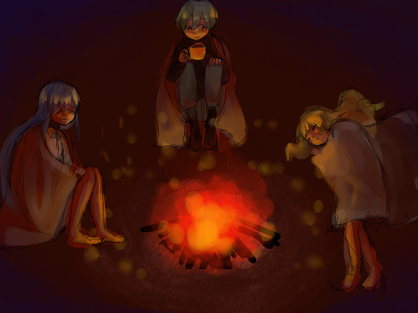

---
link:
  - rel: "stylesheet"
    href: "../css/style.css"
---

## ワールド{#world-title}

### 世界は滅びました{#world-apocalipus}

5 年前、富士山に隕石が落ちて噴火しました。その 3 日後、日本中に未知の感染症が流行しました。
感染してすぐに発症、高熱を出して意識を失うものでした。
致死率は年齢が高くなるほど高くなり 20 歳で 100%。
意識を失った後、目覚めたのは子供たちだけでした。
維持していた大人たちがいなくなり、インフラは壊滅。あちこちで火災が発生しました。

子供たちは、学校や公民館に集まり、キャンプをしながら生き延びました。
焼け跡からはすぐに芽がでました。それは、見たこともない速度で成長する新種の植物でした。
日本中が森に覆われました。森には、角の生えたうさぎや巨大な昆虫が棲みつき、生態系は一変しました。

変異は動植物に留まらず、人間の幼子にも現れました。大人並に発育した身体を持つ十歳児、生え変わった原色の髪、超能力の発現……その変化は様々でした。

### でも頑張って生きています{world-alive}

現在、人々は集まったキャンプを単位にコミュニティを作り、森に囲まれた中で生きています。食料は保存食を食べ繋いでいましたが、近年は森で捕れる獣の肉も食べています。
キャンプ間は森により遮られ、交流は困難なものとなっています。
電話や TV はもちろん使えず、なんとか電力を確保したキャンプはアマチュア無線や
ラジオ放送で情報を交換しています。
都市にはいくつかのキャンプが合流した大きなコミュニティがあり、
そこがラジオの発信を行なっているようです。

### 冒険者{#world-explorers}

森には、＜フィールド＞と呼ばれる危険地域があり、そこには強力な＜ヌシ＞がいます。5 年のうちに、比較的安全な場所の物資は全て取り尽くしてしまいました。
物資を得るためには、＜フィールド＞に挑まなくてはなりません。
また、交流のあるキャンプ間の森に＜フィールド＞が現れることもあります。
交流を続けるためには、＜ヌシ＞を倒し＜フィールド＞を消滅させる必要があるでしょう。

危険を承知で、＜フィールド＞に挑む者。彼らは今、冒険者と呼ばれています。

